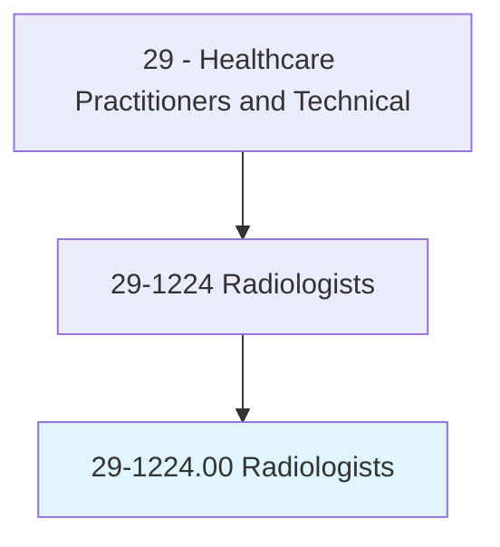
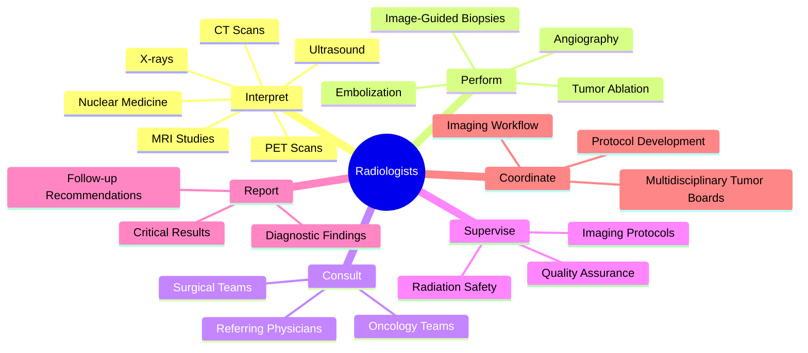
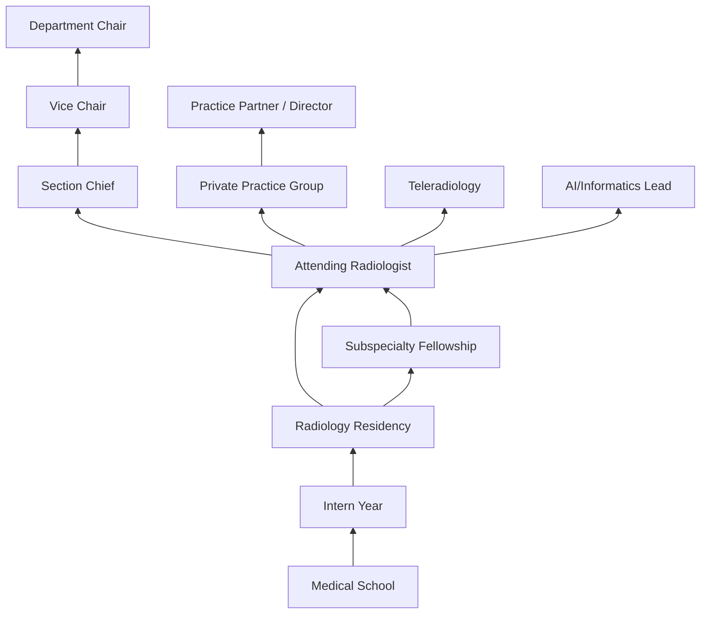
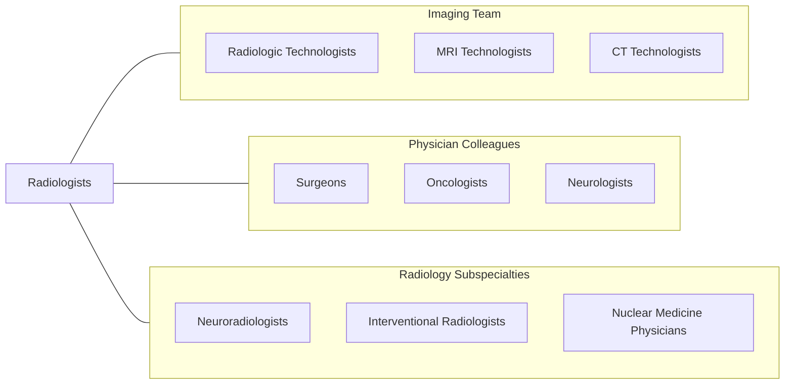

# Radiologists

> Examine and diagnose disorders and diseases using x-rays and radioactive materials. May treat patients.

## Overview

Radiologists are physician specialists who use medical imaging to diagnose and treat diseases throughout the body. They interpret a wide range of imaging studies including X-rays, computed tomography (CT), magnetic resonance imaging (MRI), ultrasound, nuclear medicine, positron emission tomography (PET), and mammography. As the "doctor's doctor," radiologists serve as diagnostic consultants to virtually every medical and surgical specialty, providing critical information that guides clinical decision-making.

The specialty encompasses both diagnostic radiology (image interpretation and diagnosis) and interventional radiology (minimally invasive image-guided procedures). Diagnostic radiologists analyze complex imaging studies to identify pathology, stage diseases, monitor treatment responses, and screen for conditions such as breast cancer. Interventional radiologists perform catheter-based procedures including angioplasty, embolization, tumor ablation, biopsy, and drain placement using real-time imaging guidance.

Modern radiology has been profoundly impacted by artificial intelligence, with machine learning algorithms now assisting in image analysis, lesion detection, and workflow prioritization. Advances in functional imaging, molecular imaging, and hybrid modalities (PET/CT, PET/MRI) have expanded radiology's role from purely anatomical diagnosis to molecular and functional disease characterization. Teleradiology has also transformed practice, enabling remote interpretation and 24/7 coverage across healthcare systems.

## Classification Hierarchy

## Key Statistics

| Metric | Value |
|--------|-------|
| SOC Code | 29-1224.00 |
| Median Annual Salary | $350,280 |
| Employment | ~34,000 |
| Projected Growth | 3% (2022-2032) |
| Job Zone | 5 (Extensive Preparation) |
| Category | [Healthcare Practitioners](/occupations/HealthcarePractitioners) |
| Core Tasks | 45+ |
| Source | O*NET |

## Core Tasks

### interpret.DiagnosticImaging

Radiologists analyze medical images for pathological findings.

**Actions:**
- `interpret.CTScans.for.PathologyIdentification` - CT analysis
- `interpret.MRIStudies.for.SoftTissueCharacterization` - MRI reading
- `interpret.Mammograms.for.BreastCancerScreening` - Breast imaging
- `interpret.NuclearMedicine.for.FunctionalAssessment` - Nuclear studies

### perform.InterventionalProcedures

Radiologists execute minimally invasive image-guided treatments.

**Actions:**
- `perform.ImageGuidedBiopsy.for.TissueDisagnosis` - Tissue sampling
- `perform.Angiography.for.VascularDiagnosis` - Vascular imaging
- `perform.Embolization.for.HemorrhageControl` - Bleeding control
- `perform.TumorAblation.using.RadiofrequencyOrMicrowave` - Cancer treatment

### consult.ReferringPhysicians

Radiologists provide imaging consultation to clinical teams.

**Actions:**
- `consult.ReferringPhysicians.regarding.ImagingFindings` - Clinical correlation
- `consult.SurgicalTeams.for.PreoperativePlanning` - Surgical planning
- `coordinate.MultidisciplinaryTumorBoards.for.CancerStaging` - Tumor boards
- `communicate.CriticalResults.using.ClosedLoopProtocols` - Critical findings

## Practice Settings

| Setting | Description |
|---------|-------------|
| Hospital Radiology Departments | Full-service diagnostic and interventional |
| Outpatient Imaging Centers | Ambulatory diagnostic imaging |
| Academic Medical Centers | Teaching, research, and subspecialty |
| Teleradiology Services | Remote image interpretation |
| Breast Imaging Centers | Dedicated mammography and breast MRI |
| Interventional Suites | Angio suites and IR labs |
| Veterans Affairs | VA radiology services |
| Emergency Departments | Acute imaging interpretation |

## Skills & Competencies

### Technical Skills
- **Cross-Sectional Imaging Interpretation** - Expert
- **Pattern Recognition** - Expert
- **Interventional Procedures** - Expert (IR subspecialty)
- **Radiation Physics & Safety** - Expert
- **Imaging Protocol Design** - Advanced
- **AI-Assisted Interpretation** - Advanced
- **Fluoroscopy** - Advanced
- **Ultrasound-Guided Procedures** - Advanced

### Soft Skills
- **Diagnostic Reasoning** - Critical
- **Attention to Detail** - Critical
- **Communication (Written Reports)** - Essential
- **Consultation Skills** - Essential
- **Efficiency** - Essential
- **Teamwork** - Essential
- **Teaching** - Important

## Education & Training

| Requirement | Details |
|-------------|---------|
| Undergraduate | 4-year bachelor's degree (pre-med) |
| Medical School | 4-year MD or DO program |
| Transitional Year | 1 year internship |
| Radiology Residency | 4 years diagnostic radiology |
| Fellowship | 1-2 years for subspecialization |
| Total Training | 13-15 years post-high school |
| Licensure | State medical license |
| Board Certification | ABR (American Board of Radiology) |

## Certifications

| Certification | Description |
|---------------|-------------|
| ABR Diagnostic Radiology | Primary radiology board certification |
| ABR Interventional Radiology | IR subspecialty certification |
| ABR Neuroradiology | Neuroimaging subspecialty |
| ABR Nuclear Radiology | Nuclear medicine certification |
| ABR Pediatric Radiology | Pediatric imaging subspecialty |
| CAQ Vascular & Interventional | Vascular intervention certification |
| FACR | Fellow of the American College of Radiology |

## Career Progression

## Specializations

| Subspecialty | Focus Area |
|-------------|------------|
| Neuroradiology | Brain and spine imaging |
| Musculoskeletal Radiology | Orthopedic imaging |
| Body/Abdominal Imaging | Abdominal and pelvic CT/MRI |
| Breast Imaging | Mammography, breast MRI, biopsy |
| Interventional Radiology | Image-guided procedures |
| Cardiothoracic Radiology | Heart and lung imaging |
| Pediatric Radiology | Children's imaging |
| Nuclear Medicine/Molecular Imaging | PET, SPECT, theranostics |

## Technology & Tools

| Technology | Purpose |
|------------|---------|
| PACS (Picture Archiving) | Image storage and viewing |
| CT Scanners (64-slice, dual-energy) | Cross-sectional imaging |
| MRI Systems (1.5T, 3T) | Soft tissue imaging |
| Digital Mammography/Tomosynthesis | Breast cancer screening |
| PET/CT Scanners | Molecular imaging |
| Angiography Suites | Interventional procedures |
| AI Diagnostic Tools (Aidoc, Viz.ai) | Computer-aided detection |
| Voice Recognition (Nuance PowerScribe) | Dictation and reporting |

## Related Occupations

## Industries

- [Hospitals](/industries/Healthcare/Hospitals/index) - Primary Employment
- [Outpatient Imaging Centers](/industries/Healthcare/AmbulatoryHealthCare) - Diagnostic Centers
- [Academic Medical Centers](/industries/Healthcare/Hospitals/Teaching) - Teaching & Research
- [Teleradiology Companies](/industries/Healthcare/Telehealth) - Remote Interpretation
- [Veterans Affairs](/industries/Government/Federal) - VA Radiology

## Departments

This occupation typically works in:
- Radiology
- Diagnostic Imaging
- Interventional Radiology
- Breast Imaging Center
- Nuclear Medicine

---

*Source: O*NET 29-1224.00 - ONETOccupation*
