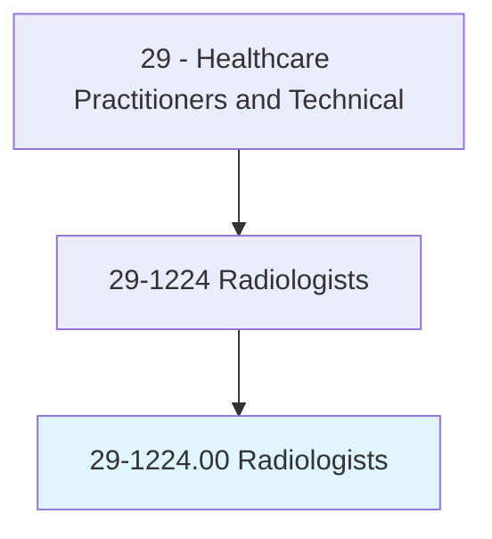
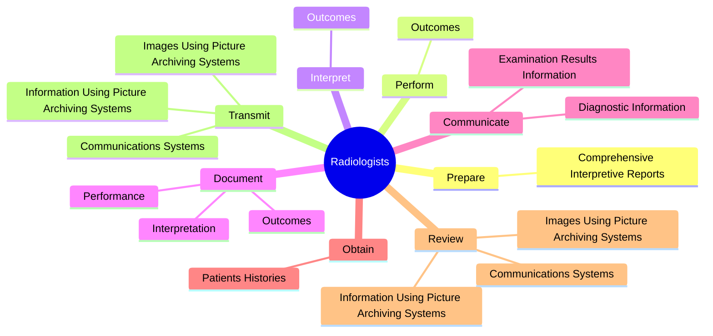
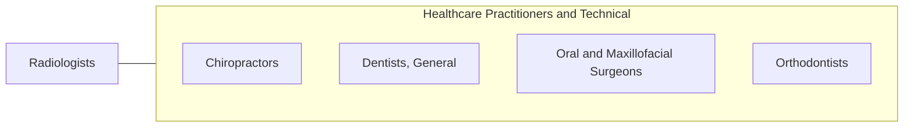

# Radiologists

> Diagnose and treat diseases and injuries using medical imaging techniques, such as x rays, magnetic resonance imaging (MRI), nuclear medicine, and ultrasounds. May perform minimally invasive medical procedures and tests.

## Overview

Radiologists is an occupation within the Healthcare Practitioners and Technical category. Diagnose and treat diseases and injuries using medical imaging techniques, such as x rays, magnetic resonance imaging (MRI), nuclear medicine, and ultrasounds. 

## Classification Hierarchy

## Key Statistics

| Metric | Value |
|--------|-------|
| SOC Code | 29-1224.00 |
| Category | [Healthcare Practitioners and Technical](/occupations/HealthcarePractitioners) |
| Task Count | 107 |
| Source | O*NET |

## Core Tasks

### prepare.ComprehensiveInterpretiveReports

Radiologists prepare comprehensive interpretive reports as part of their core responsibilities.

**Actions:**
- `prepare.ComprehensiveInterpretiveReports.of.Findings`

### perform.Outcomes

Radiologists perform outcomes as part of their core responsibilities.

**Actions:**
- `perform.Outcomes.of.DiagnosticImagingProceduresIncludingMagneticResonanceImagingMri`
- `perform.Outcomes.of.ComputerTomographyCt`
- `perform.Outcomes.of.PositronEmissionTomographyPet`
- `perform.Outcomes.of.NuclearCardiologyTreadmillStudies`

### interpret.Outcomes

Radiologists interpret outcomes as part of their core responsibilities.

**Actions:**
- `interpret.Outcomes.of.DiagnosticImagingProceduresIncludingMagneticResonanceImagingMri`
- `interpret.Outcomes.of.ComputerTomographyCt`
- `interpret.Outcomes.of.PositronEmissionTomographyPet`
- `interpret.Outcomes.of.NuclearCardiologyTreadmillStudies`

## Skills & Competencies

### Technical Skills
- **Clinical Skills** - Advanced
- **Diagnostic Procedures** - Advanced
- **Patient Care** - Advanced

### Soft Skills
- **Communication** - Essential
- **Problem Solving** - Essential
- **Critical Thinking** - Important
- **Teamwork** - Important
- **Adaptability** - Important

## Related Occupations

## Industries

This occupation is found across multiple industries. See [Industries](/industries) for sector-specific employment data.

## Career Progression

---

*Source: O*NET 29-1224.00 - ONETOccupation*
