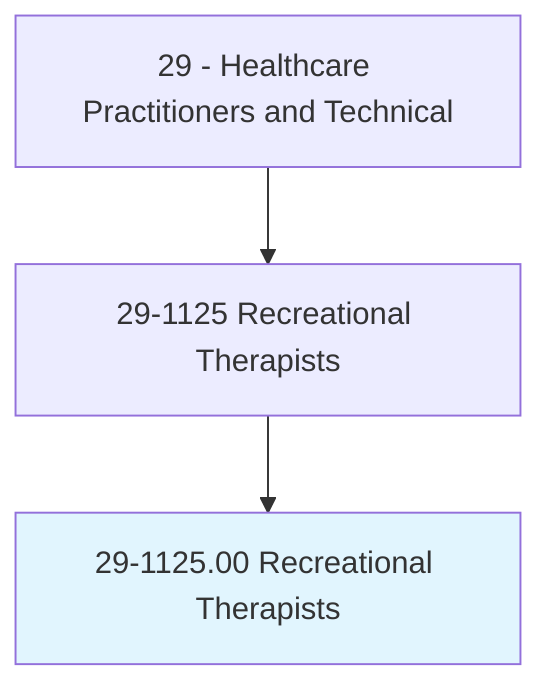
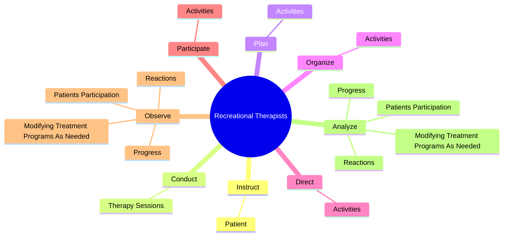
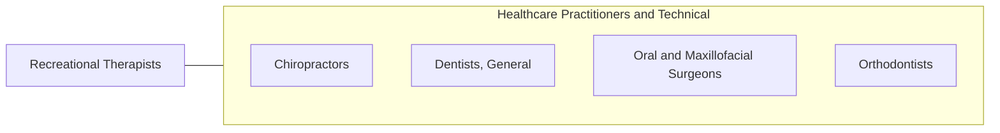

# Recreational Therapists

> Plan, direct, or coordinate medically-approved recreation programs for patients in hospitals, nursing homes, or other institutions. Activities include sports, trips, dramatics, social activities, and crafts. May assess a patient condition and recommend appropriate recreational activity.

## Overview

Recreational Therapists is an occupation within the Healthcare Practitioners and Technical category. Plan, direct, or coordinate medically-approved recreation programs for patients in hospitals, nursing homes, or other institutions. Activities include sports, trips, dramatics, social activities, and crafts.

## Classification Hierarchy

## Key Statistics

| Metric | Value |
|--------|-------|
| SOC Code | 29-1125.00 |
| Category | [Healthcare Practitioners and Technical](/occupations/HealthcarePractitioners) |
| Task Count | 65 |
| Source | O*NET |

## Core Tasks

### instruct.Patient

Recreational Therapists instruct patient as part of their core responsibilities.

**Actions:**
- `instruct.Patient.in.Activities`
- `instruct.Patient.in.Techniques`
- `instruct.Patient.in.Sports`
- `instruct.Patient.in.Dance`

### conduct.TherapySessions

Recreational Therapists conduct therapy sessions as part of their core responsibilities.

**Actions:**
- `conduct.TherapySessions.to.improve.PatientsMentalWellBeing`
- `conduct.TherapySessions.to.PhysicalWellBeing`

### plan.Activities

Recreational Therapists plan activities as part of their core responsibilities.

**Actions:**
- `plan.Activities.to.facilitate.PatientsRehabilitation`
- `plan.Activities.to.help.ThemIntegrateIntoCommunity`
- `plan.Activities.to.prevent.FurtherMedicalProblems`

## Skills & Competencies

### Technical Skills
- **Clinical Skills** - Advanced
- **Diagnostic Procedures** - Advanced
- **Patient Care** - Advanced

### Soft Skills
- **Communication** - Essential
- **Problem Solving** - Essential
- **Critical Thinking** - Important
- **Teamwork** - Important
- **Adaptability** - Important

## Related Occupations

## Industries

This occupation is found across multiple industries. See [Industries](/industries) for sector-specific employment data.

## Career Progression

---

*Source: O*NET 29-1125.00 - ONETOccupation*
