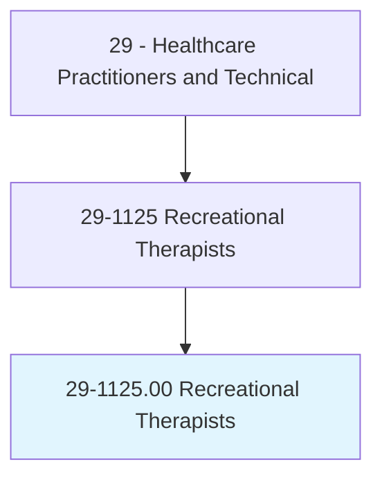
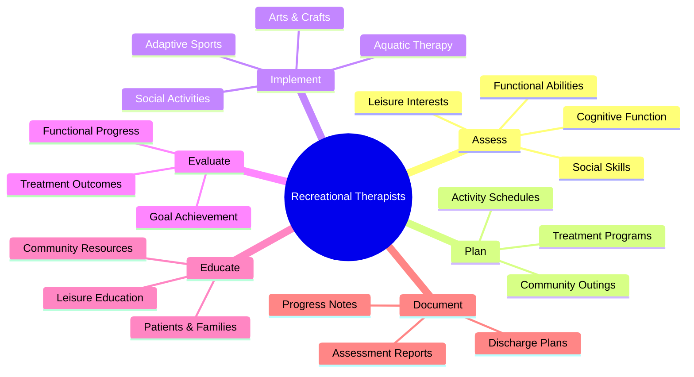
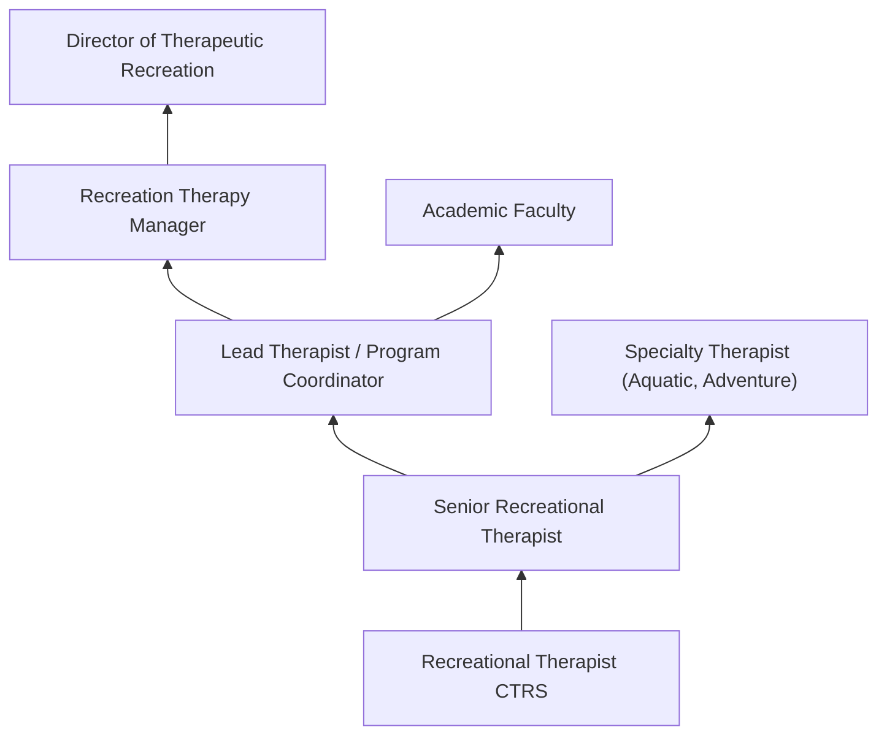
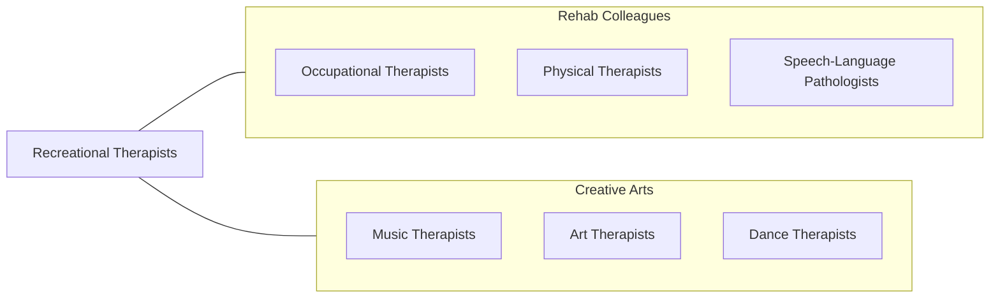

# Recreational Therapists

> Plan, direct, or coordinate medically-approved recreation programs for patients in hospitals, nursing homes, or other institutions. Activities include sports, trips, dramatics, social activities, and arts and crafts. May assess patient condition and recommend appropriate recreational activity.

## Overview

Recreational Therapists (also called Therapeutic Recreation Specialists) plan and implement recreation-based interventions to improve the physical, cognitive, emotional, and social functioning of patients with disabilities, injuries, or illnesses. They use activities such as sports, games, arts and crafts, music, dance, drama, community outings, and aquatic therapy as therapeutic tools to achieve measurable treatment goals and enhance quality of life.

The role requires assessment of patient functioning using standardized instruments, development of individualized treatment plans with measurable objectives, implementation of therapeutic recreation interventions, documentation of patient progress, and discharge planning for community leisure participation. Recreational therapists work with diverse populations including individuals with traumatic brain injury, spinal cord injury, stroke, mental illness, developmental disabilities, substance use disorders, and geriatric conditions.

The profession has evolved with evidence-based practice, adventure-based counseling, adaptive sports programs, animal-assisted therapy, horticultural therapy, and technology-assisted recreation. Recreational therapists contribute to holistic rehabilitation by addressing the leisure and social participation needs that are essential for community reintegration and overall well-being.

## Classification Hierarchy

## Key Statistics

| Metric | Value |
|--------|-------|
| SOC Code | 29-1125.00 |
| Median Annual Salary | $52,090 |
| Employment | ~17,000 |
| Projected Growth | 4% (2022-2032) |
| Job Zone | 4 (Considerable Preparation) |
| Category | [Healthcare Practitioners](/occupations/HealthcarePractitioners) |
| Core Tasks | 25+ |
| Source | O*NET |

## Core Tasks

### assess.PatientFunctioning

Recreational Therapists evaluate patient capabilities.

**Actions:**
- `assess.FunctionalAbilities.using.StandardizedInstruments` - Functional assessment
- `evaluate.LeisureInterests.for.TreatmentPlanning` - Interest inventory
- `assess.SocialSkills.for.CommunityReintegration` - Social assessment
- `develop.TreatmentPlans.with.MeasurableGoals` - Treatment planning

### implement.TherapeuticRecreation

Recreational Therapists deliver activity-based interventions.

**Actions:**
- `implement.AdaptiveSports.for.PhysicalRehabilitation` - Sports therapy
- `facilitate.ArtsAndCrafts.for.CognitiveAndMotorSkills` - Creative therapy
- `lead.CommunityOutings.for.SocialReintegration` - Community trips
- `conduct.AquaticTherapy.for.PhysicalConditioning` - Water therapy

## Practice Settings

| Setting | Description |
|---------|-------------|
| Rehabilitation Hospitals | Inpatient rehabilitation |
| Psychiatric Facilities | Mental health treatment |
| Nursing Homes/SNFs | Geriatric recreation therapy |
| Community Recreation | Adaptive recreation programs |
| Veterans Affairs | VA therapeutic recreation |
| Developmental Disability Services | DD programs |
| Substance Abuse Programs | Addiction recovery |

## Skills & Competencies

### Technical Skills
- **Assessment and Evaluation** - Expert
- **Treatment Planning** - Expert
- **Activity Analysis** - Expert
- **Adaptive Equipment** - Advanced
- **Group Facilitation** - Expert
- **Documentation** - Advanced
- **Community Resource Knowledge** - Advanced

### Soft Skills
- **Creativity** - Essential
- **Empathy** - Essential
- **Communication** - Essential
- **Patience** - Essential
- **Enthusiasm** - Important
- **Adaptability** - Essential

## Education & Training

| Requirement | Details |
|-------------|---------|
| Education | Bachelor's degree in recreational therapy or therapeutic recreation |
| Clinical Internship | 560+ hours supervised internship |
| Certification | CTRS (Certified Therapeutic Recreation Specialist) through NCTRC |
| State Licensure | Required in some states |
| Continuing Education | Per NCTRC requirements |

## Certifications

| Certification | Description |
|---------------|-------------|
| CTRS | Certified Therapeutic Recreation Specialist (NCTRC) |
| State License | State-specific TR license |
| Aquatic Therapy Certification | Water-based therapy |
| Adventure Therapy Certification | Outdoor-based therapy |

## Career Progression

## Technology & Tools

| Technology | Purpose |
|------------|---------|
| Adaptive Sports Equipment | Physical rehabilitation |
| Therapeutic Games and Activities | Cognitive and social therapy |
| Assistive Technology Devices | Activity adaptation |
| Assessment Tools (FACTR, LDB) | Functional evaluation |
| EHR Systems | Documentation |
| Community Resource Databases | Discharge planning |

## Related Occupations

## Industries

- [Hospitals](/industries/Healthcare/Hospitals/index) - Rehabilitation
- [Nursing Facilities](/industries/Healthcare/NursingCare) - Geriatric Care
- [Government](/industries/Government) - VA and State Programs
- [Community Recreation](/industries/ArtsEntertainment) - Adaptive Programs
- [Psychiatric Facilities](/industries/Healthcare/Hospitals/index) - Mental Health

## Departments

This occupation typically works in:
- [Therapeutic Recreation](/departments/TherapeuticRecreation)
- [Rehabilitation Services](/departments/RehabilitationServices)
- [Activities Department](/departments/Activities)
- [Behavioral Health](/departments/BehavioralHealth)

---

*Source: O*NET 29-1125.00 - ONETOccupation*
