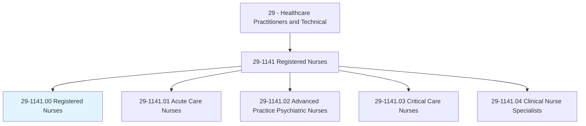
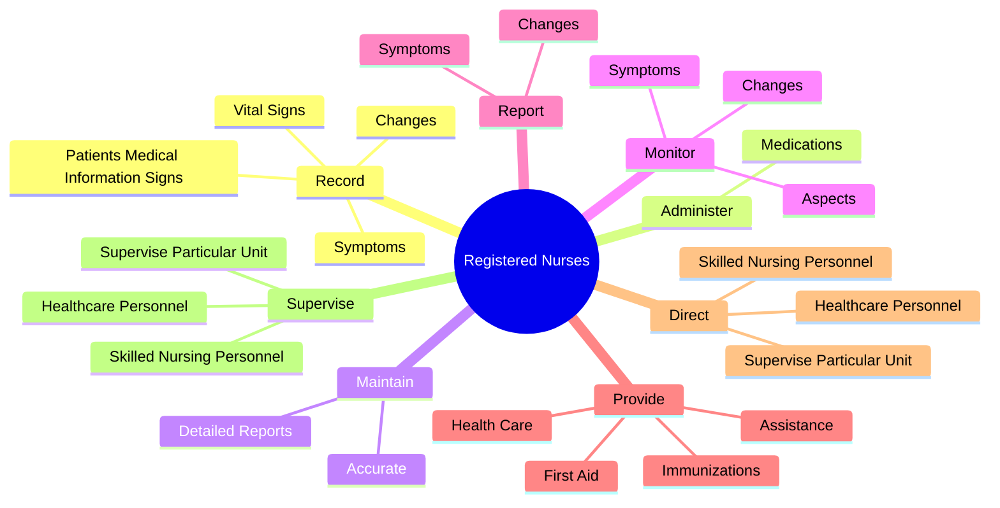
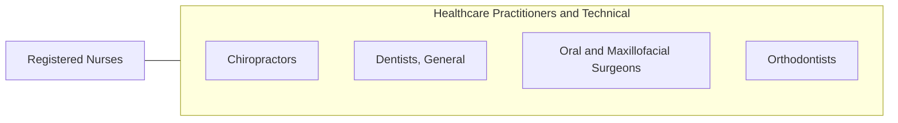

# Registered Nurses

> Assess patient health problems and needs, develop and implement nursing care plans, and maintain medical records. Administer nursing care to ill, injured, convalescent, or disabled patients. May advise patients on health maintenance and disease prevention or provide case management. Licensing or registration required.

## Overview

Registered Nurses is an occupation within the Healthcare Practitioners and Technical category. Assess patient health problems and needs, develop and implement nursing care plans, and maintain medical records. Administer nursing care to ill, injured, convalescent, or disabled patients.

## Classification Hierarchy

## Key Statistics

| Metric | Value |
|--------|-------|
| SOC Code | 29-1141.00 |
| Category | [Healthcare Practitioners and Technical](/occupations/HealthcarePractitioners) |
| Task Count | 151 |
| Source | O*NET |

## Core Tasks

### record.PatientsMedicalInformationSigns

Registered Nurses record patients medical information signs as part of their core responsibilities.

**Actions:**
- `record.PatientsMedicalInformationSigns`
- `record.VitalSigns`
- `record.Symptoms.in.PatientsConditions`
- `record.Changes.in.PatientsConditions`

### administer.Medications

Registered Nurses administer medications as part of their core responsibilities.

**Actions:**
- `administer.Medications.to.Patients`
- `administer.Medications.to.monitor.PatientsForReactionsEffects`
- `administer.Medications.to.SideEffects`

### maintain.Accurate

Registered Nurses maintain accurate as part of their core responsibilities.

**Actions:**
- `maintain.Accurate`
- `maintain.DetailedReports`

## Skills & Competencies

### Technical Skills
- **Clinical Skills** - Advanced
- **Diagnostic Procedures** - Advanced
- **Patient Care** - Advanced

### Soft Skills
- **Communication** - Essential
- **Problem Solving** - Essential
- **Critical Thinking** - Important
- **Teamwork** - Important
- **Adaptability** - Important

## Related Occupations

## Industries

This occupation is found across multiple industries. See [Industries](/industries) for sector-specific employment data.

## Career Progression

---

*Source: O*NET 29-1141.00 - ONETOccupation*
