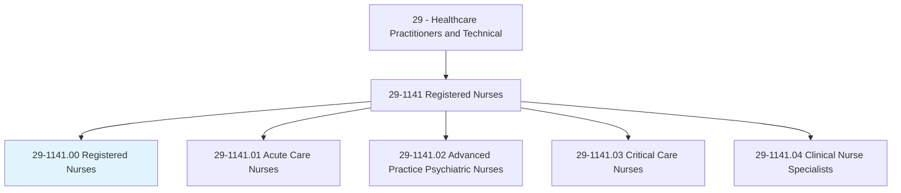
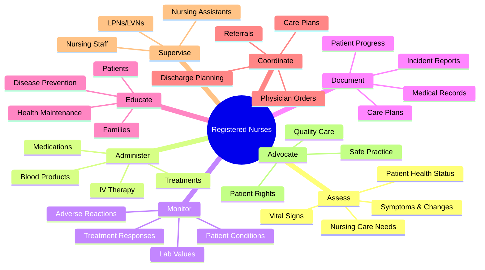
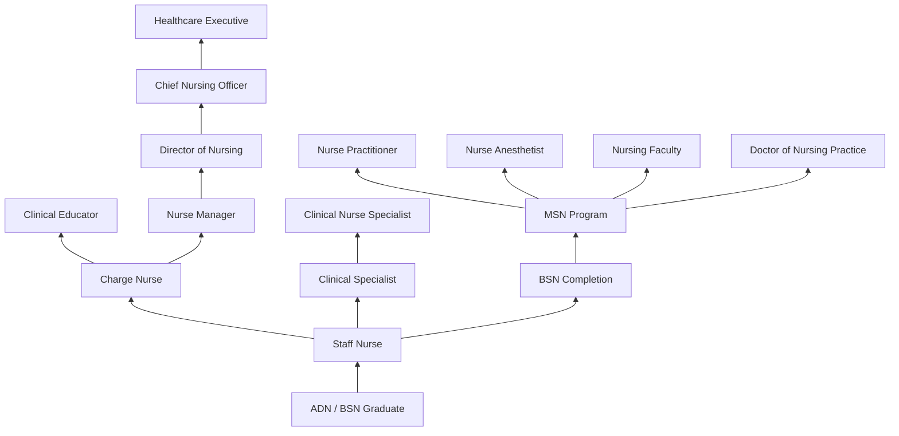
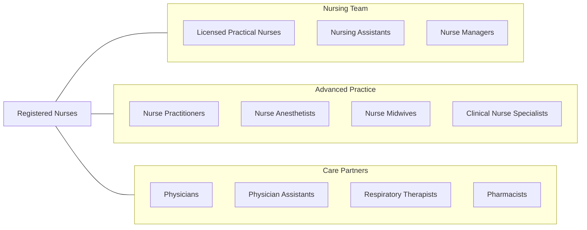

# Registered Nurses

> Assess patient health problems and needs, develop and implement nursing care plans, and maintain medical records. Administer nursing care to ill, injured, convalescent, or disabled patients. May advise patients on health maintenance and disease prevention or provide case management. Licensing or registration required.

## Overview

Registered Nurses (RNs) are the backbone of the healthcare system, providing direct patient care, education, and advocacy across virtually every medical setting. They assess patient conditions, develop nursing care plans, administer medications and treatments, monitor patient responses, and coordinate with physicians and other healthcare providers to ensure comprehensive care. RNs serve as the primary point of contact for patients throughout their healthcare experience.

The nursing profession encompasses an extraordinarily diverse range of specialties and practice settings. RNs work in hospitals, outpatient clinics, schools, home health, public health departments, and corporate wellness programs. They may specialize in areas such as medical-surgical nursing, pediatrics, oncology, emergency care, perioperative nursing, or informatics. The profession offers multiple advancement pathways, from bedside clinical expertise to nurse leadership, education, and executive management.

With a growing emphasis on population health, preventive care, and chronic disease management, registered nurses increasingly function as autonomous practitioners within interprofessional teams. They lead quality improvement initiatives, champion evidence-based practice, and serve as patient safety advocates. The nursing shortage continues to drive demand, making this one of the fastest-growing and most in-demand healthcare occupations.

## Classification Hierarchy

## Key Statistics

| Metric | Value |
|--------|-------|
| SOC Code | 29-1141.00 |
| Median Annual Salary | $81,220 |
| Employment | ~3,175,000 |
| Projected Growth | 6% (2022-2032) |
| Job Zone | 4 (Considerable Preparation) |
| Category | [Healthcare Practitioners](/occupations/HealthcarePractitioners) |
| Core Tasks | 151 |
| Source | O*NET |

## Core Tasks

### record.PatientsMedicalInformation

Registered Nurses maintain comprehensive patient documentation.

**Actions:**
- `record.PatientsMedicalInformation.in.ElectronicHealthRecords` - Chart documentation
- `record.VitalSigns.at.RegularIntervals` - Physiologic monitoring
- `record.Symptoms.in.PatientsConditions` - Clinical observations
- `record.Changes.in.PatientsConditions` - Status updates

### administer.Medications

Registered Nurses deliver medications and monitor patient responses.

**Actions:**
- `administer.Medications.to.Patients` - Medication delivery
- `administer.Medications.to.monitor.PatientsForReactions` - Safety monitoring
- `administer.IVTherapy.per.PhysicianOrders` - Intravenous medications
- `administer.BloodProducts.using.SafetyProtocols` - Transfusion management

### coordinate.CarePlans

Registered Nurses develop and implement comprehensive care plans.

**Actions:**
- `coordinate.CarePlans.with.InterdisciplinaryTeam` - Team collaboration
- `coordinate.DischargePlanning.with.CaseManagement` - Transition planning
- `educate.Patients.regarding.HealthMaintenance` - Patient teaching
- `advocate.PatientRights.in.ClinicalSettings` - Patient advocacy

## Practice Settings

| Setting | Description |
|---------|-------------|
| Hospitals | Medical-surgical, ICU, ED, perioperative |
| Outpatient Clinics | Physician offices and ambulatory care |
| Home Health | In-home patient care |
| Long-Term Care | Skilled nursing facilities |
| Schools | Student health services |
| Public Health | Community health departments |
| Occupational Health | Corporate wellness and workplace health |
| Telehealth | Remote patient monitoring and triage |

## Skills & Competencies

### Technical Skills
- **Patient Assessment** - Expert
- **Medication Administration** - Expert
- **IV Therapy & Venipuncture** - Advanced
- **Wound Care** - Advanced
- **Electronic Health Records** - Advanced
- **Cardiac Monitoring** - Advanced
- **Patient Education** - Expert
- **Infection Control** - Advanced

### Soft Skills
- **Compassion & Empathy** - Critical
- **Communication** - Critical
- **Critical Thinking** - Essential
- **Time Management** - Essential
- **Teamwork** - Essential
- **Stress Management** - Essential
- **Advocacy** - Essential
- **Adaptability** - Important

## Education & Training

| Requirement | Details |
|-------------|---------|
| Minimum Education | Associate Degree in Nursing (ADN) - 2-3 years |
| Preferred Education | Bachelor of Science in Nursing (BSN) - 4 years |
| Advanced Degrees | MSN, DNP for advanced practice or leadership |
| Licensure | Must pass NCLEX-RN exam |
| State License | Required in all states and territories |
| Continuing Education | Varies by state; typically 20-30 hours biennially |
| Clinical Hours | 500-1,500+ supervised clinical hours in program |

## Certifications

| Certification | Description |
|---------------|-------------|
| NCLEX-RN | National Council Licensure Examination (required) |
| CCRN | Critical Care Registered Nurse |
| CEN | Certified Emergency Nurse |
| OCN | Oncology Certified Nurse |
| CNOR | Certified Perioperative Nurse |
| PCCN | Progressive Care Certified Nurse |
| RNC-OB | Inpatient Obstetric Nursing |
| Nurse-BC (ANCC) | Various ANCC board certifications |
| ACLS/PALS/BLS | Life support certifications |

## Career Progression

## Specializations

| Specialty | Focus Area |
|-----------|------------|
| Medical-Surgical | General adult inpatient care |
| Critical Care / ICU | Critically ill patient management |
| Emergency Nursing | Acute and emergent care |
| Perioperative | Surgical and procedural nursing |
| Pediatric Nursing | Child and adolescent care |
| Oncology Nursing | Cancer treatment and supportive care |
| Labor & Delivery | Maternal and newborn care |
| Psychiatric-Mental Health | Behavioral health nursing |
| Informatics | Health IT and data management |
| Public Health | Population and community health |

## Technology & Tools

| Technology | Purpose |
|------------|---------|
| Electronic Health Records (Epic, Cerner) | Documentation and order management |
| Medication Dispensing Systems (Pyxis, Omnicell) | Automated medication access |
| IV Infusion Pumps | Controlled medication delivery |
| Cardiac Monitors & Telemetry | Continuous physiologic monitoring |
| Barcode Medication Administration | Medication safety verification |
| Point-of-Care Testing Devices | Bedside diagnostics |
| Communication Systems (Vocera, Spectralink) | Hands-free team communication |
| Patient Education Platforms | Digital health literacy tools |

## Related Occupations

## Industries

- [Hospitals](/industries/Healthcare/Hospitals/index) - Primary Employment (60%)
- [Ambulatory Care](/industries/Healthcare/AmbulatoryHealthCare) - Outpatient Clinics
- [Home Health Services](/industries/Healthcare/HomeHealth) - In-Home Care
- [Nursing & Residential Care](/industries/Healthcare/NursingCare) - Long-Term Care
- [Government](/industries/PublicAdministration) - Public Health and VA
- [Educational Services](/industries/Education) - School Nursing
- [Insurance Carriers](/industries/Finance/Insurance) - Utilization Review

## Departments

This occupation typically works in:
- Nursing Services
- Medical-Surgical Unit
- Emergency Department
- Intensive Care Unit
- Operating Room
- Labor & Delivery
- Ambulatory Care

---

*Source: O*NET 29-1141.00 - ONETOccupation*
