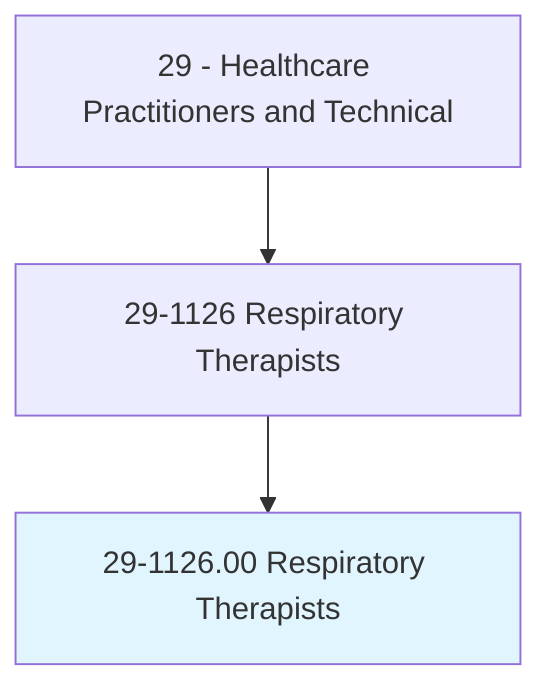
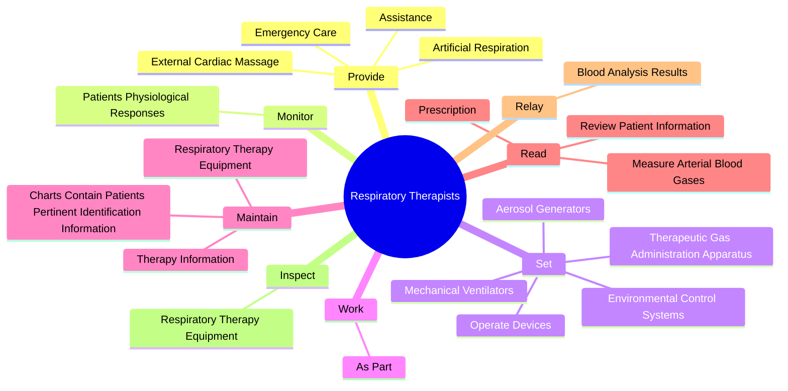
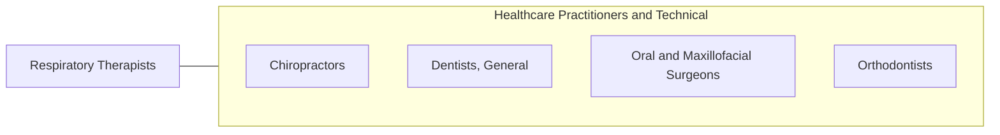

# Respiratory Therapists

> Assess, treat, and care for patients with breathing disorders. Assume primary responsibility for all respiratory care modalities, including the supervision of respiratory therapy technicians. Initiate and conduct therapeutic procedures; maintain patient records; and select, assemble, check, and operate equipment.

## Overview

Respiratory Therapists is an occupation within the Healthcare Practitioners and Technical category. Assess, treat, and care for patients with breathing disorders. Assume primary responsibility for all respiratory care modalities, including the supervision of respiratory therapy technicians.

## Classification Hierarchy

## Key Statistics

| Metric | Value |
|--------|-------|
| SOC Code | 29-1126.00 |
| Category | [Healthcare Practitioners and Technical](/occupations/HealthcarePractitioners) |
| Task Count | 85 |
| Source | O*NET |

## Core Tasks

### provide.EmergencyCare

Respiratory Therapists provide emergency care as part of their core responsibilities.

**Actions:**
- `provide.EmergencyCare.with.CardiopulmonaryResuscitation`
- `provide.ArtificialRespiration.with.CardiopulmonaryResuscitation`
- `provide.ExternalCardiacMassage.with.CardiopulmonaryResuscitation`
- `provide.Assistance.with.CardiopulmonaryResuscitation`

### monitor.PatientsPhysiologicalResponses

Respiratory Therapists monitor patients physiological responses as part of their core responsibilities.

**Actions:**
- `monitor.PatientsPhysiologicalResponses.to.Therapy`
- `monitor.PatientsPhysiologicalResponses.to.VitalSigns`
- `monitor.PatientsPhysiologicalResponses.to.ArterialBloodGases`
- `monitor.PatientsPhysiologicalResponses.to.BloodChemistryChanges`

### set.OperateDevices

Respiratory Therapists set operate devices as part of their core responsibilities.

**Actions:**
- `set.OperateDevices.of.Treatment`
- `set.MechanicalVentilators.of.Treatment`
- `set.TherapeuticGasAdministrationApparatus.of.Treatment`
- `set.EnvironmentalControlSystems.of.Treatment`

## Skills & Competencies

### Technical Skills
- **Clinical Skills** - Advanced
- **Diagnostic Procedures** - Advanced
- **Patient Care** - Advanced

### Soft Skills
- **Communication** - Essential
- **Problem Solving** - Essential
- **Critical Thinking** - Important
- **Teamwork** - Important
- **Adaptability** - Important

## Related Occupations

## Industries

This occupation is found across multiple industries. See [Industries](/industries) for sector-specific employment data.

## Career Progression

---

*Source: O*NET 29-1126.00 - ONETOccupation*
