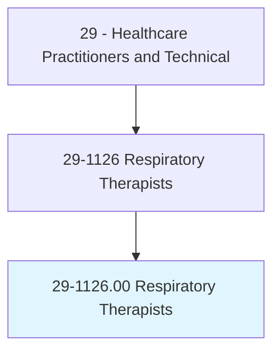
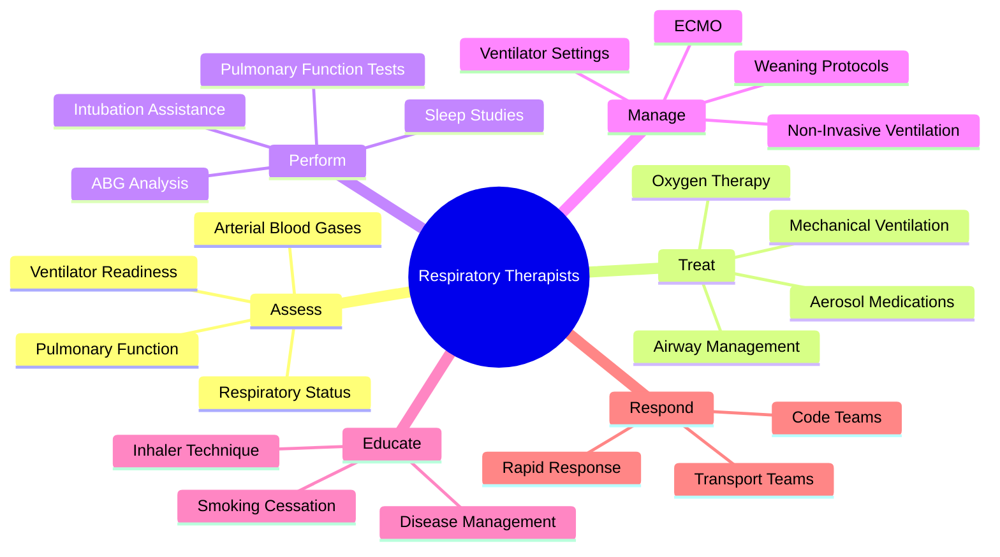
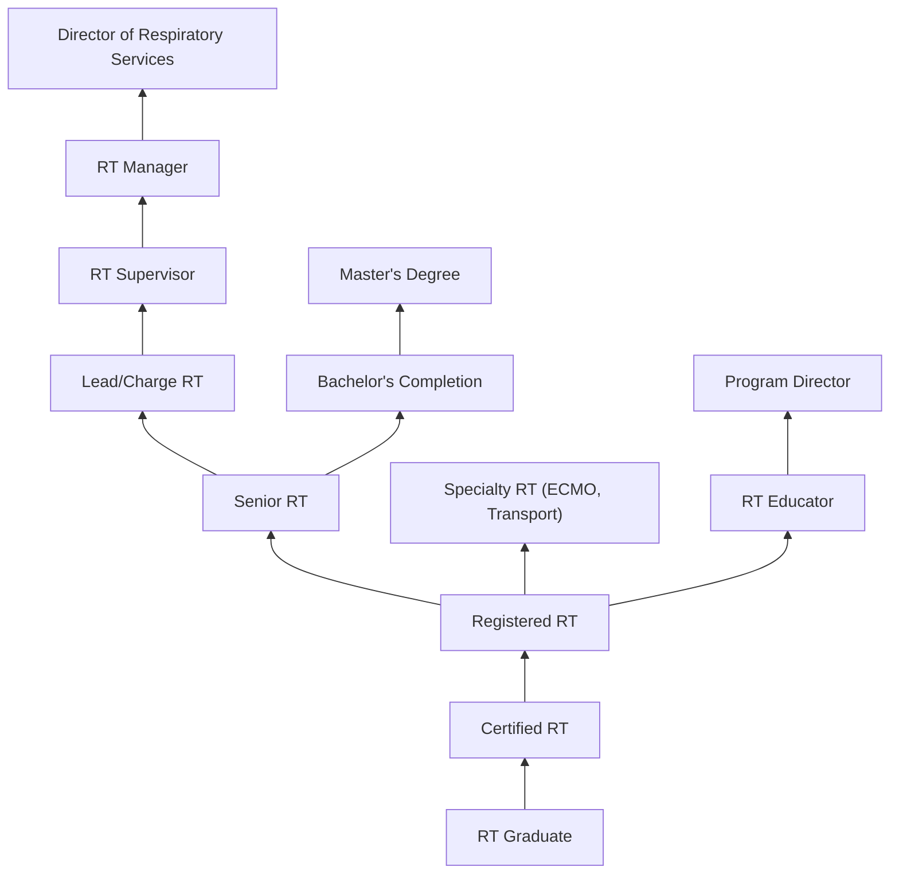
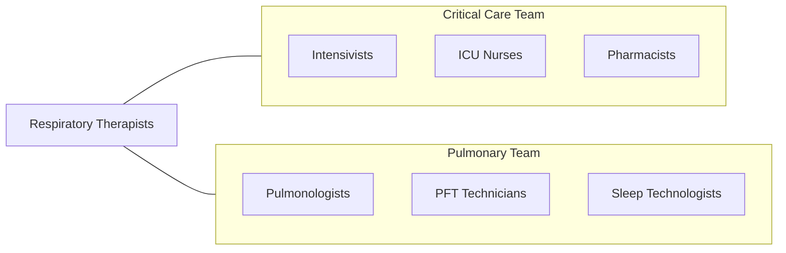

# Respiratory Therapists

> Assess, treat, and care for patients with breathing disorders. Assume primary responsibility for all respiratory care modalities, including the supervision of respiratory therapy technicians. Initiate and conduct therapeutic procedures; maintain patient records; and select, assemble, check, and operate equipment.

## Overview

Respiratory Therapists (RTs) are specialized healthcare professionals who evaluate, treat, and care for patients with cardiopulmonary disorders. They manage patients across the acuity spectrum from stable outpatients with asthma and COPD to critically ill patients on mechanical ventilation, ECMO, and inhaled nitric oxide. RTs are integral members of critical care, emergency, and surgical teams, providing expert assessment and intervention for all aspects of respiratory care.

The scope of respiratory therapy encompasses diagnostic testing (arterial blood gases, pulmonary function tests, sleep studies), therapeutic interventions (oxygen therapy, aerosol medications, chest physiotherapy, mechanical ventilation), patient education (inhaler technique, disease management, smoking cessation), and emergency response (airway management, CPR, rapid response teams). RTs initiate and modify respiratory care protocols based on patient assessment and evidence-based guidelines.

Modern respiratory therapy has expanded with advances in ventilator technology, non-invasive ventilation, high-flow nasal cannula therapy, ECMO, and pulmonary rehabilitation. The COVID-19 pandemic highlighted the critical importance of respiratory therapists, who managed ventilators and prone positioning for the sickest patients. RTs increasingly serve in expanded roles including disease management, transport teams, and pulmonary rehabilitation programs.

## Classification Hierarchy

## Key Statistics

| Metric | Value |
|--------|-------|
| SOC Code | 29-1126.00 |
| Median Annual Salary | $62,810 |
| Employment | ~133,000 |
| Projected Growth | 13% (2022-2032, much faster than average) |
| Job Zone | 3 (Medium Preparation) |
| Category | [Healthcare Practitioners](/occupations/HealthcarePractitioners) |
| Core Tasks | 50+ |
| Source | O*NET |

## Core Tasks

### assess.RespiratoryStatus

RTs evaluate cardiopulmonary function.

**Actions:**
- `assess.RespiratoryStatus.using.Auscultation` - Physical assessment
- `perform.ArterialBloodGas.analysis.for.Oxygenation` - ABG analysis
- `perform.PulmonaryFunctionTests.for.DiagnosticEvaluation` - PFT testing
- `assess.VentilatorReadiness.using.WeaningParameters` - Weaning assessment

### manage.MechanicalVentilation

RTs manage complex respiratory support.

**Actions:**
- `manage.VentilatorSettings.per.LungProtectiveProtocols` - Ventilator management
- `manage.WeaningProtocols.for.VentilatorLiberation` - Ventilator weaning
- `manage.NonInvasiveVentilation.for.RespiratoryFailure` - NIPPV management
- `manage.HighFlowNasalCannula.for.OxygenSupport` - HFNC therapy

### educate.PatientsOnRespiratoryCare

RTs provide patient and family education.

**Actions:**
- `educate.Patients.regarding.InhalerTechnique` - Device training
- `educate.Patients.regarding.DiseaseManagement` - Self-management
- `counsel.Patients.regarding.SmokingCessation` - Tobacco cessation
- `educate.Families.regarding.HomeOxygenUse` - Home care preparation

## Practice Settings

| Setting | Description |
|---------|-------------|
| Hospital ICUs | Critical care respiratory management |
| Emergency Departments | Acute respiratory intervention |
| Medical/Surgical Floors | General respiratory care |
| Neonatal ICUs | Neonatal respiratory support |
| Pulmonary Function Labs | Diagnostic testing |
| Sleep Disorder Centers | Sleep study management |
| Pulmonary Rehabilitation | COPD and chronic lung disease |
| Home Health | Home ventilator and oxygen services |

## Skills & Competencies

### Technical Skills
- **Mechanical Ventilation** - Expert
- **Arterial Blood Gas Analysis** - Expert
- **Airway Management** - Expert
- **Pulmonary Function Testing** - Expert
- **Oxygen Therapy** - Expert
- **Aerosol Medication Delivery** - Expert
- **ECMO Management** - Advanced
- **Non-Invasive Ventilation** - Expert

### Soft Skills
- **Critical Thinking** - Critical
- **Communication** - Essential
- **Teamwork** - Essential
- **Adaptability** - Essential
- **Patient Education** - Essential
- **Stress Management** - Essential

## Education & Training

| Requirement | Details |
|-------------|---------|
| Education | Associate degree (minimum); bachelor's preferred |
| Clinical Rotations | Supervised clinical hours in multiple settings |
| Licensure | Must pass NBRC TMC exam |
| Advanced Credential | RRT (Registered Respiratory Therapist) |
| State License | Required in most states |
| Continuing Education | Per NBRC and state requirements |

## Certifications

| Certification | Description |
|---------------|-------------|
| CRT | Certified Respiratory Therapist (NBRC) |
| RRT | Registered Respiratory Therapist (NBRC) |
| RRT-ACCS | Adult Critical Care Specialist |
| RRT-NPS | Neonatal/Pediatric Specialist |
| RPFT | Registered Pulmonary Function Technologist |
| RPSGT | Registered Polysomnographic Technologist |
| ACLS/PALS/NRP | Life support certifications |

## Career Progression

## Specializations

| Focus Area | Description |
|------------|-------------|
| Critical Care | ICU ventilator management |
| Neonatal/Pediatric | NICU and PICU respiratory care |
| Pulmonary Function | Diagnostic PFT lab |
| Sleep Medicine | Polysomnography and CPAP |
| ECMO Specialist | Extracorporeal membrane oxygenation |
| Transport | Critical care transport team |
| Pulmonary Rehabilitation | Chronic disease exercise program |
| Home Care | Home ventilator and oxygen |

## Technology & Tools

| Technology | Purpose |
|------------|---------|
| Mechanical Ventilators (Hamilton, Drager, PB) | Life support |
| ABG Analyzers | Blood gas analysis |
| Pulmonary Function Systems | Spirometry and lung volumes |
| CPAP/BiPAP Devices | Non-invasive ventilation |
| High-Flow Nasal Cannula Systems | Heated humidified oxygen |
| Bronchoscopy Equipment | Airway visualization |
| Polysomnography Systems | Sleep study monitoring |
| Nitric Oxide Delivery Systems | Inhaled NO therapy |

## Related Occupations

## Industries

- [Hospitals](/industries/Healthcare/Hospitals/index) - Primary Employment
- [Home Health](/industries/Healthcare/HomeHealth) - Home Respiratory
- [Sleep Centers](/industries/Healthcare/SleepCenters) - Sleep Medicine
- [Rehabilitation](/industries/Healthcare/RehabilitationCenters) - Pulmonary Rehab
- [DME Companies](/industries/Healthcare/MedicalEquipment) - Equipment Services

## Departments

This occupation typically works in:
- Respiratory Therapy
- Intensive Care Unit
- Pulmonary Function Lab
- Sleep Medicine Center
- Emergency Department

---

*Source: O*NET 29-1126.00 - ONETOccupation*
