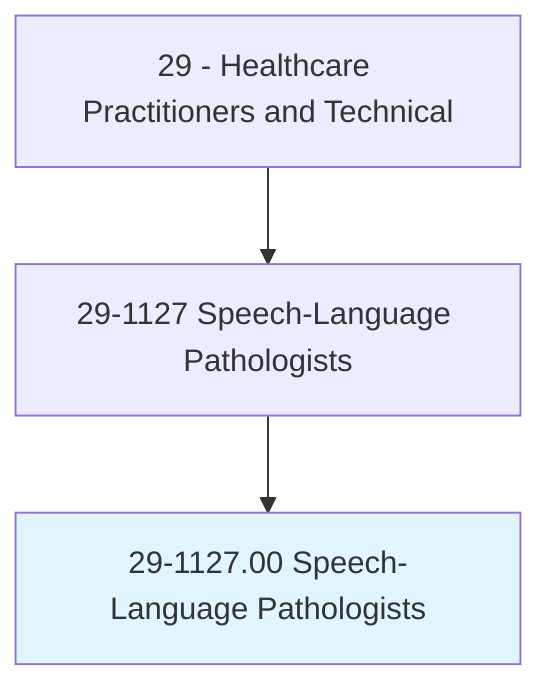
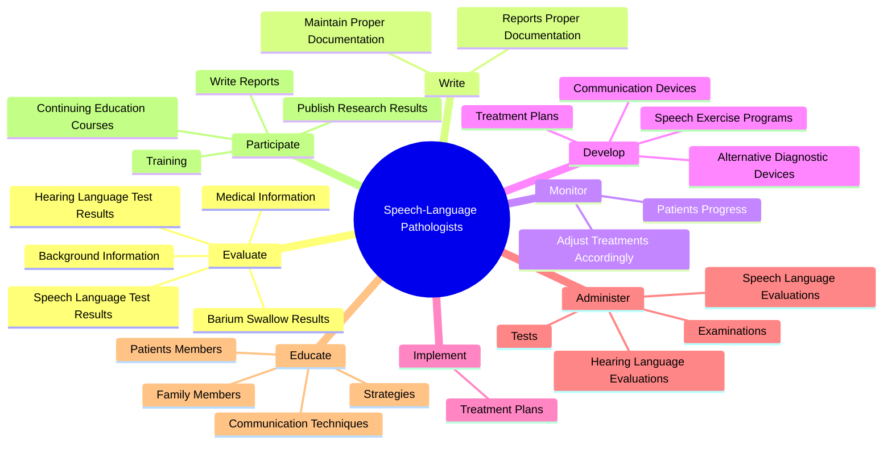
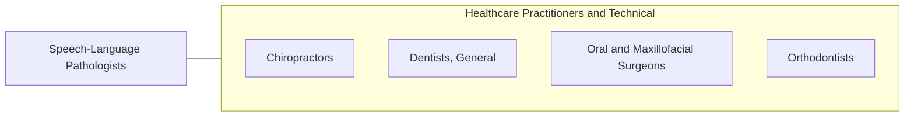

# Speech-Language Pathologists

> Assess and treat persons with speech, language, voice, and fluency disorders. May select alternative communication systems and teach their use. May perform research related to speech and language problems.

## Overview

Speech-Language Pathologists is an occupation within the Healthcare Practitioners and Technical category. Assess and treat persons with speech, language, voice, and fluency disorders. May select alternative communication systems and teach their use.

## Classification Hierarchy

## Key Statistics

| Metric | Value |
|--------|-------|
| SOC Code | 29-1127.00 |
| Category | [Healthcare Practitioners and Technical](/occupations/HealthcarePractitioners) |
| Task Count | 162 |
| Source | O*NET |

## Core Tasks

### evaluate.HearingLanguageTestResults

Speech-Language Pathologists evaluate hearing language test results as part of their core responsibilities.

**Actions:**
- `evaluate.HearingLanguageTestResults.to.diagnose.TreatmentForSpeech`
- `evaluate.HearingLanguageTestResults.to.plan.TreatmentForSpeech`
- `evaluate.HearingLanguageTestResults.to.Language`
- `evaluate.HearingLanguageTestResults.to.Fluency`

### write.ReportsProperDocumentation

Speech-Language Pathologists write reports proper documentation as part of their core responsibilities.

**Actions:**
- `write.ReportsProperDocumentation.of.Information`
- `write.ReportsProperDocumentation.of.ClientMedicaid`
- `write.ReportsProperDocumentation.of.BillingRecords`
- `write.ReportsProperDocumentation.of.CaseloadActivities`

### monitor.PatientsProgress

Speech-Language Pathologists monitor patients progress as part of their core responsibilities.

**Actions:**
- `monitor.PatientsProgress`
- `monitor.AdjustTreatmentsAccordingly`

## Skills & Competencies

### Technical Skills
- **Clinical Skills** - Advanced
- **Diagnostic Procedures** - Advanced
- **Patient Care** - Advanced

### Soft Skills
- **Communication** - Essential
- **Problem Solving** - Essential
- **Critical Thinking** - Important
- **Teamwork** - Important
- **Adaptability** - Important

## Related Occupations

## Industries

This occupation is found across multiple industries. See [Industries](/industries) for sector-specific employment data.

## Career Progression

---

*Source: O*NET 29-1127.00 - ONETOccupation*
