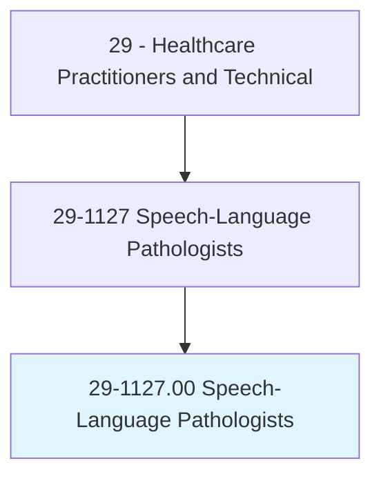
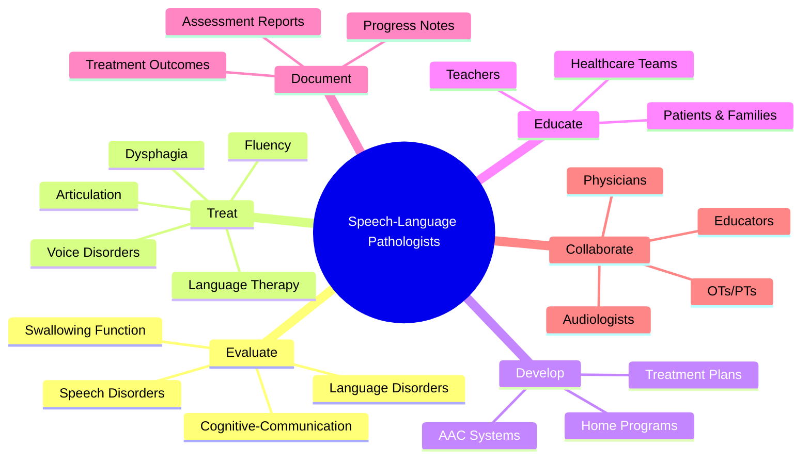
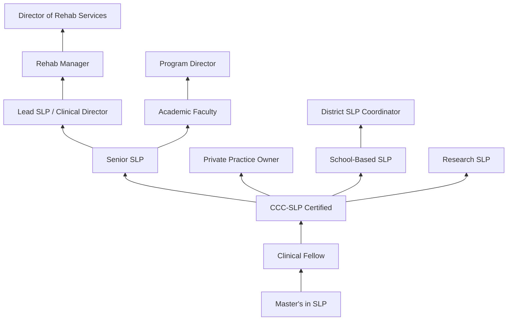
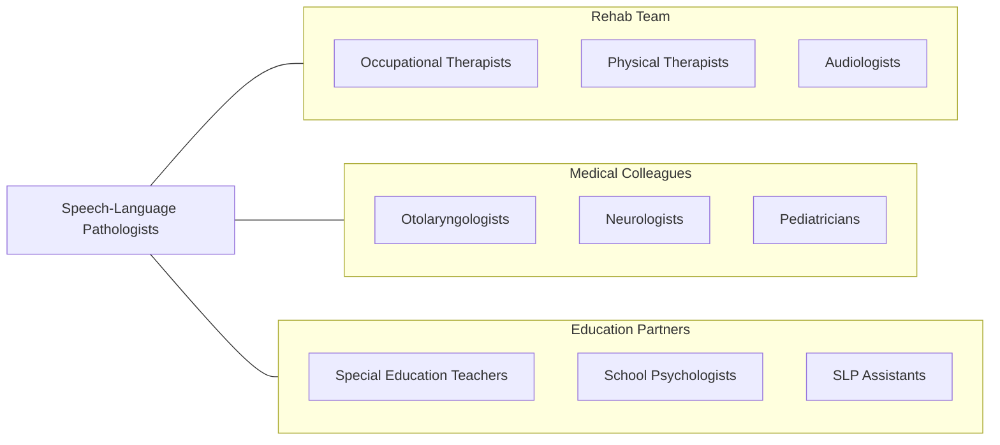

# Speech-Language Pathologists

> Assess and treat persons with speech, language, voice, and fluency disorders. May select alternative communication systems and teach their use. May perform research related to speech and language problems.

## Overview

Speech-Language Pathologists (SLPs) are healthcare professionals who evaluate, diagnose, and treat communication and swallowing disorders across the lifespan. They work with individuals experiencing speech sound disorders, language delays, voice disorders, fluency disorders (stuttering), cognitive-communication impairments, and dysphagia (swallowing difficulties). SLPs provide services in healthcare, educational, and private practice settings.

The scope of speech-language pathology encompasses articulation and phonological disorders, receptive and expressive language delays, aphasia following stroke, dysarthria, apraxia of speech, voice disorders, resonance disorders, and cognitive-linguistic deficits resulting from traumatic brain injury or neurodegenerative disease. SLPs also assess and treat oropharyngeal dysphagia using instrumental evaluation including videofluoroscopic swallow studies and fiberoptic endoscopic evaluation of swallowing.

Modern SLP practice has expanded with telepractice, augmentative and alternative communication (AAC) technology, and evidence-based neurological rehabilitation approaches. SLPs increasingly address literacy development, accent modification, transgender voice therapy, and social communication for individuals on the autism spectrum.

## Classification Hierarchy

## Key Statistics

| Metric | Value |
|--------|-------|
| SOC Code | 29-1127.00 |
| Median Annual Salary | $84,140 |
| Employment | ~162,000 |
| Projected Growth | 19% (2022-2032, much faster than average) |
| Job Zone | 5 (Extensive Preparation) |
| Category | [Healthcare Practitioners](/occupations/HealthcarePractitioners) |
| Core Tasks | 50+ |
| Source | O*NET |

## Core Tasks

### evaluate.CommunicationDisorders

SLPs conduct comprehensive evaluations.

**Actions:**
- `evaluate.SpeechDisorders.using.StandardizedAssessments` - Speech evaluation
- `evaluate.LanguageDisorders.using.FormalAndInformal.Measures` - Language assessment
- `evaluate.SwallowingFunction.using.InstrumentalStudies` - Dysphagia assessment
- `evaluate.CognitiveCommunication.using.NeurocognitiveTools` - Cognitive screening

### treat.CommunicationAndSwallowing

SLPs deliver evidence-based therapeutic interventions.

**Actions:**
- `treat.ArticulationDisorders.using.MotorLearningApproaches` - Speech therapy
- `treat.LanguageDisorders.using.NaturalisticInterventions` - Language therapy
- `treat.Dysphagia.using.SwallowingExercises` - Dysphagia treatment
- `implement.AACSystem.for.ComplexCommunicationNeeds` - AAC provision

## Practice Settings

| Setting | Description |
|---------|-------------|
| Schools | Educational speech therapy |
| Hospitals | Acute care and rehabilitation |
| Outpatient Clinics | Ambulatory speech services |
| Skilled Nursing Facilities | Geriatric communication and swallowing |
| Home Health | Home-based therapy |
| Private Practice | Independent SLP practice |
| Early Intervention | Birth-to-3 services |
| Telepractice | Virtual speech therapy |

## Skills & Competencies

### Technical Skills
- **Speech-Language Assessment** - Expert
- **Dysphagia Assessment (MBSS, FEES)** - Expert
- **AAC Technology** - Advanced
- **Cognitive-Communication Treatment** - Advanced
- **Voice Therapy** - Advanced
- **Fluency Treatment** - Advanced
- **Pediatric Language Therapy** - Expert
- **Adult Neurogenic Communication** - Advanced

### Soft Skills
- **Patient Communication** - Critical
- **Empathy** - Essential
- **Creativity** - Essential
- **Patience** - Essential
- **Collaboration** - Essential
- **Cultural Sensitivity** - Essential

## Education & Training

| Requirement | Details |
|-------------|---------|
| Undergraduate | Bachelor's degree (pre-SLP or communication sciences) |
| Graduate | Master's degree in Speech-Language Pathology (2-3 years) |
| Clinical Fellowship | 36-week supervised clinical fellowship (CF) |
| Licensure | Must pass Praxis SLP exam |
| State License | Required in all states |
| ASHA Certification | CCC-SLP (Certificate of Clinical Competence) |
| Continuing Education | 30 hours per 3-year cycle |

## Certifications

| Certification | Description |
|---------------|-------------|
| CCC-SLP | Certificate of Clinical Competence (ASHA) |
| BCS-S | Board Certified Specialist in Swallowing |
| BCS-CL | Board Certified Specialist in Child Language |
| BCS-F | Board Certified Specialist in Fluency |
| LSVT LOUD Certified | Lee Silverman Voice Treatment |
| VitalStim Certified | Neuromuscular electrical stimulation for dysphagia |

## Career Progression

## Specializations

| Focus Area | Description |
|------------|-------------|
| Pediatric Speech-Language | Early intervention and childhood |
| Dysphagia | Swallowing disorders assessment and treatment |
| Neurogenic Communication | Stroke, TBI, dementia |
| Voice Disorders | Vocal pathology and therapy |
| Fluency (Stuttering) | Fluency disorders |
| AAC | Augmentative and alternative communication |
| Autism Spectrum | Social communication |
| Head & Neck Cancer | Post-surgical rehabilitation |

## Technology & Tools

| Technology | Purpose |
|------------|---------|
| FEES Equipment (Fiberoptic) | Endoscopic swallowing evaluation |
| Videofluoroscopy (MBSS) | Modified barium swallow study |
| AAC Devices (Tobii Dynavox, Proloquo2Go) | Communication devices |
| Telepractice Platforms | Virtual therapy delivery |
| Standardized Assessment Tools | Formal evaluation |
| Voice Analysis Software (Praat) | Acoustic voice analysis |
| VitalStim/NMES Devices | Swallowing neuromuscular stimulation |
| Speech Therapy Apps | Digital therapy tools |

## Related Occupations

## Industries

- [Schools](/industries/Education/ElementarySecondary) - Primary Employment (Schools)
- [Hospitals](/industries/Healthcare/Hospitals/index) - Acute Care
- [Nursing Facilities](/industries/Healthcare/NursingCare) - Long-Term Care
- [Home Health](/industries/Healthcare/HomeHealth) - Home-Based Therapy
- [Physician Offices](/industries/Healthcare/PhysicianOffices) - Outpatient Practice
- [Rehabilitation Centers](/industries/Healthcare/RehabilitationCenters) - Rehab Services

## Departments

This occupation typically works in:
- Speech-Language Pathology
- Rehabilitation Services
- Dysphagia Services
- Special Education
- Early Intervention

---

*Source: O*NET 29-1127.00 - ONETOccupation*
