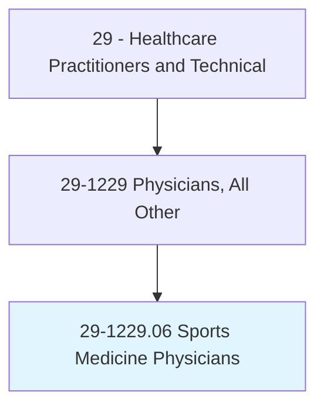
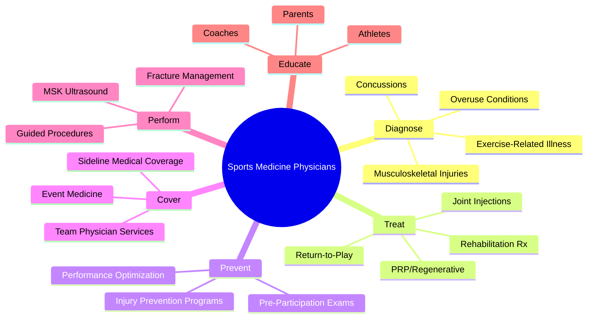
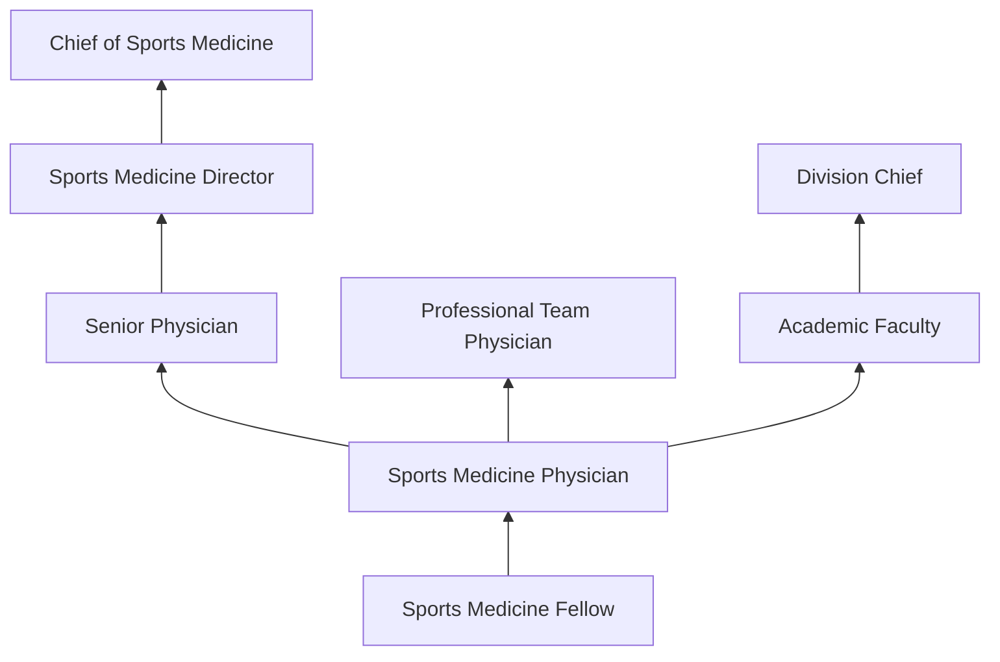
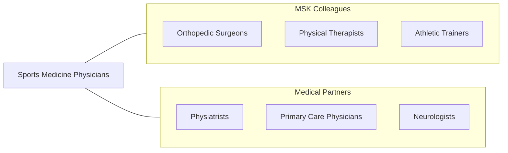

# Sports Medicine Physicians

> Diagnose, treat, and help prevent injuries that occur during sporting events, athletic training, and physical activities.

## Overview

Sports Medicine Physicians are medical doctors who specialize in the prevention, diagnosis, and treatment of sports-related injuries and conditions affecting athletes and physically active individuals. They manage musculoskeletal injuries (sprains, strains, fractures, tendinopathies), concussions, exercise-related medical conditions, and performance optimization through non-surgical approaches. Sports medicine physicians come from various primary specialty backgrounds including family medicine, internal medicine, emergency medicine, pediatrics, and physical medicine and rehabilitation.

The scope encompasses acute injury evaluation and management on the sideline and in clinic, concussion diagnosis and return-to-play protocols, musculoskeletal ultrasound-guided procedures, joint and soft tissue injections, exercise prescription, pre-participation physical examinations, and medical coverage for athletic events and teams. Sports medicine physicians emphasize non-operative treatment, rehabilitation, and injury prevention to keep athletes safely participating in sports.

Modern sports medicine has advanced with musculoskeletal ultrasound for diagnosis and guided injections, regenerative medicine (PRP, stem cells), concussion management protocols, return-to-sport testing, wearable performance monitoring technology, and evidence-based approaches to injury prevention and recovery optimization.

## Classification Hierarchy

## Key Statistics

| Metric | Value |
|--------|-------|
| SOC Code | 29-1229.06 |
| Median Annual Salary | $224,300 |
| Employment | ~7,000 |
| Projected Growth | 5% (2022-2032) |
| Job Zone | 5 (Extensive Preparation) |
| Category | [Healthcare Practitioners](/occupations/HealthcarePractitioners) |
| Core Tasks | 35+ |
| Source | O*NET |

## Core Tasks

### diagnose.SportsInjuries

Sports Medicine Physicians evaluate athletic injuries.

**Actions:**
- `diagnose.MusculoskeletalInjuries.using.PhysicalExamAndImaging` - Injury diagnosis
- `evaluate.Concussions.using.NeurocognitiveAssessment` - Concussion evaluation
- `assess.OveruseInjuries.for.TrainingModification` - Overuse assessment
- `perform.MSKUltrasound.for.PointOfCareDiagnosis` - Ultrasound diagnosis

### treat.AthleticConditions

Sports Medicine Physicians provide non-surgical treatment.

**Actions:**
- `perform.UltrasoundGuidedInjections.for.JointAndTendon` - Guided injections
- `prescribe.RehabilitationPrograms.for.InjuryRecovery` - Rehab prescription
- `manage.ReturnToPlayProtocols.for.SafeAthleteReturn` - RTP management
- `administer.RegenerativeMedicine.for.TissueHealing` - PRP/regenerative

## Practice Settings

| Setting | Description |
|---------|-------------|
| Sports Medicine Clinics | Outpatient sports care |
| Team Physician Services | Professional/collegiate teams |
| Academic Medical Centers | Teaching and research |
| Orthopedic Group Practices | Multi-specialty musculoskeletal |
| Primary Care Sports Medicine | Community sports care |
| Event Medical Services | Competition medical coverage |

## Skills & Competencies

### Technical Skills
- **Musculoskeletal Examination** - Expert
- **Musculoskeletal Ultrasound** - Expert
- **Concussion Management** - Expert
- **Joint/Soft Tissue Injections** - Expert
- **Exercise Prescription** - Expert
- **Fracture Management** - Advanced
- **Regenerative Medicine** - Advanced

### Soft Skills
- **Clinical Decision Making** - Critical
- **Communication** - Essential
- **Teamwork** - Essential
- **Composure Under Pressure** - Essential
- **Athlete Rapport** - Important

## Education & Training

| Requirement | Details |
|-------------|---------|
| Medical School | 4-year MD or DO |
| Primary Residency | 3-4 years (FM, IM, EM, Peds, PM&R) |
| Sports Medicine Fellowship | 1-2 years |
| Board Certification | CAQ in Sports Medicine |
| Total Training | 12-14 years post-high school |

## Certifications

| Certification | Description |
|---------------|-------------|
| CAQ Sports Medicine | Certificate of Added Qualification |
| Primary Board Certification | ABFM, ABIM, ABEM, ABP, or ABPMR |
| RMSK | Registered Musculoskeletal Sonographer |
| ATLS | Advanced Trauma Life Support |

## Career Progression

## Specializations

| Focus Area | Description |
|------------|-------------|
| Concussion Medicine | Brain injury in sports |
| Musculoskeletal Ultrasound | Diagnostic and interventional |
| Regenerative Medicine | PRP and biologic therapies |
| Pediatric Sports Medicine | Youth athlete care |
| Performing Arts Medicine | Dancer and musician injuries |
| Endurance Sports | Marathon and triathlon medicine |

## Technology & Tools

| Technology | Purpose |
|------------|---------|
| Musculoskeletal Ultrasound (GE, Philips) | Diagnosis and guided procedures |
| Concussion Assessment Tools (ImPACT, SCAT5) | Neurocognitive testing |
| PRP Centrifuge Systems | Regenerative medicine |
| Sideline Medical Equipment | Event coverage |
| Wearable Performance Monitors | Athlete monitoring |
| Digital Imaging (X-ray, MRI) | Injury imaging |

## Related Occupations

## Industries

- [Physician Offices](/industries/Healthcare/PhysicianOffices) - Sports Medicine Practice
- [Hospitals](/industries/Healthcare/Hospitals/index) - Academic Sports Medicine
- Sports Organizations - Team Medicine
- [Academic](/industries/Education) - Collegiate Athletics
- [Military](/industries/PublicAdministration) - Military Sports Medicine

## Departments

This occupation typically works in:
- Sports Medicine
- Orthopedics
- Primary Care Sports Medicine
- Athletic Training

---

*Source: O*NET 29-1229.06 - ONETOccupation*
