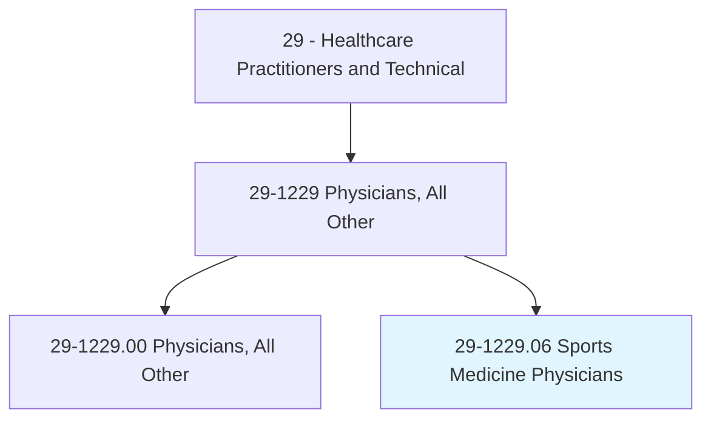
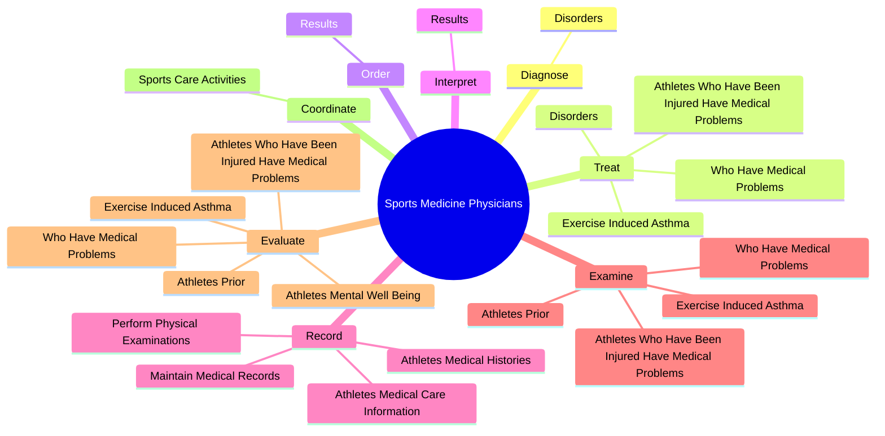

# Sports Medicine Physicians

> Diagnose, treat, and help prevent injuries that occur during sporting events, athletic training, and physical activities.

## Overview

Sports Medicine Physicians is classified under Healthcare Practitioners and Technical (SOC 29). Diagnose, treat, and help prevent injuries that occur during sporting events, athletic training, and physical activities.

## Classification Hierarchy

## Key Statistics

| Metric | Value |
|--------|-------|
| SOC Code | 29-1229.06 |
| Category | [Healthcare Practitioners and Technical](/occupations/HealthcarePractitioners) |
| Task Count | 93 |
| Source | O*NET |

## Core Tasks

### diagnose.Disorders

Sports Medicine Physicians diagnose disorders as part of their core responsibilities.

**Actions:**
- `diagnose.Disorders.of.MusculoskeletalSystem`

### treat.Disorders

Sports Medicine Physicians treat disorders as part of their core responsibilities.

**Actions:**
- `treat.Disorders.of.MusculoskeletalSystem`
- `treat.AthletesWhoHaveBeenInjuredHaveMedicalProblems`
- `treat.ExerciseInducedAsthma`
- `treat.WhoHaveMedicalProblems`

### order.Results

Sports Medicine Physicians order results as part of their core responsibilities.

**Actions:**
- `order.Results.of.LaboratoryTestsImagingProcedures`
- `order.Results.of.DiagnosticImagingProcedures`

## Skills & Competencies

### Technical Skills
- **Clinical Skills** - Advanced
- **Diagnostic Procedures** - Advanced
- **Patient Care** - Advanced

### Soft Skills
- **Communication** - Essential
- **Problem Solving** - Essential
- **Critical Thinking** - Important
- **Teamwork** - Important
- **Adaptability** - Important

## Related Occupations

## Industries

This occupation is found across multiple industries. See [Industries](/industries) for sector-specific employment data.

## Career Progression

---

*Source: O*NET 29-1229.06 - ONETOccupation*
