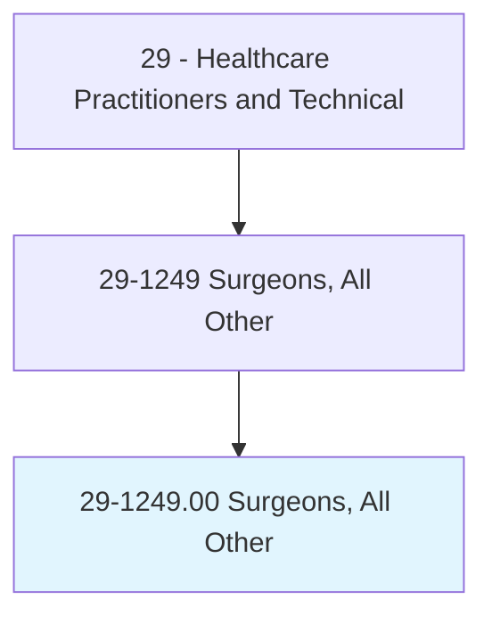
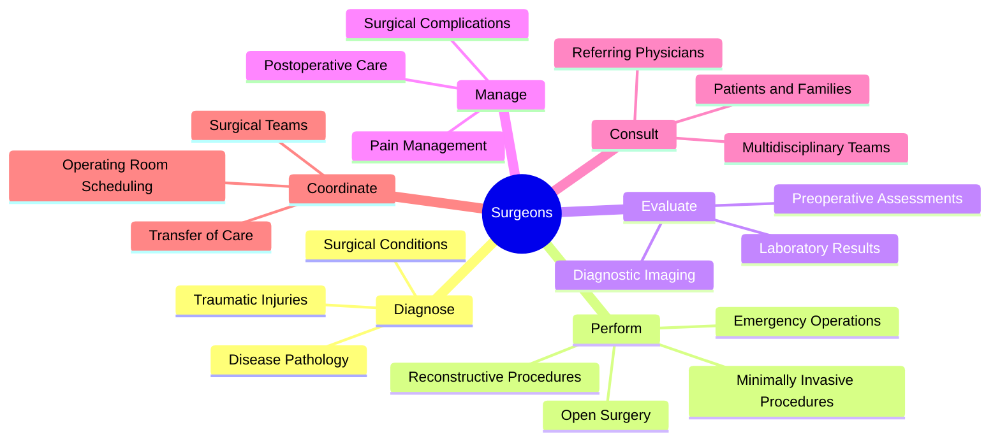
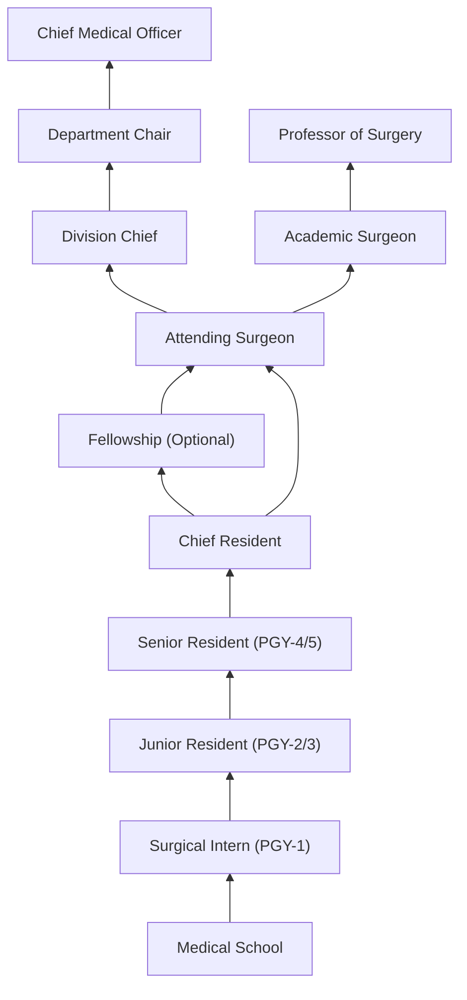
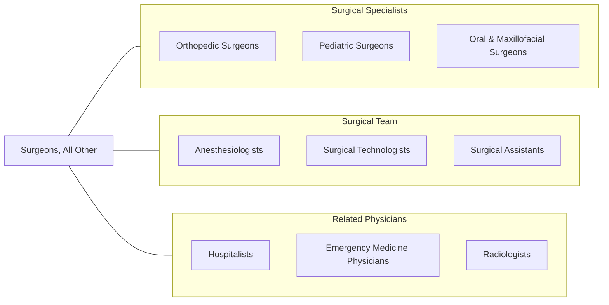

# Surgeons, All Other

> All surgeons not listed separately. Perform surgical procedures to treat injuries, diseases, and deformities using a variety of surgical instruments and techniques across multiple surgical specialties.

## Overview

Surgeons who fall under this classification represent a diverse group of surgical specialists not individually categorized within the standard occupational classification system. These physicians have completed extensive surgical training and perform operative procedures across a range of specialties including general surgery, vascular surgery, thoracic surgery, transplant surgery, trauma surgery, and surgical oncology. They diagnose conditions requiring surgical intervention, perform preoperative evaluations, execute complex surgical procedures, and manage postoperative care.

The role demands exceptional manual dexterity, spatial reasoning, decisive judgment under pressure, and deep anatomical knowledge. Surgeons in this category often work in high-acuity settings where they must rapidly assess clinical situations, determine the most appropriate surgical approach, and execute procedures with precision. They collaborate extensively with anesthesiologists, surgical nurses, radiologists, and other specialists to ensure optimal patient outcomes.

Modern surgical practice increasingly incorporates minimally invasive techniques, robotic-assisted surgery, and image-guided navigation systems. Surgeons must continuously adapt to technological advances while maintaining mastery of traditional open surgical approaches for cases where advanced techniques are not appropriate or available.

## Classification Hierarchy

## Key Statistics

| Metric | Value |
|--------|-------|
| SOC Code | 29-1249.00 |
| Median Annual Salary | $229,300+ |
| Employment | ~45,000 |
| Projected Growth | 3% (2022-2032) |
| Job Zone | 5 (Extensive Preparation) |
| Category | [Healthcare Practitioners](/occupations/HealthcarePractitioners) |
| Task Count | 0 (See specialty categories) |
| Source | O*NET |

## Core Tasks

### diagnose.SurgicalConditions

Surgeons evaluate patients to determine the need for surgical intervention.

**Actions:**
- `diagnose.SurgicalConditions.using.PhysicalExamination` - Assess clinical findings
- `diagnose.SurgicalConditions.using.DiagnosticImaging` - Review CT, MRI, ultrasound
- `diagnose.TraumaticInjuries.in.EmergencySettings` - Evaluate acute trauma
- `evaluate.PatientRisk.for.SurgicalIntervention` - Assess operative risk

### perform.SurgicalProcedures

Surgeons execute operative procedures across multiple specialties.

**Actions:**
- `perform.OpenSurgery.to.treat.Disease` - Traditional surgical approaches
- `perform.MinimallyInvasiveProcedures.using.Laparoscopy` - MIS techniques
- `perform.EmergencyOperations.for.AcuteConditions` - Urgent surgical care
- `perform.ReconstructiveProcedures.to.restore.Function` - Restorative surgery

### manage.PostoperativeCare

Surgeons oversee recovery and manage complications.

**Actions:**
- `manage.PostoperativeCare.for.SurgicalPatients` - Recovery management
- `manage.SurgicalComplications.using.ClinicalProtocols` - Complication management
- `manage.PainManagement.with.MultimodalApproaches` - Pain control
- `coordinate.DischargeP.with.CareTeam` - Transition planning

## Practice Settings

| Setting | Description |
|---------|-------------|
| Hospital Operating Rooms | Primary surgical venue for complex procedures |
| Ambulatory Surgery Centers | Outpatient surgical procedures |
| Trauma Centers | Level I-IV trauma surgical care |
| Academic Medical Centers | Teaching, research, and complex referral cases |
| Veterans Affairs Hospitals | Surgical care for military veterans |
| Private Practice | Independent or group surgical practice |
| Critical Care Units | Surgical ICU management |

## Skills & Competencies

### Technical Skills
- **Surgical Technique** - Expert
- **Anatomy & Physiology** - Expert
- **Diagnostic Imaging Interpretation** - Expert
- **Laparoscopic/Robotic Surgery** - Advanced
- **Critical Care Management** - Advanced
- **Wound Management** - Advanced
- **Hemostasis & Vascular Control** - Expert

### Soft Skills
- **Decision Making Under Pressure** - Critical
- **Manual Dexterity** - Critical
- **Leadership** - Essential
- **Communication** - Essential
- **Teamwork** - Essential
- **Stress Management** - Essential
- **Attention to Detail** - Critical

## Education & Training

| Requirement | Details |
|-------------|---------|
| Undergraduate | 4-year bachelor's degree (pre-med) |
| Medical School | 4-year MD or DO program |
| Residency | 5-7 years (General Surgery or specialty) |
| Fellowship | 1-3 years for subspecialization |
| Total Training | 13-18 years post-high school |
| Licensure | State medical license required |
| Board Certification | American Board of Surgery or relevant specialty board |
| Continuing Education | Minimum 50 CME credits annually |

## Certifications

| Certification | Description |
|---------------|-------------|
| ABS General Surgery | American Board of Surgery certification |
| ABTS Thoracic Surgery | Thoracic and cardiothoracic specialization |
| ABS Vascular Surgery | Vascular surgical certification |
| ABS Surgical Critical Care | Critical care specialization |
| FACS | Fellow of the American College of Surgeons |
| ATLS | Advanced Trauma Life Support |
| ACLS | Advanced Cardiovascular Life Support |

## Career Progression

## Specializations

| Subspecialty | Focus Area |
|-------------|------------|
| Vascular Surgery | Arteries, veins, lymphatic system |
| Thoracic Surgery | Chest organs excluding heart |
| Transplant Surgery | Organ transplantation |
| Surgical Oncology | Cancer resection |
| Trauma Surgery | Acute injury management |
| Bariatric Surgery | Weight loss procedures |
| Endocrine Surgery | Thyroid, parathyroid, adrenal |
| Hepatobiliary Surgery | Liver, gallbladder, bile ducts |

## Technology & Tools

| Technology | Purpose |
|------------|---------|
| Robotic Surgical Systems (da Vinci) | Minimally invasive precision surgery |
| Electrosurgical Units | Tissue cutting and coagulation |
| Surgical Navigation Systems | Image-guided surgery |
| Harmonic Scalpel | Ultrasonic tissue dissection |
| Laparoscopic Towers | Minimally invasive visualization |
| Intraoperative Imaging (C-arm) | Real-time fluoroscopic guidance |
| Electronic Health Records | Documentation and order entry |
| Surgical Scheduling Software | OR management and coordination |

## Related Occupations

## Industries

- [Hospitals](/industries/Healthcare/Hospitals/index) - Primary Employment
- [Ambulatory Surgery Centers](/industries/Healthcare/AmbulatoryHealthCare) - Outpatient Surgery
- [Physician Offices](/industries/Healthcare/PhysicianOffices) - Surgical Practice
- [Academic Medical Centers](/industries/Healthcare/Hospitals/Teaching) - Teaching & Research
- [Veterans Affairs](/industries/Government/Federal) - VA Healthcare System

## Departments

This occupation typically works in:
- [Surgery](/departments/Surgery)
- [Surgical Services](/departments/SurgicalServices)
- [Trauma Services](/departments/TraumaServices)
- [Operating Room](/departments/OperatingRoom)
- [Surgical Intensive Care](/departments/SurgicalICU)

---

*Source: O*NET 29-1249.00 - ONETOccupation*
