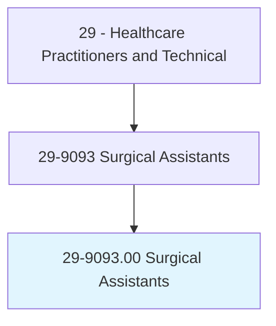
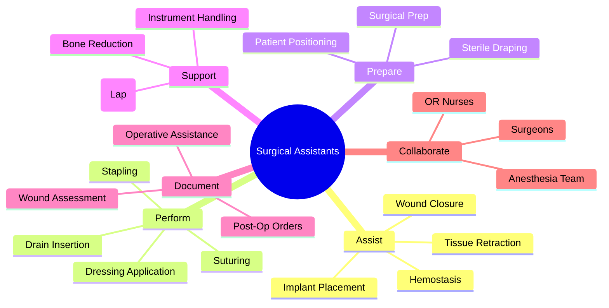
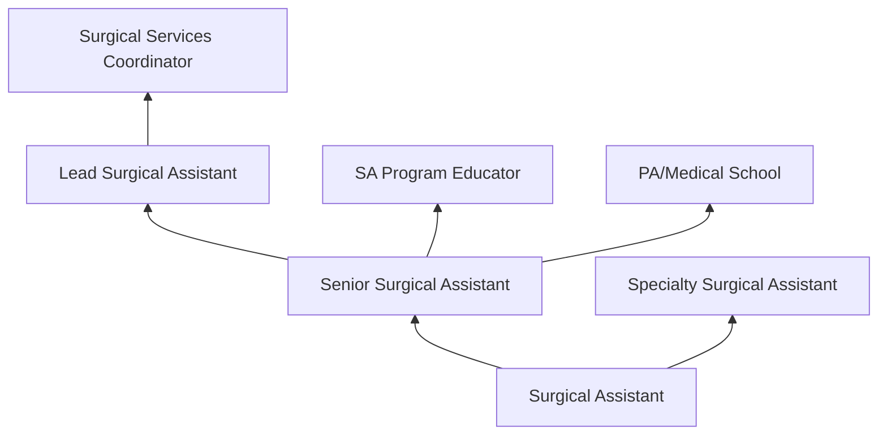
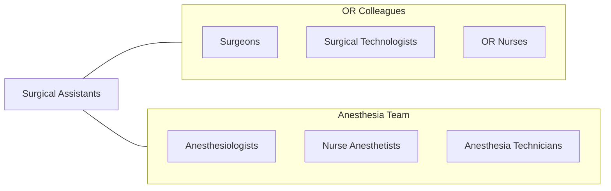

# Surgical Assistants

> Assist in operations, under the supervision of surgeons. May, in accordance with applicable law and regulation, help surgeons to make incisions and close surgical sites, manipulate or remove tissues, implant surgical devices or drain tubes, suture or staple skin, and apply wound dressings.

## Overview

Surgical Assistants are advanced-level perioperative professionals who directly assist surgeons during operative procedures. Unlike surgical technologists who pass instruments and maintain the sterile field, surgical assistants provide hands-on surgical assistance including tissue retraction, hemostasis, wound closure, suturing, tissue manipulation, and assisting with implant placement. They function as an extension of the surgeon, enabling complex procedures to proceed efficiently and safely.

The role requires advanced knowledge of surgical anatomy, operative techniques, instrumentation, and patient physiology. Surgical assistants position patients, prep surgical sites, assist with draping, provide exposure and retraction during procedures, suture and staple incisions, apply dressings, and assist with post-operative patient transport. They work across surgical specialties including general surgery, orthopedics, cardiovascular, neurosurgery, and transplant surgery.

The profession has grown as surgical complexity increases and work-hour restrictions limit resident availability for surgical assistance. Surgical assistants provide consistent, experienced assistance that enhances surgical efficiency, reduces operative time, and improves surgical outcomes. They complement surgical teams in both academic and community hospital settings.

## Classification Hierarchy

## Key Statistics

| Metric | Value |
|--------|-------|
| SOC Code | 29-9093.00 |
| Median Annual Salary | $60,370 |
| Employment | ~18,000 |
| Projected Growth | 8% (2022-2032) |
| Job Zone | 3 (Medium Preparation) |
| Category | [Healthcare Practitioners](/occupations/HealthcarePractitioners) |
| Core Tasks | 25+ |
| Source | O*NET |

## Core Tasks

### assist.SurgicalProcedures

Surgical Assistants provide direct operative support.

**Actions:**
- `retract.Tissue.for.SurgicalExposure` - Surgical retraction
- `achieve.Hemostasis.using.CauteryAndSuture` - Bleeding control
- `close.SurgicalIncisions.using.SutureAndStaple` - Wound closure
- `assist.WithImplantPlacement.during.OrthopedicSurgery` - Implant support

### prepare.SurgicalSite

Surgical Assistants ready patients for surgery.

**Actions:**
- `position.Patients.for.OptimalSurgicalAccess` - Patient positioning
- `prep.SurgicalSite.using.AntisepticTechnique` - Surgical prep
- `apply.SterileWoundDressings.after.Procedures` - Dressing application
- `insert.SurgicalDrains.per.SurgeonDirections` - Drain placement

## Practice Settings

| Setting | Description |
|---------|-------------|
| Hospital Operating Rooms | Inpatient surgical assistance |
| Ambulatory Surgery Centers | Outpatient surgical support |
| Trauma Centers | Emergency surgical assistance |
| Academic Medical Centers | Teaching hospital OR |
| Cardiac Surgery | Cardiovascular surgical support |
| Orthopedic Surgery | Musculoskeletal surgical support |

## Skills & Competencies

### Technical Skills
- **Surgical Assistance** - Expert
- **Suturing and Wound Closure** - Expert
- **Hemostasis Techniques** - Expert
- **Surgical Anatomy** - Expert
- **Patient Positioning** - Advanced
- **Sterile Technique** - Expert
- **Laparoscopic Camera Operation** - Advanced

### Soft Skills
- **Teamwork** - Critical
- **Anticipation** - Essential
- **Composure Under Pressure** - Essential
- **Communication** - Essential
- **Adaptability** - Essential

## Education & Training

| Requirement | Details |
|-------------|---------|
| Education | Associate or bachelor's degree in surgical assisting |
| Clinical Training | Accredited surgical assisting program |
| Certification | CSA or CSFA credential |
| State Regulations | Vary by state |
| BLS/ACLS | Required |

## Certifications

| Certification | Description |
|---------------|-------------|
| CSA | Certified Surgical Assistant (NSAA) |
| CSFA | Certified Surgical First Assistant (NBSTSA) |
| SA-C | Surgical Assistant - Certified (ABSA) |
| BLS/ACLS | Life support certifications |

## Career Progression

## Technology & Tools

| Technology | Purpose |
|------------|---------|
| Electrosurgical Devices | Hemostasis and cutting |
| Laparoscopic Instruments | Minimally invasive surgery |
| Suture Materials | Wound closure |
| Retraction Systems | Surgical exposure |
| Surgical Stapling Devices | Wound/tissue closure |
| Headlights and Magnification | Surgical visualization |

## Related Occupations

## Industries

- [Hospitals](/industries/Healthcare/Hospitals/index) - Surgical Services
- [Ambulatory Surgery](/industries/Healthcare/AmbulatoryHealthCare) - Outpatient Surgery
- [Academic](/industries/Education) - Teaching Hospitals

## Departments

This occupation typically works in:
- [Operating Room](/departments/OperatingRoom)
- [Surgical Services](/departments/SurgicalServices)
- [Perioperative Services](/departments/PerioperativeServices)

---

*Source: O*NET 29-9093.00 - ONETOccupation*
