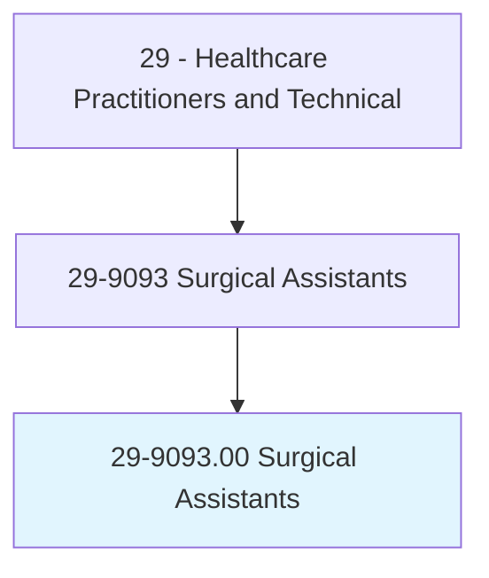
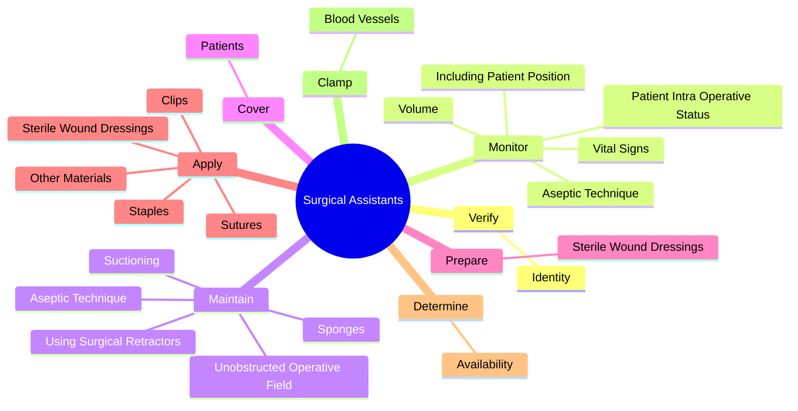
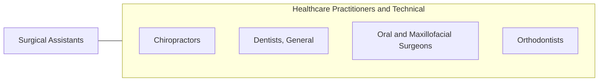

# Surgical Assistants

> Assist in operations, under the supervision of surgeons. May, in accordance with state laws, help surgeons to make incisions and close surgical sites, manipulate or remove tissues, implant surgical devices or drains, suction the surgical site, place catheters, clamp or cauterize vessels or tissue, and apply dressings to surgical site.

## Overview

Surgical Assistants is an occupation within the Healthcare Practitioners and Technical category. Assist in operations, under the supervision of surgeons. 

## Classification Hierarchy

## Key Statistics

| Metric | Value |
|--------|-------|
| SOC Code | 29-9093.00 |
| Category | [Healthcare Practitioners and Technical](/occupations/HealthcarePractitioners) |
| Task Count | 79 |
| Source | O*NET |

## Core Tasks

### verify.Identity

Surgical Assistants verify identity as part of their core responsibilities.

**Actions:**
- `verify.Identity.of.PatientSite`
- `verify.Identity.of.OperativeSite`

### monitor.AsepticTechnique

Surgical Assistants monitor aseptic technique as part of their core responsibilities.

**Actions:**
- `monitor.AsepticTechnique.throughout.Procedures`
- `monitor.PatientIntraOperativeStatus.of.Blood`
- `monitor.IncludingPatientPosition.of.Blood`
- `monitor.VitalSigns.of.Blood`

### maintain.AsepticTechnique

Surgical Assistants maintain aseptic technique as part of their core responsibilities.

**Actions:**
- `maintain.AsepticTechnique.throughout.Procedures`
- `maintain.UnobstructedOperativeField`
- `maintain.UsingSurgicalRetractors`
- `maintain.Sponges`

## Skills & Competencies

### Technical Skills
- **Clinical Skills** - Advanced
- **Diagnostic Procedures** - Advanced
- **Patient Care** - Advanced

### Soft Skills
- **Communication** - Essential
- **Problem Solving** - Essential
- **Critical Thinking** - Important
- **Teamwork** - Important
- **Adaptability** - Important

## Related Occupations

## Industries

This occupation is found across multiple industries. See [Industries](/industries) for sector-specific employment data.

## Career Progression

---

*Source: O*NET 29-9093.00 - ONETOccupation*
