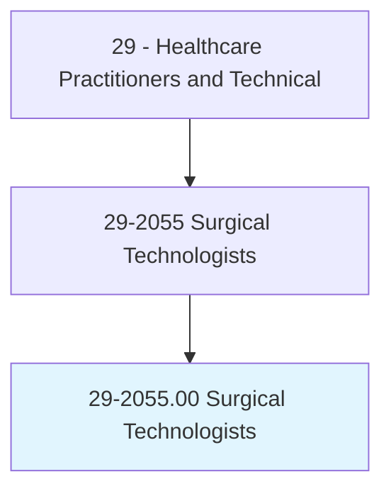
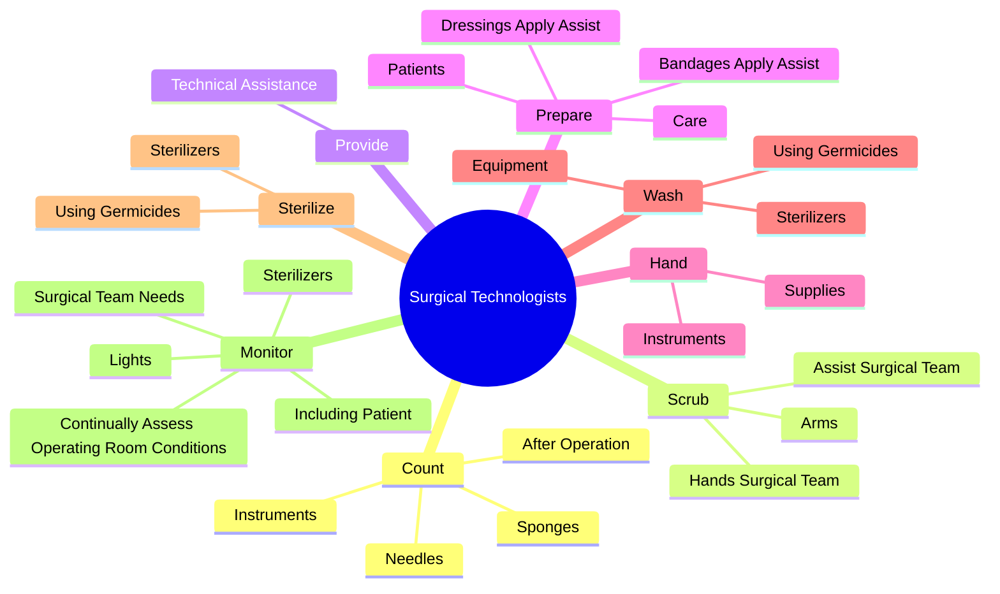
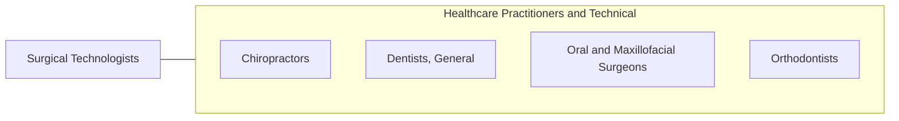

# Surgical Technologists

> Assist in operations, under the supervision of surgeons, registered nurses, or other surgical personnel. May help set up operating room, prepare and transport patients for surgery, adjust lights and equipment, pass instruments and other supplies to surgeons and surgeons' assistants, hold retractors, cut sutures, and help count sponges, needles, supplies, and instruments.

## Overview

Surgical Technologists is an occupation within the Healthcare Practitioners and Technical category. Assist in operations, under the supervision of surgeons, registered nurses, or other surgical personnel. 

## Classification Hierarchy

## Key Statistics

| Metric | Value |
|--------|-------|
| SOC Code | 29-2055.00 |
| Category | [Healthcare Practitioners and Technical](/occupations/HealthcarePractitioners) |
| Task Count | 87 |
| Source | O*NET |

## Core Tasks

### count.Sponges

Surgical Technologists count sponges as part of their core responsibilities.

**Actions:**
- `count.Sponges`
- `count.Needles`
- `count.Instruments.before`
- `count.AfterOperation`

### scrub.Arms

Surgical Technologists scrub arms as part of their core responsibilities.

**Actions:**
- `scrub.Arms.to.scrub.OnGloves`
- `scrub.Arms.to.put.OnGloves`
- `scrub.Arms.to.masks`
- `scrub.Arms.to.SurgicalClothing`

### provide.TechnicalAssistance

Surgical Technologists provide technical assistance as part of their core responsibilities.

**Actions:**
- `provide.TechnicalAssistance.to.Surgeons`
- `provide.TechnicalAssistance.to.SurgicalNurses`
- `provide.TechnicalAssistance.to.Anesthesiologists`

## Skills & Competencies

### Technical Skills
- **Clinical Skills** - Advanced
- **Diagnostic Procedures** - Advanced
- **Patient Care** - Advanced

### Soft Skills
- **Communication** - Essential
- **Problem Solving** - Essential
- **Critical Thinking** - Important
- **Teamwork** - Important
- **Adaptability** - Important

## Related Occupations

## Industries

This occupation is found across multiple industries. See [Industries](/industries) for sector-specific employment data.

## Career Progression

---

*Source: O*NET 29-2055.00 - ONETOccupation*
