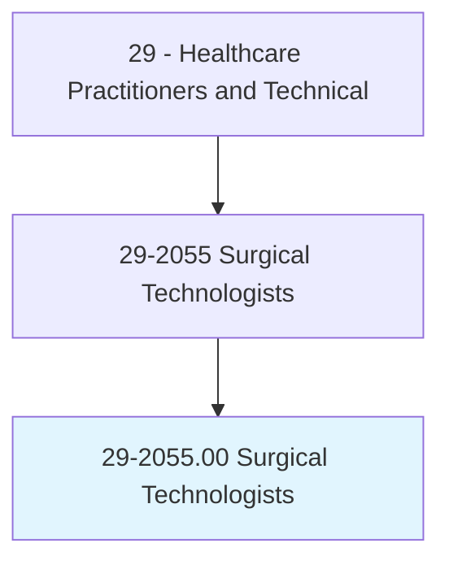
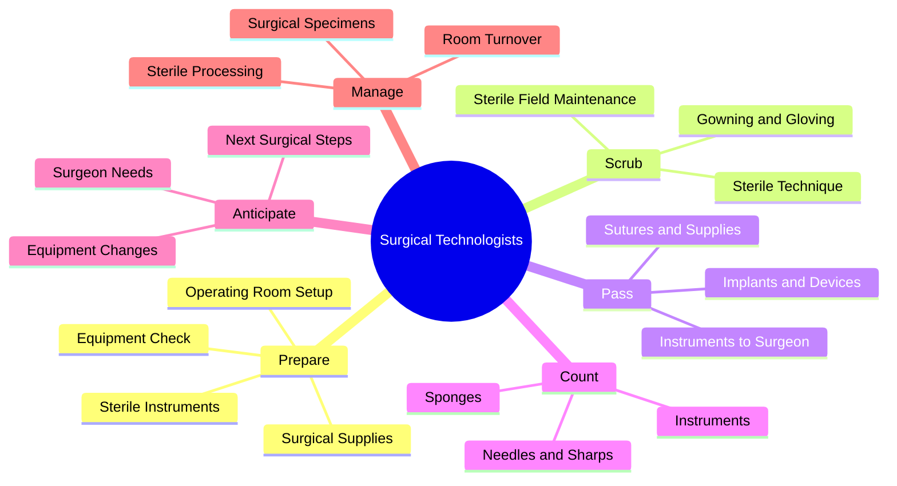
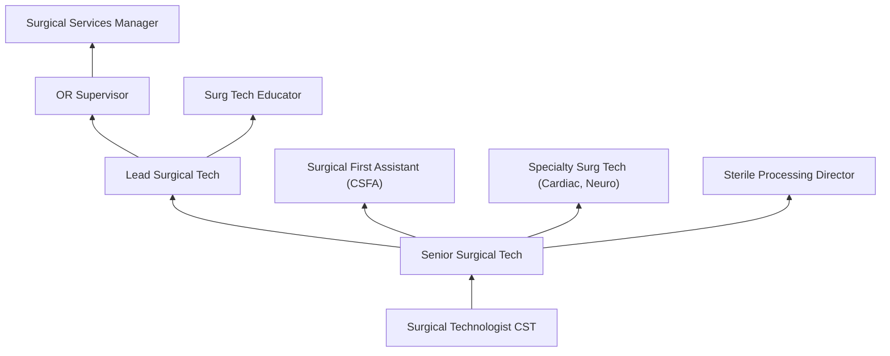
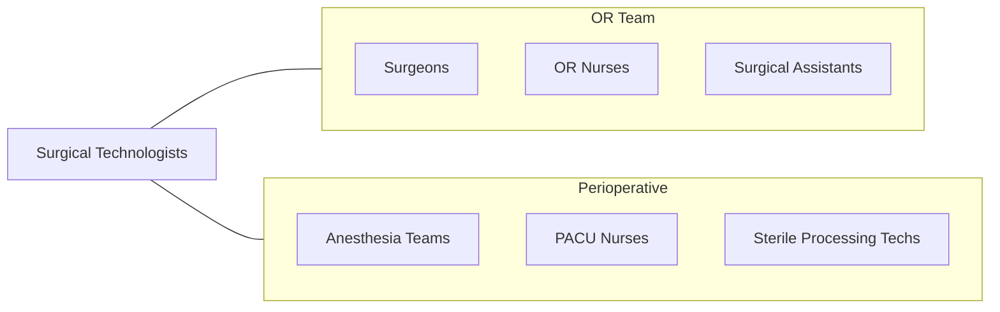

# Surgical Technologists

> Assist in operations, under the supervision of surgeons, registered nurses, or other surgical personnel. May help set up operating room, prepare and transport patients for surgery, adjust lights and equipment, pass instruments and other supplies to surgeons and surgeons' assistants, hold retractors, cut sutures, and help count sponges, needles, supplies, and instruments.

## Overview

Surgical Technologists (also called Scrub Techs or Operating Room Technicians) are integral members of the surgical team who prepare operating rooms, arrange sterile instruments and equipment, maintain the sterile field during surgery, and pass instruments and supplies to surgeons and surgical assistants. They ensure that all equipment and supplies needed for each procedure are available, properly sterilized, and organized for efficient surgical workflow.

The role requires knowledge of surgical procedures, surgical anatomy, sterile technique, instrumentation, and surgical safety protocols. Surgical technologists scrub and gown for the sterile role, prepare the sterile field and back table, anticipate surgeon needs during procedures, manage surgical specimens, count instruments and sponges to prevent retained items, and ensure all surgical safety checklists (WHO Surgical Safety Checklist) are completed. They work across all surgical specialties.

Modern surgical technology has expanded with robotic surgery (da Vinci system), advanced energy devices, minimally invasive and endoscopic procedures, hybrid operating rooms, and sophisticated surgical navigation systems. Surgical technologists must master increasingly complex instrumentation and technology while maintaining the fundamental principles of aseptic technique and patient safety.

## Classification Hierarchy

## Key Statistics

| Metric | Value |
|--------|-------|
| SOC Code | 29-2055.00 |
| Median Annual Salary | $56,350 |
| Employment | ~115,000 |
| Projected Growth | 5% (2022-2032) |
| Job Zone | 3 (Medium Preparation) |
| Category | [Healthcare Practitioners](/occupations/HealthcarePractitioners) |
| Core Tasks | 30+ |
| Source | O*NET |

## Core Tasks

### prepare.OperatingRoom

Surgical Technologists set up for procedures.

**Actions:**
- `prepare.SterileField.for.SurgicalProcedure` - Sterile setup
- `arrange.SurgicalInstruments.per.PreferenceCards` - Instrument organization
- `verify.EquipmentFunction.before.SurgeryStart` - Equipment check
- `assist.WithPatientPositioning.for.SurgicalAccess` - Patient prep

### maintain.SterileField

Surgical Technologists ensure intraoperative sterility and safety.

**Actions:**
- `pass.InstrumentsToSurgeon.anticipating.ProcedureNeeds` - Instrument passing
- `count.InstrumentsAndSponges.for.PatientSafety` - Surgical counts
- `manage.SurgicalSpecimens.for.PathologySubmission` - Specimen handling
- `maintain.SterileTechnique.throughout.Procedure` - Sterile maintenance

## Practice Settings

| Setting | Description |
|---------|-------------|
| Hospital Operating Rooms | Inpatient surgical services |
| Ambulatory Surgery Centers | Outpatient surgery |
| Trauma Centers | Emergency surgical support |
| Labor and Delivery | Cesarean section support |
| Cardiac Surgery Suites | Cardiovascular OR |
| Sterile Processing | Instrument reprocessing |

## Skills & Competencies

### Technical Skills
- **Sterile Technique** - Expert
- **Surgical Instrumentation** - Expert
- **Surgical Anatomy** - Advanced
- **Equipment Operation** - Advanced
- **Specimen Management** - Advanced
- **Surgical Counting** - Expert
- **Robotic Surgery Setup** - Advanced

### Soft Skills
- **Anticipation** - Critical
- **Teamwork** - Essential
- **Composure Under Pressure** - Essential
- **Attention to Detail** - Critical
- **Adaptability** - Essential

## Education & Training

| Requirement | Details |
|-------------|---------|
| Education | Certificate or associate degree in surgical technology |
| Clinical Training | CAAHEP-accredited program |
| Certification | CST through NBSTSA |
| Continuing Education | Per certification requirements |

## Certifications

| Certification | Description |
|---------------|-------------|
| CST | Certified Surgical Technologist (NBSTSA) |
| TS-C | Tech in Surgery - Certified (NCCT) |
| CSFA | Certified Surgical First Assistant (advancement) |
| BLS | Basic Life Support |

## Career Progression

## Specializations

| Focus Area | Description |
|------------|-------------|
| Cardiac Surgery | Open heart and vascular |
| Neurosurgery | Brain and spine surgery |
| Orthopedic Surgery | Bone and joint procedures |
| Robotic Surgery | da Vinci and robotic platforms |
| Transplant Surgery | Organ transplantation |
| Ophthalmology | Eye surgery |

## Technology & Tools

| Technology | Purpose |
|------------|---------|
| Surgical Instruments (General and Specialty) | Procedure-specific tools |
| Robotic Surgery Systems (da Vinci) | Robotic-assisted surgery |
| Electrosurgical Units (Bovie) | Cutting and cautery |
| Laparoscopic/Endoscopic Equipment | Minimally invasive surgery |
| Surgical Navigation Systems | Computer-guided surgery |
| Sterilization Equipment (autoclaves) | Instrument processing |
| Surgical Safety Checklists | Patient safety |

## Related Occupations

## Industries

- [Hospitals](/industries/Healthcare/Hospitals/index) - Surgical Services
- [Ambulatory Surgery](/industries/Healthcare/AmbulatoryHealthCare) - Outpatient Surgery
- [Dental Surgery](/industries/Healthcare/DentalOffices) - Oral Surgery
- [Academic](/industries/Education) - Teaching Hospitals

## Departments

This occupation typically works in:
- Operating Room
- Surgical Services
- Ambulatory Surgery
- Sterile Processing

---

*Source: O*NET 29-2055.00 - ONETOccupation*
