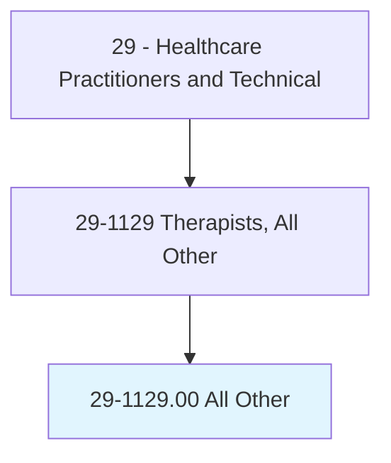
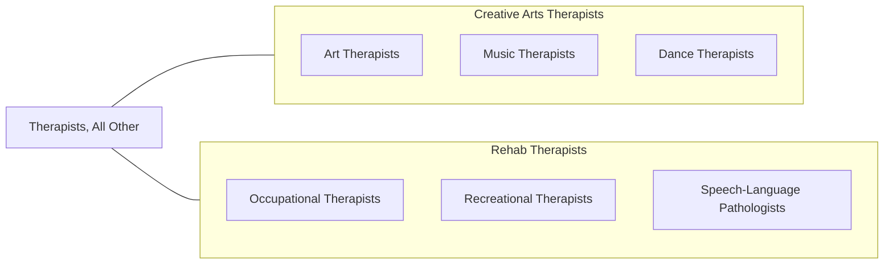

# Therapists, All Other

> All therapists not listed separately.

## Overview

Therapists, All Other is a residual category encompassing licensed therapeutic professionals not separately classified in the SOC system. This includes art therapists, music therapists, dance/movement therapists, drama therapists, horticultural therapists, animal-assisted therapists, play therapists, and other creative arts and specialized therapy practitioners who use evidence-based therapeutic interventions to address physical, cognitive, emotional, and social needs.

These therapists typically hold master's degrees in their specific discipline, maintain board certification, and practice within defined scopes of treatment. They assess patient functioning, develop individualized treatment plans, implement therapeutic interventions using their specialized modality, and evaluate treatment outcomes. Creative arts therapists are increasingly integrated into medical, psychiatric, rehabilitative, and educational settings.

The field continues to evolve with neuroscience-informed practice, telehealth delivery of therapeutic services, integration into palliative care and oncology programs, and growing evidence bases for specific therapeutic modalities in treating trauma, dementia, autism, and chronic conditions.

## Classification Hierarchy

## Key Statistics

| Metric | Value |
|--------|-------|
| SOC Code | 29-1129.00 |
| Median Annual Salary | $55,300 |
| Employment | ~25,000 |
| Projected Growth | 12% (2022-2032) |
| Job Zone | 5 (Extensive Preparation) |
| Category | [Healthcare Practitioners](/occupations/HealthcarePractitioners) |
| Source | O*NET |

## Included Occupations

| Specialty | SOC Code |
|-----------|----------|
| [Art Therapists](/occupations/HealthcarePractitioners/ArtTherapists) | 29-1129.01 |
| [Music Therapists](/occupations/HealthcarePractitioners/MusicTherapists) | 29-1129.02 |
| Dance/Movement Therapists | 29-1129.XX |
| Drama Therapists | 29-1129.XX |
| Other Therapists | Various |

## Related Occupations

## Industries

- [Hospitals](/industries/Healthcare/Hospitals/index) - Medical and Psychiatric
- [Nursing Facilities](/industries/Healthcare/NursingCare) - Geriatric Therapy
- [Schools](/industries/Education/ElementarySecondary) - Educational Therapy
- [Mental Health](/industries/Healthcare/AmbulatoryHealthCare) - Behavioral Health

## Departments

This occupation category typically works in:
- Creative Arts Therapies
- Rehabilitation Services
- Behavioral Health

---

*Source: O*NET 29-1129.00 - ONETOccupation*
