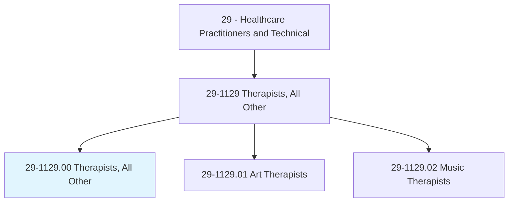
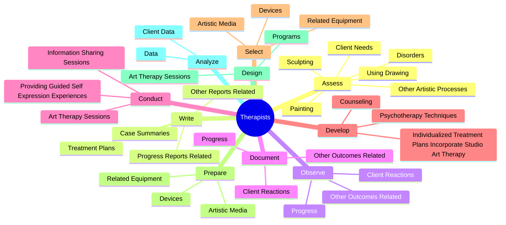
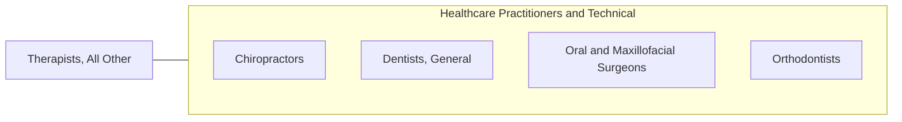

# Therapists, All Other

> All therapists not listed separately.

## Overview

Therapists, All Other is classified under Healthcare Practitioners and Technical (SOC 29). All therapists not listed separately.

## Classification Hierarchy

## Key Statistics

| Metric | Value |
|--------|-------|
| SOC Code | 29-1129.00 |
| Category | [Healthcare Practitioners and Technical](/occupations/HealthcarePractitioners) |
| Task Count | 115 |
| Source | O*NET |

## Core Tasks

### assess.ClientNeeds

Therapists, All Other assess client needs as part of their core responsibilities.

**Actions:**
- `assess.ClientNeeds`
- `assess.Disorders`
- `assess.UsingDrawing`
- `assess.Painting`

### write.TreatmentPlans

Therapists, All Other write treatment plans as part of their core responsibilities.

**Actions:**
- `write.TreatmentPlans.to.IndividualClientsGroups`
- `write.TreatmentPlans.to.ClientGroups`
- `write.CaseSummaries.to.IndividualClientsGroups`
- `write.CaseSummaries.to.ClientGroups`

### observe.ClientReactions

Therapists, All Other observe client reactions as part of their core responsibilities.

**Actions:**
- `observe.ClientReactions.to.ArtTherapy`
- `observe.Progress.to.ArtTherapy`
- `observe.OtherOutcomesRelated.to.ArtTherapy`

## Skills & Competencies

### Technical Skills
- **Clinical Skills** - Advanced
- **Diagnostic Procedures** - Advanced
- **Patient Care** - Advanced

### Soft Skills
- **Communication** - Essential
- **Problem Solving** - Essential
- **Critical Thinking** - Important
- **Teamwork** - Important
- **Adaptability** - Important

## Related Occupations

## Industries

This occupation is found across multiple industries. See [Industries](/industries) for sector-specific employment data.

## Career Progression

---

*Source: O*NET 29-1129.00 - ONETOccupation*
