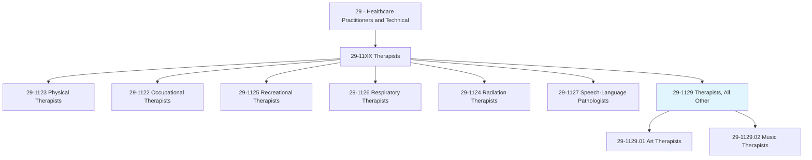
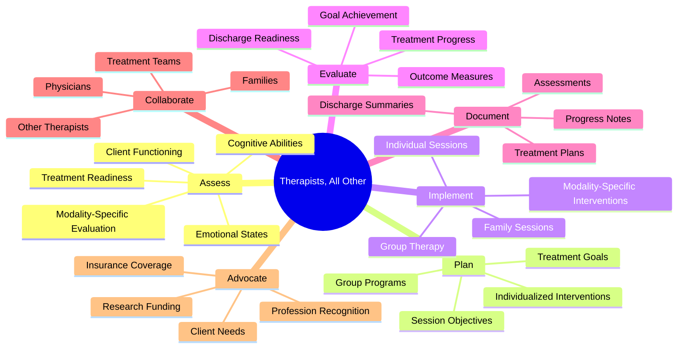
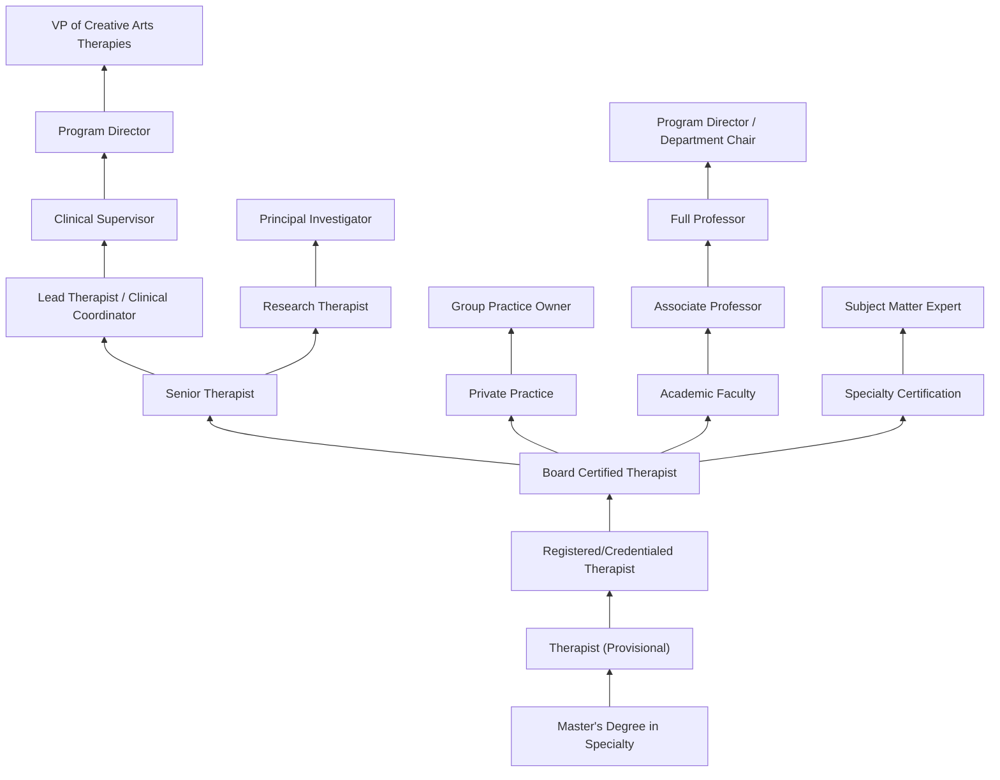
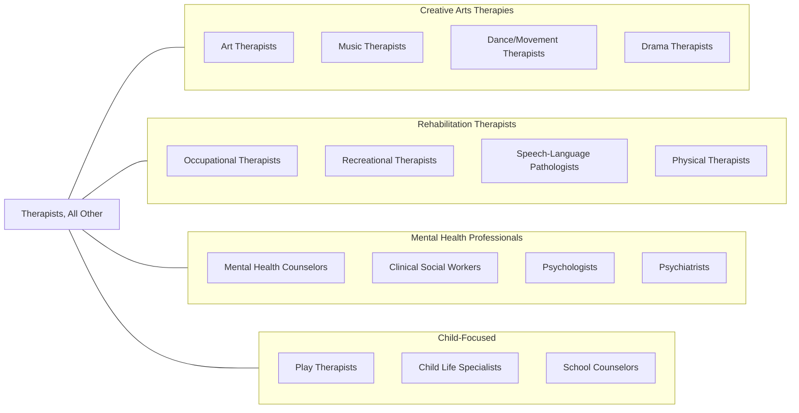

# Therapists, All Other

> All therapists not listed separately.

## Overview

Therapists, All Other is a residual category encompassing licensed therapeutic professionals not separately classified in the SOC system. This includes art therapists, music therapists, dance/movement therapists, drama therapists, horticultural therapists, animal-assisted therapists, play therapists, expressive arts therapists, poetry therapists, and other creative arts and specialized therapy practitioners who use evidence-based therapeutic interventions to address physical, cognitive, emotional, and social needs across the lifespan.

These therapists typically hold master's degrees in their specific discipline, maintain board certification or professional registration, and practice within defined scopes of treatment. They assess patient functioning through both clinical interviews and modality-specific observations, develop individualized treatment plans with measurable goals, implement therapeutic interventions using their specialized modality, and evaluate treatment outcomes. Creative arts therapists are increasingly integrated into medical, psychiatric, rehabilitative, educational, and community settings as research validates the neurobiological and psychological mechanisms underlying expressive therapeutic interventions.

The field continues to evolve with neuroscience-informed practice, trauma-informed approaches, telehealth delivery of therapeutic services, integration into palliative care and oncology programs, and growing evidence bases for specific therapeutic modalities in treating trauma, dementia, autism spectrum disorders, and chronic medical conditions. The creative arts therapies represent a distinct professional identity from recreational or activity-based programs, requiring clinical training, supervised practice, and professional credentialing.

## Classification Hierarchy

## Key Statistics

| Metric | Value |
|--------|-------|
| SOC Code | 29-1129.00 |
| Median Annual Salary | $55,300 |
| Employment | ~25,000 |
| Projected Growth | 12% (2022-2032) |
| Job Zone | 5 (Extensive Preparation) |
| Category | [Healthcare Practitioners](/occupations/HealthcarePractitioners) |
| Source | O*NET |

## Sub-Occupations

### Classified Sub-Occupations

| Occupation | SOC Code | Description | Link |
|-----------|----------|-------------|------|
| Art Therapists | 29-1129.01 | Plan and conduct art therapy sessions to improve clients' physical, cognitive, or emotional well-being | [View Details](/occupations/HealthcarePractitioners/ArtTherapists) |
| Music Therapists | 29-1129.02 | Plan, organize, and direct clinical music therapy interventions to positively influence patients' psychological, cognitive, or behavioral status | [View Details](/occupations/HealthcarePractitioners/MusicTherapists) |

### Additional Therapist Specialties in This Category

| Specialty | Description | Primary Modality |
|-----------|-------------|------------------|
| Dance/Movement Therapists | Use movement and dance to support emotional, cognitive, and physical integration | Body movement, dance |
| Drama Therapists | Use theater techniques and role-play for psychological growth and healing | Dramatic arts, improvisation |
| Poetry/Bibliotherapy Therapists | Use literature, poetry writing, and reading as therapeutic interventions | Written and spoken word |
| Horticultural Therapists | Use gardening and plant-based activities for therapeutic outcomes | Plants, gardening |
| Animal-Assisted Therapists | Incorporate animals into treatment for emotional and physical benefits | Animal interaction |
| Play Therapists | Use play as the primary communication medium for children's emotional expression | Play, toys, games |
| Sandplay/Sand Tray Therapists | Use miniature figures in sand as symbolic communication | Sand tray, miniatures |
| Expressive Arts Therapists | Integrate multiple creative arts modalities in treatment | Multimodal arts |
| Equine-Assisted Therapists | Use horses in therapeutic interventions | Horses, riding |
| Adventure Therapists | Use outdoor experiences and challenge activities for therapeutic outcomes | Outdoor activities |

## Core Tasks

### assess.ClientFunctioning

Therapists evaluate clients through clinical and modality-specific methods.

**Actions:**
- `assess.ClientNeeds.using.ClinicalInterview` - Intake assessment
- `assess.EmotionalStates.through.ModalityExpression` - Expressive evaluation
- `assess.CognitiveFunction.using.ObservationalMethods` - Cognitive screening
- `identify.TreatmentGoals.based.on.ClientPresentation` - Goal formulation

### plan.TherapeuticInterventions

Therapists design individualized treatment programs using specialized modalities.

**Actions:**
- `plan.TreatmentSessions.for.IndividualClients` - Individual planning
- `plan.GroupPrograms.for.SharedTherapeuticGoals` - Group design
- `develop.TreatmentPlans.with.MeasurableGoals` - Goals documentation
- `select.ModalityInterventions.based.on.ClinicalIndicators` - Intervention selection

### implement.ModalityBasedTreatment

Therapists deliver therapeutic interventions using their specialized expressive modality.

**Actions:**
- `facilitate.ExpressionThroughModality.for.TherapeuticProcessing` - Expressive therapy
- `conduct.GroupTherapy.using.CreativeArtsActivities` - Group work
- `interpret.ClientExpressions.for.ClinicalInsight` - Therapeutic interpretation
- `adapt.Interventions.to.ClientResponses` - Responsive treatment

## Common Skills Across the Group

### Clinical Skills

| Skill | Proficiency Level | Description |
|-------|-------------------|-------------|
| Clinical Assessment | Expert | Evaluation through observation, interview, and modality-specific methods |
| Treatment Planning | Expert | Developing individualized goals and intervention strategies |
| Therapeutic Relationship | Expert | Establishing rapport and maintaining therapeutic boundaries |
| Group Facilitation | Advanced-Expert | Leading therapeutic groups using creative modalities |
| Crisis Intervention | Advanced | Responding to emotional crises and safety concerns |
| Clinical Documentation | Advanced | Writing assessments, treatment plans, and progress notes |
| Cultural Competence | Advanced | Adapting treatment across diverse populations |
| Trauma-Informed Practice | Advanced | Recognizing and responding to trauma presentations |

### Modality Skills

| Skill | Application |
|-------|-------------|
| Arts/Music/Movement Proficiency | Technical skill in primary expressive modality |
| Improvisation | Spontaneous creative response to client expression |
| Symbolic Interpretation | Understanding metaphor and symbolism in creative expression |
| Activity Analysis | Breaking down activities for therapeutic application |
| Adaptation Skills | Modifying activities for diverse abilities and needs |

### Soft Skills

| Skill | Importance | Application |
|-------|------------|-------------|
| Empathy & Compassion | Critical | Creating safety for vulnerable emotional expression |
| Creativity | Critical | Developing and adapting therapeutic interventions |
| Patience | Essential | Allowing therapeutic process to unfold |
| Observational Skills | Critical | Noticing nonverbal and expressive communication |
| Flexibility | Essential | Adapting to client needs in the moment |
| Self-Awareness | Essential | Managing countertransference and personal reactions |
| Cultural Sensitivity | Essential | Respecting diverse backgrounds and beliefs |

## Education & Training

| Requirement | Details |
|-------------|---------|
| Undergraduate | Bachelor's degree in related field (psychology, arts, human services) |
| Graduate | Master's degree in specific therapy discipline (2-3 years, 60+ credits) |
| Clinical Hours | 600-1,500 supervised direct client contact hours |
| Practicum/Internship | 100-1,000+ hours during graduate program |
| Licensure | State-specific (LCAT, LPAT, LPC, or equivalent) |
| Board Certification | Discipline-specific national credential |
| Continuing Education | Typically 20-50 hours per renewal cycle |

### Graduate Program Requirements by Discipline

| Discipline | Typical Degree | Accrediting Body | Program Hours |
|------------|---------------|------------------|---------------|
| Art Therapy | MA Art Therapy | CAAHEP/AATA | 60+ credits |
| Music Therapy | MM Music Therapy | AMTA/NASM | 60+ credits |
| Dance/Movement Therapy | MA Dance/Movement Therapy | ADTA | 60+ credits |
| Drama Therapy | MA Drama Therapy | NADTA | 60+ credits |
| Play Therapy | MA Counseling + RPT | APT | Counseling degree + play therapy training |

## Certifications

| Certification | Discipline | Certifying Body | Requirements |
|---------------|------------|-----------------|--------------|
| ATR | Art Therapy | ATCB | Master's degree + supervised hours |
| ATR-BC | Art Therapy (Board Certified) | ATCB | ATR + exam |
| MT-BC | Music Therapy | CBMT | Bachelor's/Master's + 1,200 hours + exam |
| BC-DMT | Dance/Movement Therapy | DMTCB | Master's + 3,640 hours |
| RDT | Drama Therapy | NADTA | Master's + supervised hours |
| RPT | Play Therapy | APT | Licensed mental health professional + play therapy training |
| HTR | Horticultural Therapy | AHTA | Bachelor's + 480 hours + exam |
| LCAT | Creative Arts Therapy License | State boards | State-specific requirements |

## Career Progression

### Career Pathways

| Pathway | Typical Timeline | Key Milestones |
|---------|-----------------|----------------|
| Clinical Practice | 5-15 years | Provisional > Registered > BC > Senior > Supervisor |
| Private Practice | 3-10 years | Gain experience > Build caseload > Expand services |
| Academic | 5-20 years | Doctoral degree > Lecturer > Assistant > Associate > Full Professor |
| Administration | 10-20 years | Clinical > Supervisor > Manager > Director > VP |
| Research | 5-15 years | Clinical > Research position > Grant funding > PI |

## Specializations

| Focus Area | Client Population | Treatment Focus |
|------------|-------------------|-----------------|
| Trauma & PTSD | Trauma survivors | Processing traumatic experiences through creative expression |
| Child & Adolescent | Children, teens | Age-appropriate expression and developmental support |
| Geriatric/Dementia | Older adults | Cognitive stimulation, memory care, quality of life |
| Oncology | Cancer patients | Coping with diagnosis, treatment, and survivorship |
| Hospice/Palliative | End-of-life patients | Comfort, meaning-making, legacy work |
| Substance Abuse | Addiction recovery | Expression of emotions, coping skills, relapse prevention |
| Autism Spectrum | Neurodiverse individuals | Social communication, sensory integration, self-expression |
| Medical/Hospital | Medical patients | Procedural support, pain management, coping |
| Mental Health | Psychiatric patients | Emotional regulation, insight, symptom management |
| Forensic | Correctional populations | Anger management, social skills, rehabilitation |
| Developmental Disabilities | DD populations | Life skills, communication, social engagement |

## Practice Settings

| Setting | Description | Common Modalities |
|---------|-------------|-------------------|
| Mental Health Centers | Outpatient counseling and therapy | All creative arts therapies |
| Hospitals (Psychiatric Units) | Inpatient psychiatric care | Art, music, recreational |
| Hospitals (Medical) | Medical inpatient services | Music, art therapy |
| Schools | Student counseling and special education | Art, music, play therapy |
| Rehabilitation Centers | Physical and cognitive rehabilitation | Music, recreational therapy |
| Nursing Homes | Geriatric care and memory units | Music, art, horticultural |
| Hospice Programs | End-of-life care | Music, art therapy |
| Veterans Affairs | Military trauma and PTSD treatment | All modalities |
| Correctional Facilities | Inmate mental health services | Art, drama therapy |
| Private Practice | Independent therapy practice | All modalities |
| Community Programs | Nonprofit and community organizations | Various modalities |
| Early Intervention | Birth-to-three programs | Music, play therapy |

## Industry Context

### Healthcare Settings Employment Distribution

| Industry | % of Employment | Key Characteristics |
|----------|----------------|---------------------|
| Hospitals (Medical & Psychiatric) | 25% | Integrated healthcare teams, shift work |
| Mental Health Centers | 20% | Outpatient treatment, caseload management |
| Schools & Educational Services | 15% | School-year calendar, IEP involvement |
| Nursing Care Facilities | 15% | Geriatric focus, quality of life programs |
| Private Practice | 10% | Independent business, fee-for-service |
| Government/VA | 5% | Federal employment, specialized populations |
| Residential Programs | 5% | Substance abuse, developmental disabilities |
| Other Settings | 5% | Hospice, community programs, research |

### Workforce Trends

- **Telehealth Expansion**: Virtual creative arts therapy delivery becoming standard practice
- **Evidence-Based Practice**: Increased emphasis on research-supported interventions
- **Insurance Recognition**: Growing but variable reimbursement for creative arts therapies
- **Trauma-Informed Care**: Integration of trauma awareness across all practice settings
- **Medical Integration**: Creative arts therapists joining medical treatment teams
- **Neuroscience Foundation**: Research validating neurobiological mechanisms of creative therapies
- **Diversity & Inclusion**: Emphasis on culturally responsive and anti-racist practice

## Related Occupations

### Related Occupation Links

| Occupation | Relationship | Link |
|------------|--------------|------|
| Art Therapists | Sub-occupation | [View](/occupations/HealthcarePractitioners/ArtTherapists) |
| Music Therapists | Sub-occupation | [View](/occupations/HealthcarePractitioners/MusicTherapists) |
| Occupational Therapists | Related rehabilitation | [View](/occupations/HealthcarePractitioners/OccupationalTherapists) |
| Recreational Therapists | Related activity-based therapy | [View](/occupations/HealthcarePractitioners/RecreationalTherapists) |
| Speech-Language Pathologists | Related communication therapy | [View](/occupations/HealthcarePractitioners/SpeechLanguagePathologists) |
| Physical Therapists | Related rehabilitation | [View](/occupations/HealthcarePractitioners/PhysicalTherapists) |

## Industries

- [Mental Health Centers](/industries/Healthcare/MentalHealth) - Primary employment setting
- [Hospitals](/industries/Healthcare/Hospitals/index) - Medical and psychiatric units
- [Schools](/industries/Education/ElementarySecondary) - Educational therapy services
- [Nursing Facilities](/industries/Healthcare/NursingCare) - Geriatric care programs
- [Rehabilitation Centers](/industries/Healthcare/RehabilitationCenters) - Rehabilitation programs
- [Government](/industries/PublicAdministration) - VA and state programs
- [Home Health](/industries/Healthcare/HomeHealth) - Home-based therapy services

## Departments

This occupation category typically works in:
- Creative Arts Therapies
- Behavioral Health
- Rehabilitation Services
- Child & Adolescent Services
- Geriatric Services
- Palliative Care
- Integrative Medicine
- Special Education

## Technology & Tools

| Category | Examples | Purpose |
|----------|----------|---------|
| Art Supplies | Paints, clay, collage materials, drawing media | Art therapy interventions |
| Musical Instruments | Guitar, piano, percussion, adaptive instruments | Music therapy interventions |
| Recording Equipment | Audio/video recording, digital platforms | Session documentation, telehealth |
| Electronic Health Records | Epic, Cerner, specialty EHRs | Clinical documentation |
| Telehealth Platforms | Zoom, doxy.me, specialized platforms | Virtual therapy delivery |
| Assessment Tools | Standardized art/music assessments | Clinical evaluation |
| Digital Creative Tools | Tablets, art apps, music software | Digital creative interventions |
| Sensory Materials | Sensory integration tools, fidgets | Multi-sensory therapeutic engagement |

## Professional Organizations

| Organization | Abbreviation | Focus |
|--------------|--------------|-------|
| American Art Therapy Association | AATA | Art therapy profession |
| American Music Therapy Association | AMTA | Music therapy profession |
| American Dance Therapy Association | ADTA | Dance/movement therapy |
| North American Drama Therapy Association | NADTA | Drama therapy profession |
| American Horticultural Therapy Association | AHTA | Horticultural therapy |
| Association for Play Therapy | APT | Play therapy |
| National Coalition of Creative Arts Therapies Associations | NCCATA | Coalition of creative arts therapies |

---

*Source: O*NET 29-1129.00 - ONETOccupation*
