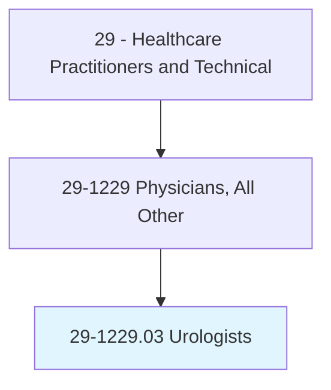
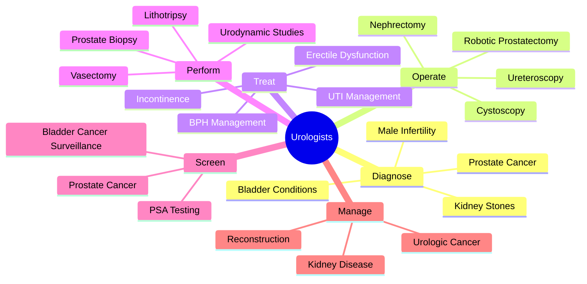
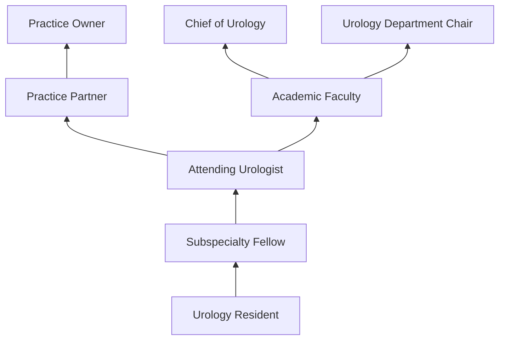
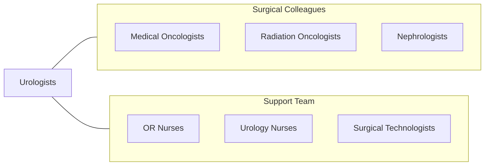

# Urologists

> Diagnose, treat, and help prevent benign and malignant medical and surgical disorders of the genitourinary system and the renal glands.

## Overview

Urologists are physician surgeons who specialize in diagnosing and treating diseases and conditions of the urinary tract (kidneys, ureters, bladder, urethra) in both sexes and the male reproductive system (prostate, testes, penis). They manage conditions ranging from kidney stones and urinary tract infections to prostate cancer, bladder cancer, kidney cancer, male infertility, erectile dysfunction, and urinary incontinence.

The scope encompasses both medical management and surgical intervention. Urologists perform cystoscopy, ureteroscopy, transurethral resection of the prostate (TURP), radical prostatectomy, nephrectomy, penile prosthesis placement, vasectomy, and complex reconstructive procedures. They interpret urodynamic studies, manage urinary catheters and stents, prescribe medications for BPH and overactive bladder, and coordinate multidisciplinary care for urologic cancers.

Modern urology has been transformed by robotic-assisted surgery (da Vinci), laser lithotripsy for kidney stones, focal therapy for prostate cancer, artificial urinary sphincters, sacral neuromodulation for incontinence, and MRI-guided prostate biopsy. Urologists increasingly practice minimally invasive surgery, reducing patient morbidity and recovery time.

## Classification Hierarchy

## Key Statistics

| Metric | Value |
|--------|-------|
| SOC Code | 29-1229.03 |
| Median Annual Salary | $352,690 |
| Employment | ~12,000 |
| Projected Growth | 3% (2022-2032) |
| Job Zone | 5 (Extensive Preparation) |
| Category | [Healthcare Practitioners](/occupations/HealthcarePractitioners) |
| Core Tasks | 45+ |
| Source | O*NET |

## Core Tasks

### operate.UrologicSurgery

Urologists perform genitourinary procedures.

**Actions:**
- `perform.RoboticProstatectomy.for.ProstateCancer` - Robotic surgery
- `perform.Ureteroscopy.for.KidneyStoneRemoval` - Stone surgery
- `perform.Cystoscopy.for.BladderEvaluation` - Endoscopy
- `perform.Nephrectomy.for.KidneyCancer` - Kidney surgery

### manage.UrologicConditions

Urologists provide medical management.

**Actions:**
- `manage.BPH.using.MedicationsAndMinimallyInvasiveProcedures` - Prostate management
- `treat.UrinaryIncontinence.using.BehavioralAndSurgicalApproaches` - Incontinence care
- `manage.MaleInfertility.using.DiagnosticAndTherapeuticMethods` - Fertility treatment
- `surveil.BladderCancer.using.CystoscopyProtocols` - Cancer surveillance

## Practice Settings

| Setting | Description |
|---------|-------------|
| Private Urology Practice | Office and surgical practice |
| Hospitals | Inpatient and outpatient urology |
| Academic Medical Centers | Teaching and subspecialty care |
| Ambulatory Surgery Centers | Outpatient procedures |
| Cancer Centers | Urologic oncology |
| VA Medical Centers | Veterans urologic care |

## Skills & Competencies

### Technical Skills
- **Robotic Surgery** - Expert
- **Endoscopic Procedures** - Expert
- **Urodynamic Interpretation** - Expert
- **Lithotripsy** - Expert
- **Open and Reconstructive Surgery** - Expert
- **Prostate Biopsy** - Expert
- **Laparoscopic Surgery** - Expert

### Soft Skills
- **Manual Dexterity** - Critical
- **Patient Communication** - Essential
- **Decision Making** - Critical
- **Empathy** - Essential
- **Composure** - Essential

## Education & Training

| Requirement | Details |
|-------------|---------|
| Medical School | 4-year MD or DO |
| Urology Residency | 5-6 years (1-2 general surgery + 4 urology) |
| Fellowship | 1-2 years subspecialty (optional) |
| Board Certification | American Board of Urology |
| Total Training | 13-15 years post-high school |

## Certifications

| Certification | Description |
|---------------|-------------|
| ABU | American Board of Urology certification |
| State Medical License | Required in all states |
| da Vinci Certification | Robotic surgery credentialing |
| FPMRS | Female Pelvic Medicine (subspecialty) |

## Career Progression

## Specializations

| Subspecialty | Focus Area |
|-------------|-------------|
| Urologic Oncology | Prostate, bladder, kidney cancer |
| Endourology/Stone Disease | Kidney stones and laser surgery |
| Female Pelvic Medicine | Incontinence and prolapse |
| Male Infertility/Andrology | Male reproductive health |
| Pediatric Urology | Children's urologic conditions |
| Neurourology | Neurogenic bladder |
| Reconstructive Urology | Urinary tract reconstruction |

## Technology & Tools

| Technology | Purpose |
|------------|---------|
| da Vinci Robotic System | Robotic-assisted surgery |
| Cystoscopes and Ureteroscopes | Endoscopic procedures |
| Holmium/Thulium Lasers | Stone and tissue surgery |
| Urodynamic Systems | Bladder function testing |
| Transrectal/MRI Ultrasound Biopsy | Prostate diagnosis |
| ESWL (Shock Wave Lithotripsy) | Non-invasive stone treatment |
| GreenLight Laser | BPH treatment |

## Related Occupations

## Industries

- [Physician Offices](/industries/Healthcare/PhysicianOffices) - Urology Practice
- [Hospitals](/industries/Healthcare/Hospitals/index) - Inpatient Urology
- [Ambulatory Surgery](/industries/Healthcare/AmbulatoryHealthCare) - Outpatient Procedures
- [Academic](/industries/Education) - Teaching Hospitals
- [Cancer Centers](/industries/Healthcare/AmbulatoryHealthCare) - Urologic Oncology

## Departments

This occupation typically works in:
- Urology
- Surgical Services
- Cancer Center
- Operating Room

---

*Source: O*NET 29-1229.03 - ONETOccupation*
