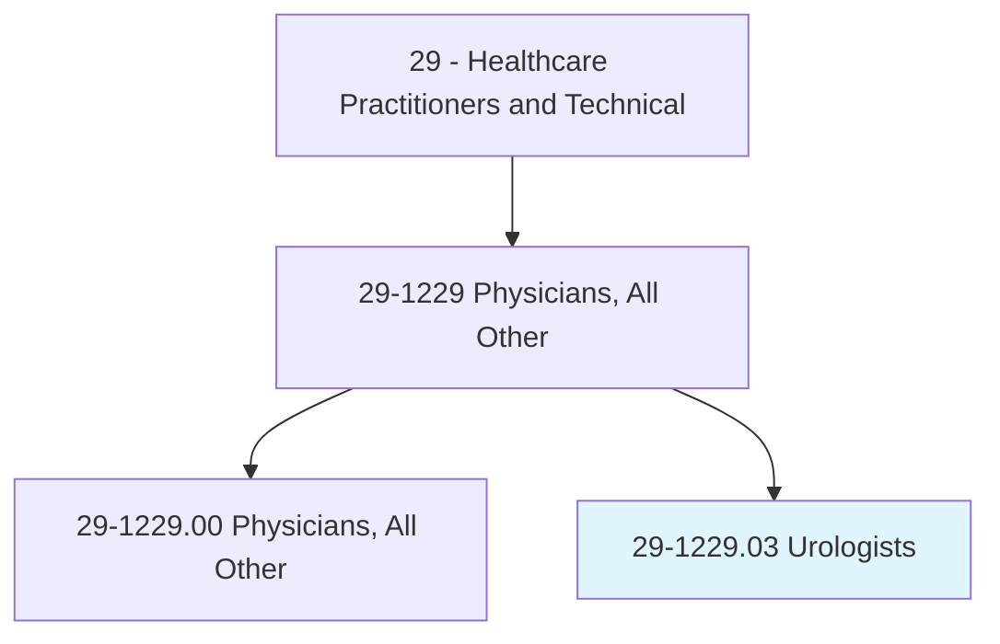
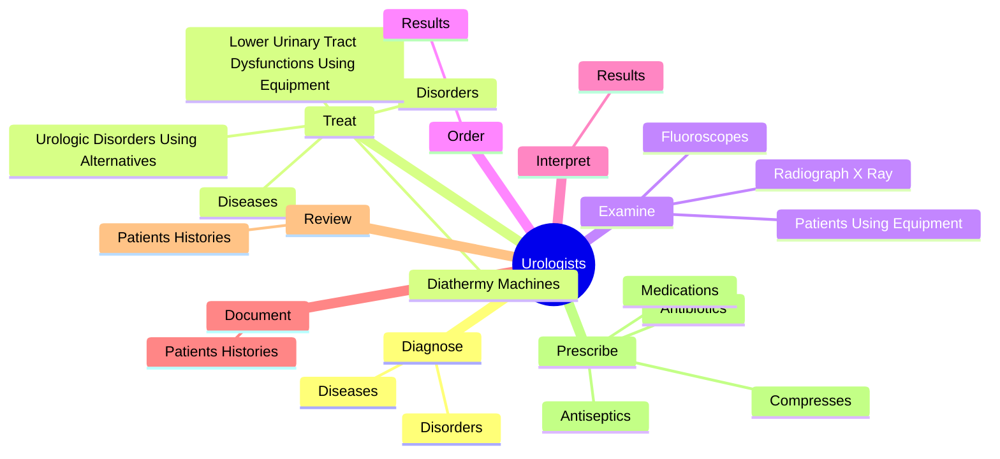
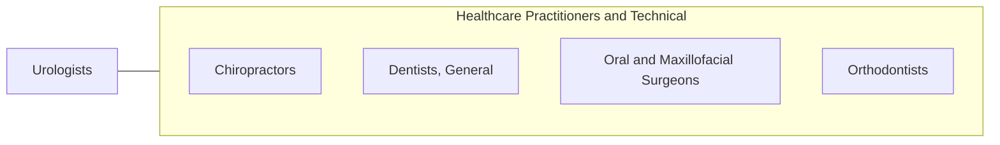

# Urologists

> Diagnose, treat, and help prevent benign and malignant medical and surgical disorders of the genitourinary system and the renal glands.

## Overview

Urologists is classified under Healthcare Practitioners and Technical (SOC 29). Diagnose, treat, and help prevent benign and malignant medical and surgical disorders of the genitourinary system and the renal glands.

## Classification Hierarchy

## Key Statistics

| Metric | Value |
|--------|-------|
| SOC Code | 29-1229.03 |
| Category | [Healthcare Practitioners and Technical](/occupations/HealthcarePractitioners) |
| Task Count | 88 |
| Source | O*NET |

## Core Tasks

### diagnose.Diseases

Urologists diagnose diseases as part of their core responsibilities.

**Actions:**
- `diagnose.Diseases.of.GenitourinaryOrgansIncludingErectileDysfunctionEd`
- `diagnose.Diseases.of.TractsIncludingErectileDysfunctionEd`
- `diagnose.Diseases.of.Infertility`
- `diagnose.Diseases.of.Incontinence`

### treat.Diseases

Urologists treat diseases as part of their core responsibilities.

**Actions:**
- `treat.Diseases.of.GenitourinaryOrgansIncludingErectileDysfunctionEd`
- `treat.Diseases.of.TractsIncludingErectileDysfunctionEd`
- `treat.Diseases.of.Infertility`
- `treat.Diseases.of.Incontinence`

### examine.PatientsUsingEquipment

Urologists examine patients using equipment as part of their core responsibilities.

**Actions:**
- `examine.PatientsUsingEquipment.to.determine.NatureOfDisorderInjury`
- `examine.PatientsUsingEquipment.to.ExtentOfDisorderInjury`
- `examine.RadiographXRay`
- `examine.Fluoroscopes.to.determine.NatureOfDisorderInjury`

## Skills & Competencies

### Technical Skills
- **Clinical Skills** - Advanced
- **Diagnostic Procedures** - Advanced
- **Patient Care** - Advanced

### Soft Skills
- **Communication** - Essential
- **Problem Solving** - Essential
- **Critical Thinking** - Important
- **Teamwork** - Important
- **Adaptability** - Important

## Related Occupations

## Industries

This occupation is found across multiple industries. See [Industries](/industries) for sector-specific employment data.

## Career Progression

---

*Source: O*NET 29-1229.03 - ONETOccupation*
