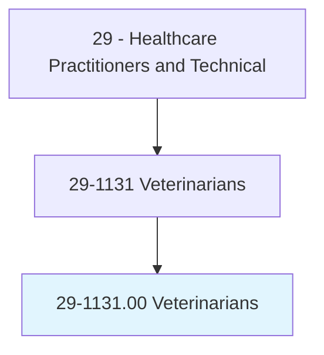
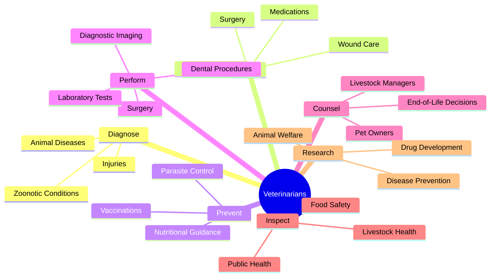
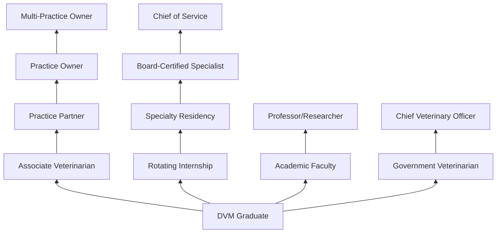
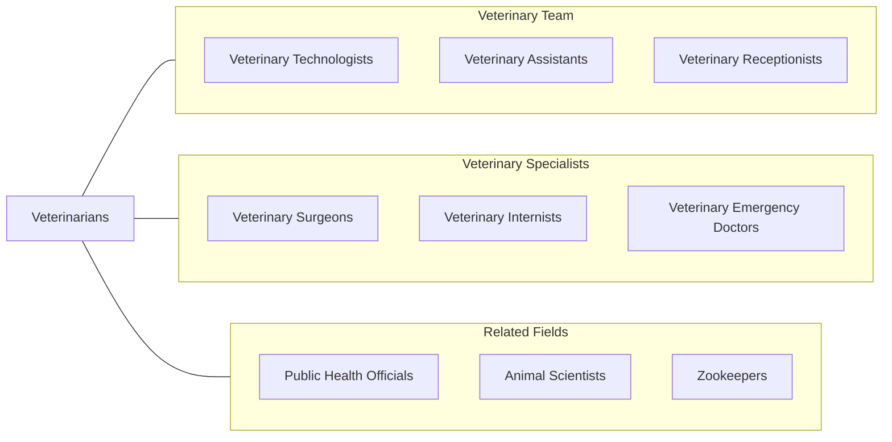

# Veterinarians

> Diagnose, treat, or research diseases and injuries of animals. Includes veterinarians who conduct research and development, inspect livestock, or care for pets and companion animals.

## Overview

Veterinarians are doctoral-level healthcare professionals who prevent, diagnose, and treat diseases, disorders, and injuries in animals. They provide medical care for companion animals (dogs, cats, exotic pets), livestock (cattle, horses, swine, poultry), wildlife, zoo animals, and laboratory animals. Veterinarians perform surgery, prescribe medications, administer vaccinations, and counsel animal owners on care, nutrition, and disease prevention.

The veterinary profession extends far beyond clinical animal care. Veterinarians serve critical roles in public health (zoonotic disease surveillance, food safety inspection), biomedical research, pharmaceutical development, wildlife conservation, and emergency disaster response. The One Health concept recognizes the interconnection between animal, human, and environmental health, positioning veterinarians as essential contributors to global health security.

Modern veterinary practice has advanced dramatically with diagnostic imaging (digital radiography, CT, MRI for animals), minimally invasive surgery, advanced anesthesia protocols, oncology, cardiology, and rehabilitative medicine. Telemedicine, wearable health monitors for animals, and AI-assisted diagnostics are increasingly integrated into veterinary practice.

## Classification Hierarchy

## Key Statistics

| Metric | Value |
|--------|-------|
| SOC Code | 29-1131.00 |
| Median Annual Salary | $103,260 |
| Employment | ~86,000 |
| Projected Growth | 20% (2022-2032, much faster than average) |
| Job Zone | 5 (Extensive Preparation) |
| Category | [Healthcare Practitioners](/occupations/HealthcarePractitioners) |
| Core Tasks | 50+ |
| Source | O*NET |

## Core Tasks

### diagnose.AnimalConditions

Veterinarians evaluate animals through clinical examination.

**Actions:**
- `diagnose.AnimalDiseases.using.PhysicalExamination` - Clinical assessment
- `diagnose.Injuries.using.DiagnosticImaging` - Radiographic evaluation
- `diagnose.InfectiousDisease.using.LaboratoryTesting` - Lab diagnostics
- `diagnose.ZoonoticConditions.for.PublicHealthProtection` - Zoonotic screening

### treat.AnimalPatients

Veterinarians deliver medical and surgical care.

**Actions:**
- `perform.Surgery.for.InjuryAndDisease` - Surgical intervention
- `prescribe.Medications.for.AnimalConditions` - Pharmacotherapy
- `administer.Vaccinations.per.SpeciesProtocols` - Preventive immunization
- `provide.EmergencyCare.for.TraumatizedAnimals` - Emergency medicine

### counsel.AnimalOwners

Veterinarians educate owners on animal health.

**Actions:**
- `counsel.PetOwners.regarding.PreventiveCare` - Wellness education
- `counsel.LivestockManagers.regarding.HerdHealth` - Production animal health
- `counsel.Owners.regarding.EndOfLifeDecisions` - Euthanasia counseling
- `counsel.Owners.regarding.NutritionAndExercise` - Lifestyle guidance

## Practice Settings

| Setting | Description |
|---------|-------------|
| Small Animal Practice | Companion animal care |
| Mixed Animal Practice | Small and large animal combined |
| Emergency/Specialty Hospitals | 24/7 emergency and specialty care |
| Large Animal/Equine Practice | Livestock and horse medicine |
| Zoo/Wildlife Medicine | Exotic and wildlife care |
| Academic Veterinary Medicine | Teaching and research |
| Government/Military | USDA, CDC, military veterinary |
| Industry | Pharmaceutical and food safety |

## Skills & Competencies

### Technical Skills
- **Clinical Diagnosis** - Expert
- **Veterinary Surgery** - Expert
- **Diagnostic Imaging** - Advanced
- **Anesthesiology** - Advanced
- **Pharmacology** - Expert
- **Dentistry** - Advanced
- **Emergency Medicine** - Advanced
- **Laboratory Diagnostics** - Advanced

### Soft Skills
- **Animal Handling** - Expert
- **Client Communication** - Critical
- **Empathy** - Essential
- **Business Management** - Important
- **Problem Solving** - Essential
- **Teamwork** - Essential
- **Emotional Resilience** - Essential

## Education & Training

| Requirement | Details |
|-------------|---------|
| Undergraduate | 4-year bachelor's degree (pre-veterinary) |
| Veterinary School | 4-year DVM or VMD program |
| Internship | 1 year rotating internship (optional) |
| Residency | 3-4 years for board specialization |
| Total Training | 8-12 years post-high school |
| Licensure | Must pass NAVLE (North American Veterinary Licensing Exam) |
| State License | Required in all states |
| Continuing Education | Per state requirements |

## Certifications

| Certification | Description |
|---------------|-------------|
| NAVLE | National licensing exam (required) |
| ACVIM | Internal Medicine board certification |
| ACVS | Surgery board certification |
| ACVECC | Emergency & Critical Care |
| ABVP | Practice board certification (various species) |
| DACVR | Radiology board certification |
| DACVO | Ophthalmology board certification |
| USDA Accreditation | Federal animal health inspection |

## Career Progression

## Specializations

| Subspecialty | Focus Area |
|-------------|------------|
| Internal Medicine | Complex medical cases |
| Surgery (Soft Tissue, Orthopedic) | Advanced surgical procedures |
| Emergency & Critical Care | Animal ER and ICU |
| Oncology | Animal cancer treatment |
| Cardiology | Heart disease in animals |
| Dermatology | Skin conditions |
| Neurology | Nervous system disorders |
| Ophthalmology | Eye conditions |
| Exotic/Zoo Medicine | Non-domestic species |

## Technology & Tools

| Technology | Purpose |
|------------|---------|
| Digital Radiography/DR | Diagnostic imaging |
| Veterinary Ultrasound | Abdominal and cardiac imaging |
| Veterinary CT/MRI | Advanced cross-sectional imaging |
| In-House Lab Analyzers (IDEXX) | Point-of-care diagnostics |
| Anesthesia Monitoring Systems | Surgical patient monitoring |
| Veterinary Practice Management Software | Scheduling and records |
| Laser Therapy Equipment | Pain management and healing |
| Dental Radiography & Equipment | Veterinary dental care |

## Related Occupations

## Industries

- [Veterinary Services](/industries/Healthcare/VeterinaryServices) - Private Practice
- [Government](/industries/PublicAdministration) - USDA, CDC, Military
- [Academic](/industries/Education) - Veterinary Schools
- [Pharmaceutical](/industries/Manufacturing/ChemicalManufacturing/Pharmaceutical) - Drug Development
- Zoos & Aquariums - Wildlife Care
- [Research](/industries/ProfessionalServices/Research) - Biomedical Research

## Departments

This occupation typically works in:
- Veterinary Medicine
- Veterinary Surgery
- Animal Emergency
- Public Health
- Food Safety

---

*Source: O*NET 29-1131.00 - ONETOccupation*
