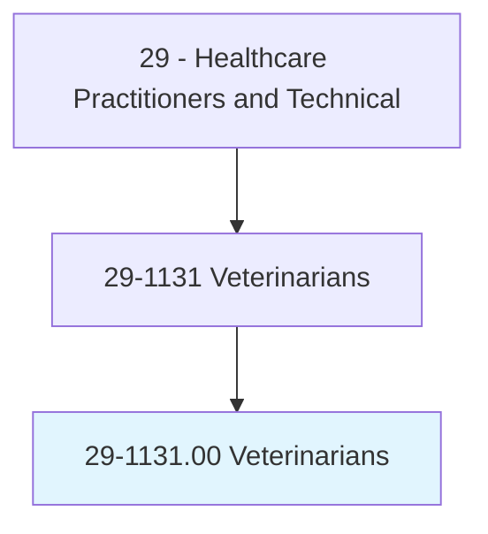
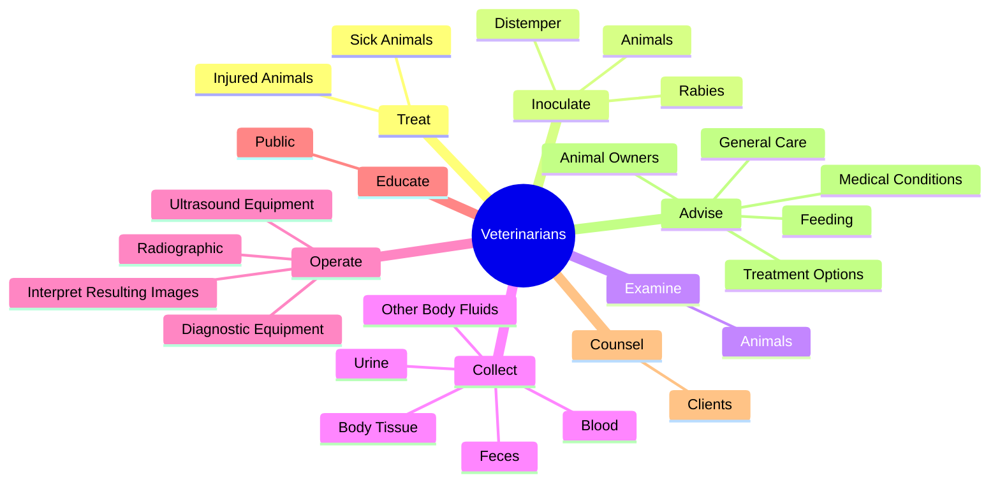
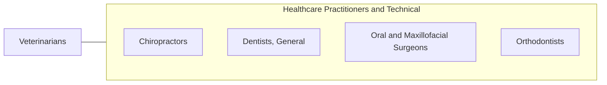

# Veterinarians

> Diagnose, treat, or research diseases and injuries of animals. Includes veterinarians who conduct research and development, inspect livestock, or care for pets and companion animals.

## Overview

Veterinarians is an occupation within the Healthcare Practitioners and Technical category. Diagnose, treat, or research diseases and injuries of animals. 

## Classification Hierarchy

## Key Statistics

| Metric | Value |
|--------|-------|
| SOC Code | 29-1131.00 |
| Category | [Healthcare Practitioners and Technical](/occupations/HealthcarePractitioners) |
| Task Count | 88 |
| Source | O*NET |

## Core Tasks

### treat.SickAnimals

Veterinarians treat sick animals as part of their core responsibilities.

**Actions:**
- `treat.SickAnimals.by.PrescribingMedication`
- `treat.SickAnimals.by.SettingBones`
- `treat.SickAnimals.by.DressingWounds`
- `treat.SickAnimals.by.PerformingSurgery`

### inoculate.Animals

Veterinarians inoculate animals as part of their core responsibilities.

**Actions:**
- `inoculate.Animals.against.VariousDiseases`
- `inoculate.Rabies`
- `inoculate.Distemper`

### examine.Animals

Veterinarians examine animals as part of their core responsibilities.

**Actions:**
- `examine.Animals.to.detect.NatureOfDiseasesInjuries`
- `examine.Animals.to.determine.NatureOfDiseasesInjuries`

## Skills & Competencies

### Technical Skills
- **Clinical Skills** - Advanced
- **Diagnostic Procedures** - Advanced
- **Patient Care** - Advanced

### Soft Skills
- **Communication** - Essential
- **Problem Solving** - Essential
- **Critical Thinking** - Important
- **Teamwork** - Important
- **Adaptability** - Important

## Related Occupations

## Industries

This occupation is found across multiple industries. See [Industries](/industries) for sector-specific employment data.

## Career Progression

---

*Source: O*NET 29-1131.00 - ONETOccupation*
