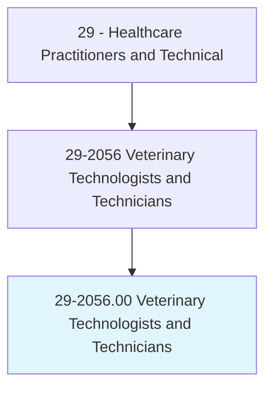
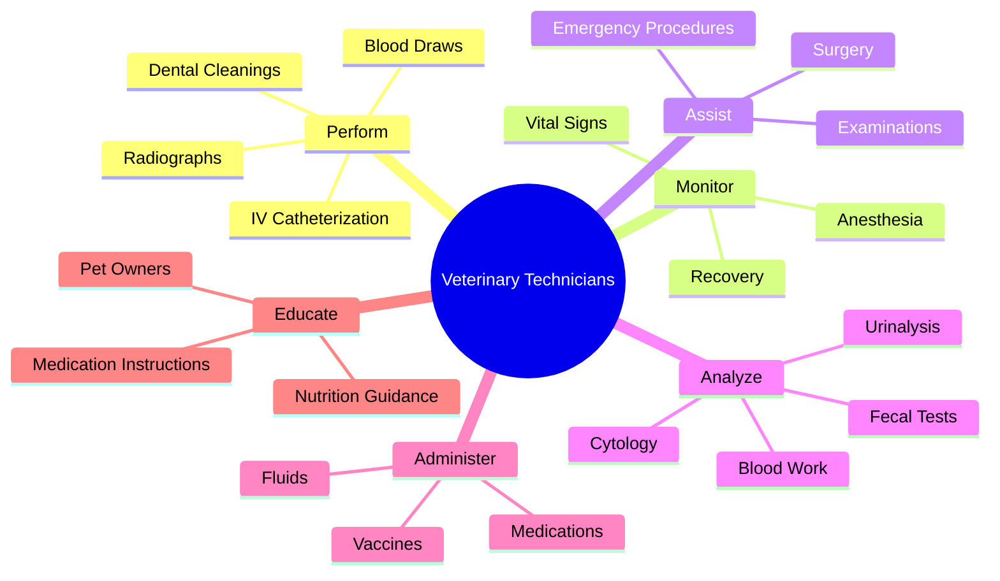
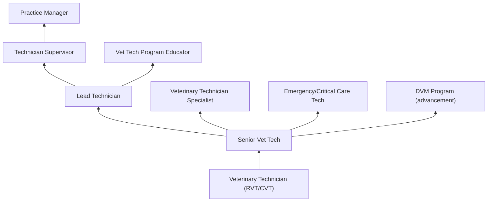
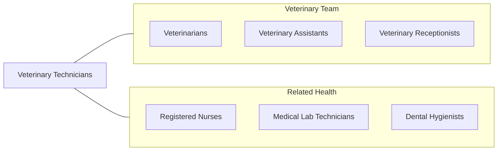

# Veterinary Technologists and Technicians

> Perform medical tests in a laboratory environment for use in the treatment and diagnosis of diseases in animals. Prepare vaccines and serums for prevention of diseases. Prepare tissue samples, take blood samples, and execute laboratory tests. Clean and sterilize instruments and materials and maintain equipment and machines. May assist a veterinarian during surgery.

## Overview

Veterinary Technologists and Technicians (Vet Techs) are skilled animal healthcare professionals who assist veterinarians in providing medical care to animals. They perform clinical procedures including physical examinations, blood draws, IV catheter placement, anesthesia induction and monitoring, surgical preparation and assistance, dental cleanings, radiographic imaging, laboratory testing, and medication administration. Vet techs are the veterinary equivalent of registered nurses.

The scope encompasses patient assessment (TPR, physical exam assistance), diagnostic sample collection and laboratory analysis (CBC, chemistry, urinalysis, cytology), anesthesia monitoring (induction, maintenance, recovery), surgical preparation and assisting, dental prophylaxis and radiography, radiology (positioning and exposure), pharmacy (medication dispensing and administration), and client education on pet care, nutrition, and medication compliance.

Modern veterinary technology has advanced with digital radiography, veterinary-specific laboratory analyzers, multiparameter anesthesia monitoring, veterinary dentistry equipment, laser therapy, and telemedicine support. Veterinary technicians are in high demand as companion animal care becomes increasingly sophisticated and specialty veterinary medicine expands.

## Classification Hierarchy

## Key Statistics

| Metric | Value |
|--------|-------|
| SOC Code | 29-2056.00 |
| Median Annual Salary | $38,240 |
| Employment | ~120,000 |
| Projected Growth | 20% (2022-2032, much faster than average) |
| Job Zone | 3 (Medium Preparation) |
| Category | [Healthcare Practitioners](/occupations/HealthcarePractitioners) |
| Core Tasks | 35+ |
| Source | O*NET |

## Core Tasks

### perform.VeterinaryProcedures

Vet Techs execute clinical procedures.

**Actions:**
- `perform.Phlebotomy.for.DiagnosticBloodWork` - Blood collection
- `monitor.Anesthesia.during.SurgicalProcedures` - Anesthesia monitoring
- `perform.DentalProphylaxis.including.ScalingAndPolishing` - Dental cleaning
- `perform.Radiography.for.DiagnosticImaging` - X-ray imaging

### assist.VeterinaryMedicine

Vet Techs support veterinary care delivery.

**Actions:**
- `assist.Veterinarian.during.SurgicalProcedures` - Surgical assisting
- `administer.Medications.per.VeterinarianOrders` - Medication administration
- `analyze.LaboratorySamples.for.DiagnosticResults` - Lab analysis
- `educate.PetOwners.regarding.MedicationAndCare` - Client education

## Practice Settings

| Setting | Description |
|---------|-------------|
| Small Animal Practices | Companion animal clinics |
| Emergency/Specialty Hospitals | 24/7 emergency and referral |
| Mixed Animal Practices | Small and large animal |
| Research Laboratories | Animal research facilities |
| Zoos and Wildlife Centers | Exotic animal care |
| Academic Veterinary Hospitals | Teaching hospitals |
| Large Animal/Equine Practices | Livestock and horse medicine |

## Skills & Competencies

### Technical Skills
- **Anesthesia Monitoring** - Expert
- **Phlebotomy and IV Access** - Expert
- **Surgical Preparation** - Expert
- **Laboratory Diagnostics** - Advanced
- **Dental Prophylaxis** - Advanced
- **Radiographic Imaging** - Advanced
- **Animal Restraint** - Expert

### Soft Skills
- **Animal Handling** - Expert
- **Client Communication** - Essential
- **Empathy** - Essential
- **Attention to Detail** - Critical
- **Emotional Resilience** - Essential
- **Teamwork** - Essential

## Education & Training

| Requirement | Details |
|-------------|---------|
| Education | Associate degree (technician) or bachelor's degree (technologist) in vet tech |
| Accreditation | AVMA-accredited program |
| Certification | VTNE (Veterinary Technician National Exam) |
| State Credentialing | RVT, CVT, or LVT (varies by state) |
| Continuing Education | Per state requirements |

## Certifications

| Certification | Description |
|---------------|-------------|
| RVT/CVT/LVT | Registered/Certified/Licensed Veterinary Technician |
| VTS | Veterinary Technician Specialist (various specialties) |
| VTNE | National credentialing examination |
| Fear Free Certified | Low-stress handling certification |

## Career Progression

## Specializations

| Focus Area | Description |
|------------|-------------|
| Emergency & Critical Care | ICU and emergency medicine |
| Anesthesia & Analgesia | Advanced anesthesia |
| Dentistry | Veterinary dental care |
| Internal Medicine | Complex medical cases |
| Surgery | Advanced surgical nursing |
| Behavior | Animal behavior support |
| Exotic Animals | Non-traditional species |

## Technology & Tools

| Technology | Purpose |
|------------|---------|
| In-House Analyzers (IDEXX, Abaxis) | Point-of-care diagnostics |
| Digital Radiography | Diagnostic imaging |
| Anesthesia Machines and Monitors | Surgical anesthesia |
| Dental Equipment (Ultrasonic Scalers) | Dental procedures |
| Fluid Pumps | IV therapy |
| Microscopes | Cytology and fecal analysis |
| Practice Management Software (Cornerstone, eVetPractice) | Patient records |

## Related Occupations

## Industries

- [Veterinary Services](/industries/Healthcare/VeterinaryServices) - Clinical Practice
- [Emergency Veterinary](/industries/Healthcare/VeterinaryServices) - Emergency Hospitals
- [Research](/industries/ProfessionalServices/Research) - Animal Research
- Zoos & Aquariums - Wildlife Care
- [Academic](/industries/Education) - Veterinary Teaching Hospitals

## Departments

This occupation typically works in:
- Veterinary Medicine
- Veterinary Surgery
- Animal Emergency
- Veterinary Laboratory

---

*Source: O*NET 29-2056.00 - ONETOccupation*
