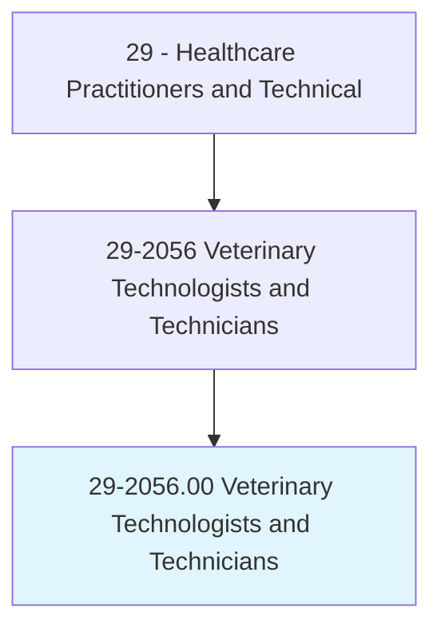
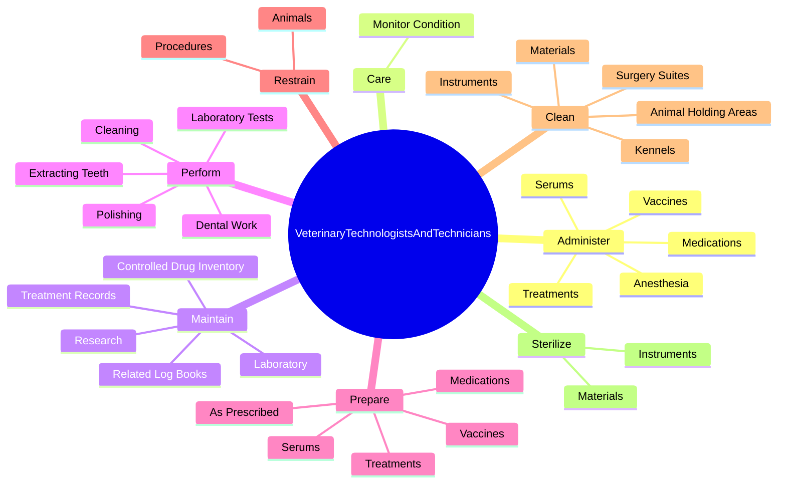
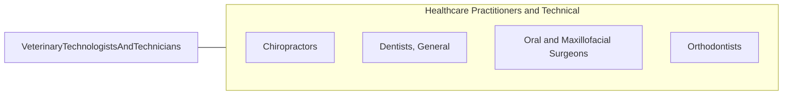

# Veterinary Technologists and Technicians

> Perform medical tests in a laboratory environment for use in the treatment and diagnosis of diseases in animals. Prepare vaccines and serums for prevention of diseases. Prepare tissue samples, take blood samples, and execute laboratory tests, such as urinalysis and blood counts. Clean and sterilize instruments and materials and maintain equipment and machines. May assist a veterinarian during surgery.

## Overview

Veterinary Technologists and Technicians is an occupation within the Healthcare Practitioners and Technical category. Perform medical tests in a laboratory environment for use in the treatment and diagnosis of diseases in animals. Prepare vaccines and serums for prevention of diseases.

## Classification Hierarchy

## Key Statistics

| Metric | Value |
|--------|-------|
| SOC Code | 29-2056.00 |
| Category | [Healthcare Practitioners and Technical](/occupations/HealthcarePractitioners) |
| Task Count | 124 |
| Source | O*NET |

## Core Tasks

### administer.Anesthesia

Veterinary Technologists and Technicians administer anesthesia as part of their core responsibilities.

**Actions:**
- `administer.Anesthesia.to.Animals`
- `administer.Anesthesia.to.UnderDirectionOfVeterinarian`
- `administer.Anesthesia.to.monitor.AnimalsResponsesToAnestheticsSoDosagesCanBeAdjusted`
- `administer.Medications.by.Veterinarians`

### care.MonitorCondition

Veterinary Technologists and Technicians care monitor condition as part of their core responsibilities.

**Actions:**
- `care.MonitorCondition.of.AnimalsRecovering.from.Surgery`

### maintain.ControlledDrugInventory

Veterinary Technologists and Technicians maintain controlled drug inventory as part of their core responsibilities.

**Actions:**
- `maintain.ControlledDrugInventory`
- `maintain.RelatedLogBooks`
- `maintain.Laboratory.of.Pharmaceuticals`
- `maintain.Laboratory.of.Equipment`

## Skills & Competencies

### Technical Skills
- **Clinical Skills** - Advanced
- **Diagnostic Procedures** - Advanced
- **Patient Care** - Advanced

### Soft Skills
- **Communication** - Essential
- **Problem Solving** - Essential
- **Critical Thinking** - Important
- **Teamwork** - Important
- **Adaptability** - Important

## Related Occupations

## Industries

This occupation is found across multiple industries. See [Industries](/industries) for sector-specific employment data.

## Career Progression

---

*Source: O*NET 29-2056.00 - ONETOccupation*
