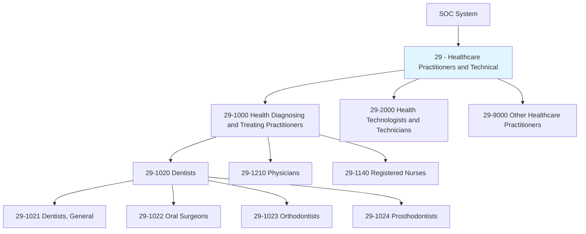
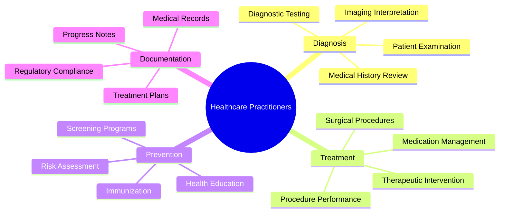
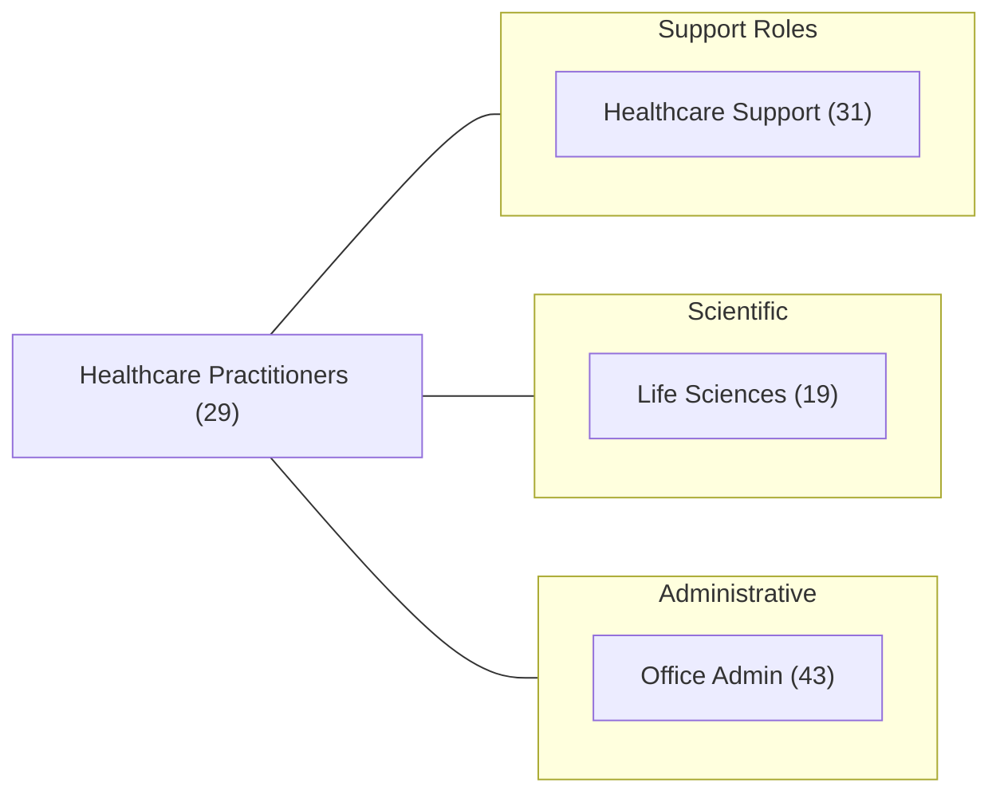
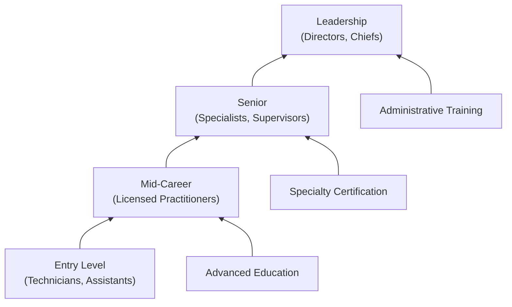

# Healthcare Practitioners and Technical

> Healthcare practitioners diagnose, treat, and prevent illnesses and injuries, applying specialized medical knowledge and technical skills to improve patient health outcomes across dental, medical, and therapeutic disciplines.

## Overview

Healthcare Practitioners and Technical occupations (SOC Major Group 29) encompass professionals who diagnose illnesses, prescribe treatments, and provide therapeutic care. This category includes physicians, dentists, nurses, pharmacists, therapists, and other clinical professionals who require extensive education, licensure, and ongoing professional development to maintain competency in their specialized fields.

## Classification Hierarchy

## Key Statistics

| Metric | Value |
|--------|-------|
| SOC Code | 29-0000 |
| Major Group | Healthcare Practitioners and Technical |
| Occupation Groups | 3 |
| Total Occupations | 100+ |
| Education Range | Associate's to Doctoral |

## Occupations in this Category

### Dental Practitioners
- [Chiropractors](./Chiropractors.mdx) - Spinal and musculoskeletal specialists
- [Dentists, General](./DentistsGeneral.mdx) - Primary dental care providers
- [Oral and Maxillofacial Surgeons](./OralSurgeons.mdx) - Surgical dental specialists
- [Orthodontists](./Orthodontists.mdx) - Teeth alignment specialists
- [Prosthodontists](./Prosthodontists.mdx) - Dental prosthetics specialists

### Other Practitioners
- Dietitians and Nutritionists
- Optometrists
- Pharmacists
- Physician Assistants
- Registered Nurses
- Nurse Practitioners

## Core Competency Areas

## Related Categories

## Industries

- [Hospitals](/industries/Hospitals) - Primary employment
- [Physician Offices](/industries/PhysicianOffices) - High employment
- [Dental Offices](/industries/DentalOffices) - Specialized employment
- [Outpatient Care Centers](/industries/OutpatientCare) - Growing sector
- [Nursing Care Facilities](/industries/NursingCare) - Long-term care

## Education & Certification Requirements

| Level | Typical Occupations | Requirements |
|-------|---------------------|--------------|
| Doctoral | Dentists, Physicians, Chiropractors | 8+ years post-secondary, residency |
| Master's | Nurse Practitioners, Physician Assistants | 6-7 years post-secondary |
| Bachelor's | Registered Nurses, Dietitians | 4 years post-secondary |
| Associate's | Dental Hygienists, Health Technicians | 2 years post-secondary |

## Career Progression

---

*Source: O*NET SOC Category 29 - Healthcare Practitioners and Technical*
