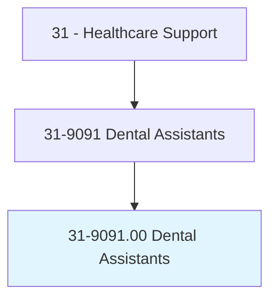
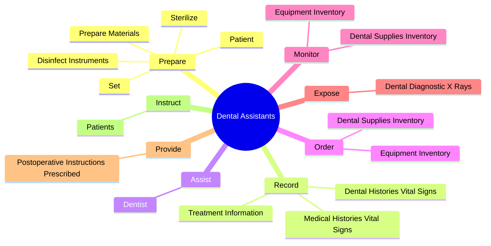
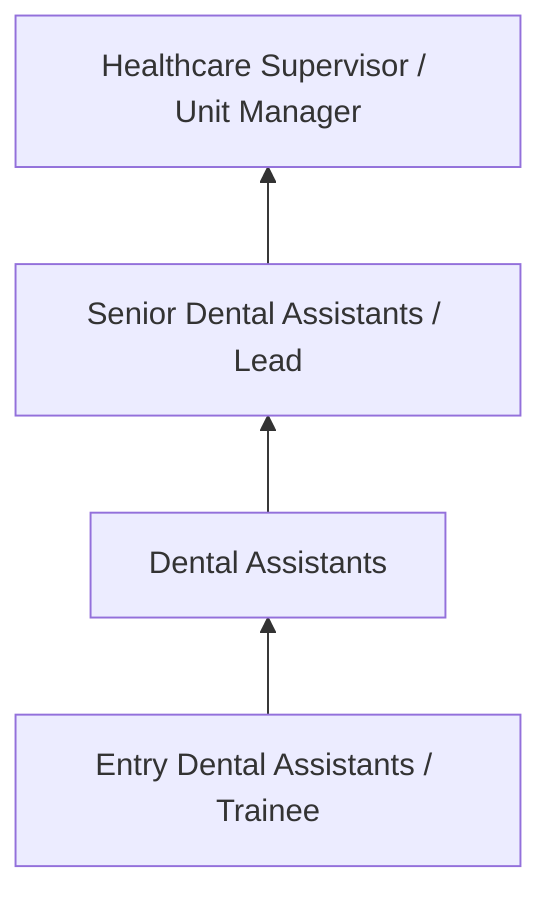
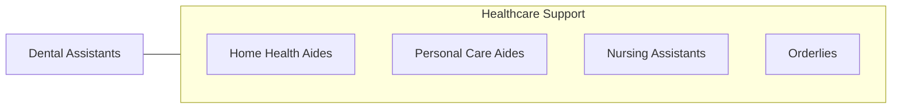

# Dental Assistants

> Perform limited clinical duties under the direction of a dentist. Clinical duties may include equipment preparation and sterilization, preparing patients for treatment, assisting the dentist during treatment, and providing patients with instructions for oral healthcare procedures. May perform administrative duties such as scheduling appointments, maintaining medical records, billing, and coding information for insurance purposes.

## Overview

Dental Assistants professionals perform limited clinical duties under the direction of a dentist. This occupation falls within the Healthcare Support category and requires a combination of specialized knowledge, technical skills, and practical experience.

These professionals work across diverse settings and organizational contexts, applying their expertise to meet the demands of their field. They must stay current with industry standards, emerging practices, and regulatory requirements that affect their work. The role demands both independent judgment and collaborative skills, as practitioners regularly interact with colleagues, stakeholders, and the public.

As the field continues to evolve, Dental Assistants professionals increasingly leverage technology and data-driven approaches to enhance their effectiveness. Career opportunities span the public and private sectors, with demand influenced by economic conditions, demographic shifts, and technological advancement.

## Classification Hierarchy



## Key Statistics

| Metric | Value |
|--------|-------|
| SOC Code | 31-9091.00 |
| Job Zone | N/A |
| Category | [Healthcare Support](/occupations/HealthcareSupport/index) |
| Core Tasks | 62+ |
| Salary Range | $28,000 - $55,000 |
| Median Salary | $38,000 |
| Growth Outlook | 15% (Much faster than average) |
| Source | O*NET |

## Core Tasks



### schedule.Appointments

Dental Assistants schedule appointments as part of their core responsibilities.

**Actions:**
- `schedule.Appointments.for.DentalServices` - Schedule appointments, prepare bills and receive payment for dental services,...
- `schedule.Appointments.for.CompleteInsuranceForms` - Schedule appointments, prepare bills and receive payment for dental services,...
- `schedule.Appointments.for.MaintainRecords` - Schedule appointments, prepare bills and receive payment for dental services,...
- `schedule.Appointments.for.Manually` - Schedule appointments, prepare bills and receive payment for dental services,...
- `schedule.Appointments.for.UsingComputer` - Schedule appointments, prepare bills and receive payment for dental services,...

### fabricate.TemporaryRestorationsImpressions

Dental Assistants fabricate temporary restorations impressions as part of their core responsibilities.

**Actions:**
- `fabricate.TemporaryRestorationsImpressions.from.PreliminaryImpressions` - Fabricate temporary restorations or custom impressions from preliminary impre...
- `fabricate.CustomImpressions.from.PreliminaryImpressions` - Fabricate temporary restorations or custom impressions from preliminary impre...
- `fabricate.OrthodonticAppliances.for.Patients` - Fabricate and fit orthodontic appliances and materials for patients, such as ...
- `fabricate.OrthodonticAppliances.for.Retainers` - Fabricate and fit orthodontic appliances and materials for patients, such as ...
- `fabricate.OrthodonticAppliances.for.Wires` - Fabricate and fit orthodontic appliances and materials for patients, such as ...

### fit.OrthodonticAppliances

Dental Assistants fit orthodontic appliances as part of their core responsibilities.

**Actions:**
- `fit.OrthodonticAppliances.for.Patients` - Fabricate and fit orthodontic appliances and materials for patients, such as ...
- `fit.OrthodonticAppliances.for.Retainers` - Fabricate and fit orthodontic appliances and materials for patients, such as ...
- `fit.OrthodonticAppliances.for.Wires` - Fabricate and fit orthodontic appliances and materials for patients, such as ...
- `fit.OrthodonticAppliances.for.Bands` - Fabricate and fit orthodontic appliances and materials for patients, such as ...
- `fit.Materials.for.Patients` - Fabricate and fit orthodontic appliances and materials for patients, such as ...

### prepare.Patient

Dental Assistants prepare patient as part of their core responsibilities.

**Actions:**
- `prepare.Patient` - Prepare patient, sterilize or disinfect instruments, set up instrument trays,...
- `prepare.Sterilize` - Prepare patient, sterilize or disinfect instruments, set up instrument trays,...
- `prepare.DisinfectInstruments` - Prepare patient, sterilize or disinfect instruments, set up instrument trays,...
- `prepare.Set.up.InstrumentTrays` - Prepare patient, sterilize or disinfect instruments, set up instrument trays,...
- `prepare.PrepareMaterials` - Prepare patient, sterilize or disinfect instruments, set up instrument trays,...


## Skills & Competencies

### Technical Skills
- **Patient Care** - Advanced
- **Vital Signs Monitoring** - Advanced
- **Infection Control** - Advanced
- **Medical Terminology** - Proficient
- **Patient Safety** - Proficient
- **Electronic Health Records** - Proficient

### Soft Skills
- **Compassion** - Critical
- **Communication** - Critical
- **Physical Stamina** - Essential
- **Attention to Detail** - Essential
- **Emotional Resilience** - Essential

## Education & Certifications

| Requirement | Details |
|-------------|---------|
| Typical Education | Post-secondary certificate or associate degree |
| Work Experience | 0-1 years clinical experience |
| On-the-Job Training | Moderate - clinical procedures and patient care |
| Certifications | CNA, CPR/BLS, state-specific healthcare certifications |

## Career Progression



## Industry Variations

### Hospital Settings
Acute care support in hospital environments. Dental Assistants professionals assist with direct patient care under nursing supervision.

### Long-Term Care
Extended care in nursing homes and assisted living facilities. Emphasis on daily living assistance and ongoing patient relationships.

### Home Health
In-home patient care services. Requires independence and ability to work with minimal supervision in patient homes.

### Rehabilitation Services
Support for physical, occupational, or speech therapy. Focus on helping patients recover function and independence.

## Technology & Tools

- **Electronic health records (EHR)**
- **Patient monitoring equipment**
- **Medical devices and assistive technology**
- **Vital signs measurement tools**
- **Healthcare information systems**

## Related Occupations



## Industries

- [Hospitals](/industries/Hospitals) - High Employment
- [Nursing Care Facilities](/industries/NursingFacilities) - High Employment
- [Home Health Services](/industries/HomeHealth) - High Employment
- [Outpatient Care Centers](/industries/OutpatientCare) - Moderate Employment

## Departments

This occupation typically works in:
- [Patient Care](/departments/PatientCare)
- [Nursing Services](/departments/NursingServices)
- [Clinical Support](/departments/ClinicalSupport)

## GraphDL Semantic Structure

```
Dental Assistants perform:
- prepare.Patient
- prepare.Sterilize
- prepare.DisinfectInstruments
- prepare.Set.up.InstrumentTrays
- prepare.PrepareMaterials
- prepare.AssistDentist.during.DentalProcedures
```

---

*Source: O*NET 31-9091.00 - ONETOccupation*
