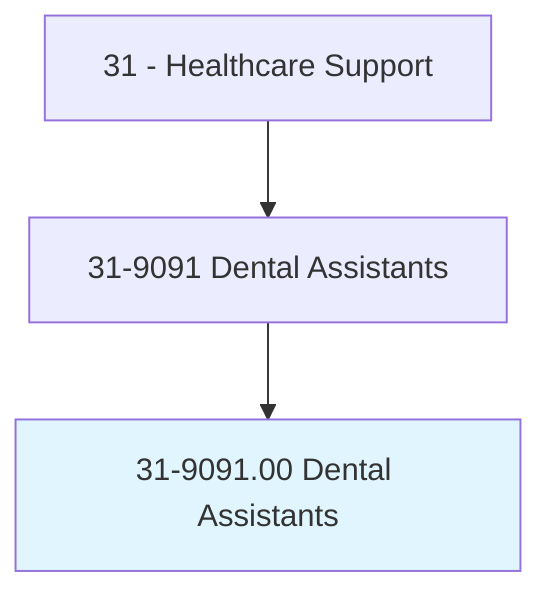
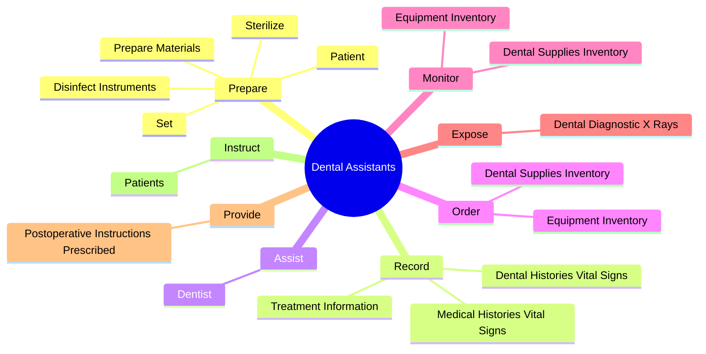
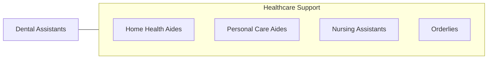

# Dental Assistants

> Perform limited clinical duties under the direction of a dentist. Clinical duties may include equipment preparation and sterilization, preparing patients for treatment, assisting the dentist during treatment, and providing patients with instructions for oral healthcare procedures. May perform administrative duties such as scheduling appointments, maintaining medical records, billing, and coding information for insurance purposes.

## Overview

Dental Assistants is an occupation within the Healthcare Support category. Perform limited clinical duties under the direction of a dentist. Clinical duties may include equipment preparation and sterilization, preparing patients for treatment, assisting the dentist during treatment, and providing patients with instructions for oral healthcare procedures.

## Classification Hierarchy

## Key Statistics

| Metric | Value |
|--------|-------|
| SOC Code | 31-9091.00 |
| Category | [Healthcare Support](/occupations/HealthcareSupport) |
| Task Count | 62 |
| Source | O*NET |

## Core Tasks

### prepare.Patient

Dental Assistants prepare patient as part of their core responsibilities.

**Actions:**
- `prepare.Patient`
- `prepare.Sterilize`
- `prepare.DisinfectInstruments`
- `prepare.Set.up.InstrumentTrays`

### record.TreatmentInformation

Dental Assistants record treatment information as part of their core responsibilities.

**Actions:**
- `record.TreatmentInformation.in.PatientRecords`
- `record.MedicalHistoriesVitalSigns.of.Patients`
- `record.DentalHistoriesVitalSigns.of.Patients`

### assist.Dentist

Dental Assistants assist dentist as part of their core responsibilities.

**Actions:**
- `assist.Dentist.in.Management.of.MedicalEmergencies`
- `assist.Dentist.in.DentalEmergencies`

## Skills & Competencies

### Technical Skills
- **Patient Care** - Advanced
- **Medical Terminology** - Intermediate
- **Health Records** - Intermediate

### Soft Skills
- **Communication** - Essential
- **Problem Solving** - Essential
- **Critical Thinking** - Important
- **Teamwork** - Important
- **Adaptability** - Important

## Related Occupations

## Industries

This occupation is found across multiple industries. See [Industries](/industries) for sector-specific employment data.

## Career Progression

---

*Source: O*NET 31-9091.00 - ONETOccupation*
