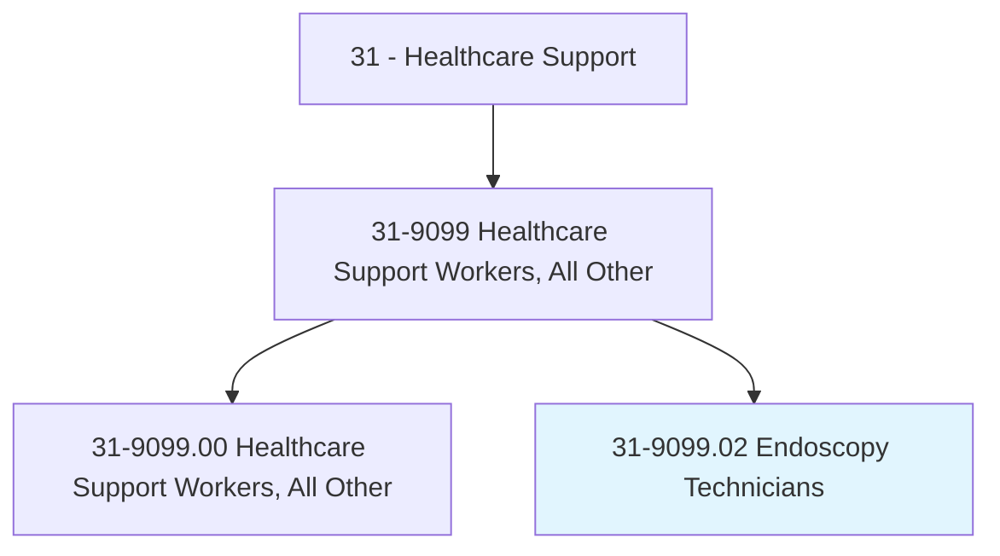
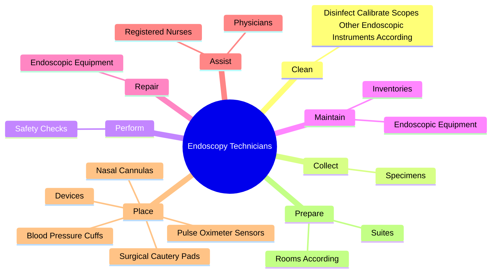
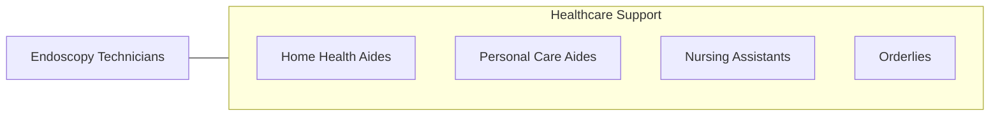

# Endoscopy Technicians

> Maintain a sterile field to provide support for physicians and nurses during endoscopy procedures. Prepare and maintain instruments and equipment. May obtain specimens.

## Overview

Endoscopy Technicians is a specialized variant within the Healthcare Support category. Maintain a sterile field to provide support for physicians and nurses during endoscopy procedures. Prepare and maintain instruments and equipment.

## Classification Hierarchy

## Key Statistics

| Metric | Value |
|--------|-------|
| SOC Code | 31-9099.02 |
| Category | [Healthcare Support](/occupations/HealthcareSupport) |
| Task Count | 22 |
| Source | O*NET |

## Core Tasks

### clean.DisinfectCalibrateScopesOtherEndoscopicInstrumentsAccording

Endoscopy Technicians clean disinfect calibrate scopes other endoscopic instruments according as part of their core responsibilities.

**Actions:**
- `clean.DisinfectCalibrateScopesOtherEndoscopicInstrumentsAccording.to.ManufacturerRecommendationsFacilityStandards`

### collect.Specimens

Endoscopy Technicians collect specimens as part of their core responsibilities.

**Actions:**
- `collect.Specimens.from.Patients`
- `collect.Specimens.from.UsingStandardMedicalProcedures`

### perform.SafetyChecks

Endoscopy Technicians perform safety checks as part of their core responsibilities.

**Actions:**
- `perform.SafetyChecks.to.verify.ProperEquipmentFunctioning`

## Skills & Competencies

### Technical Skills
- **Patient Care** - Advanced
- **Medical Terminology** - Intermediate
- **Health Records** - Intermediate

### Soft Skills
- **Communication** - Essential
- **Problem Solving** - Essential
- **Critical Thinking** - Important
- **Teamwork** - Important
- **Adaptability** - Important

## Related Occupations

## Industries

This occupation is found across multiple industries. See [Industries](/industries) for sector-specific employment data.

## Career Progression

---

*Source: O*NET 31-9099.02 - ONETOccupation*
