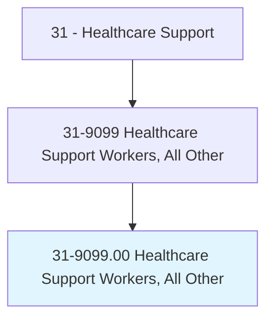
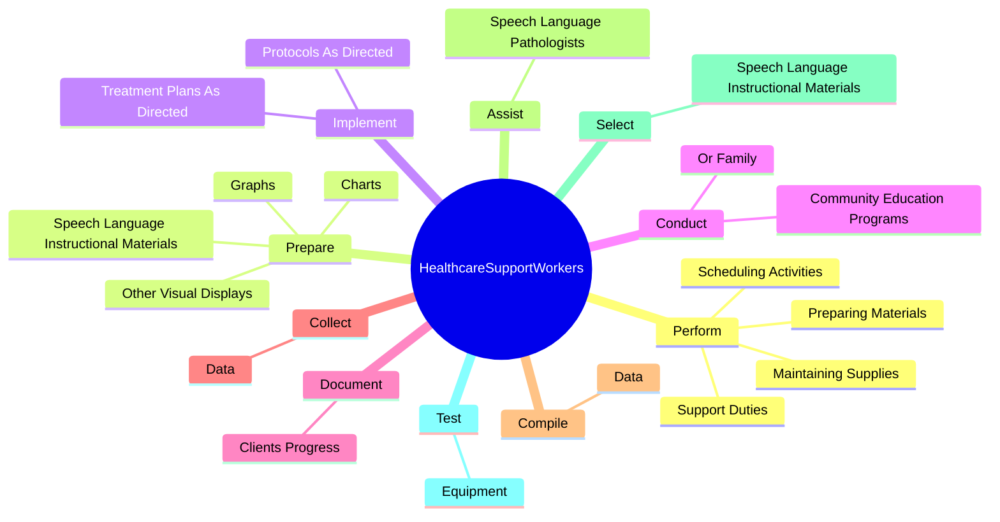
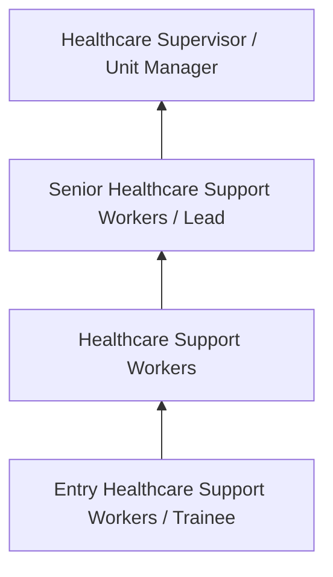
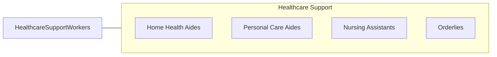

# Healthcare Support Workers, All Other

> All healthcare support workers not listed separately.

## Overview

Healthcare Support Workers professionals serve a vital function within the Healthcare Support field. They bring specialized skills and knowledge to their roles, contributing to organizational objectives and societal needs.

These practitioners work in varied environments, adapting their expertise to meet specific requirements of their industry and employer. The role requires ongoing professional development to maintain competency and respond to changing demands.

Career paths in this field offer opportunities for advancement through experience, additional education, and specialized certifications. Employment prospects are influenced by industry trends, technological change, and workforce demographics.

## Classification Hierarchy



## Key Statistics

| Metric | Value |
|--------|-------|
| SOC Code | 31-9099.00 |
| Job Zone | N/A |
| Category | [Healthcare Support](/occupations/HealthcareSupport/index) |
| Core Tasks | N/A+ |
| Salary Range | $28,000 - $55,000 |
| Median Salary | $38,000 |
| Growth Outlook | 15% (Much faster than average) |
| Source | O*NET |

## Core Tasks



### perform.SupportDuties

Healthcare Support Workers, All Other perform support duties as part of their core responsibilities.

**Actions:**
- `perform.SupportDuties`
- `perform.PreparingMaterials`
- `perform.MaintainingSupplies`
- `perform.SchedulingActivities`

### prepare.SpeechLanguageInstructionalMaterials

Healthcare Support Workers, All Other prepare speech language instructional materials as part of their core responsibilities.

**Actions:**
- `prepare.SpeechLanguageInstructionalMaterials`
- `prepare.Charts.to.ClientsPerformanceInformation`
- `prepare.Graphs.to.ClientsPerformanceInformation`
- `prepare.OtherVisualDisplays.to.ClientsPerformanceInformation`

### implement.TreatmentPlansAsDirected

Healthcare Support Workers, All Other implement treatment plans as directed as part of their core responsibilities.

**Actions:**
- `implement.TreatmentPlansAsDirected.by.SpeechLanguagePathologists`
- `implement.ProtocolsAsDirected.by.SpeechLanguagePathologists`


### Technical Skills
- **Patient Care** - Advanced
- **Medical Terminology** - Intermediate
- **Health Records** - Intermediate

### Soft Skills
- **Communication** - Essential
- **Problem Solving** - Essential
- **Critical Thinking** - Important
- **Teamwork** - Important
- **Adaptability** - Important


## Skills & Competencies

### Technical Skills
- **Patient Care** - Advanced
- **Vital Signs Monitoring** - Advanced
- **Infection Control** - Advanced
- **Medical Terminology** - Proficient
- **Patient Safety** - Proficient
- **Electronic Health Records** - Proficient

### Soft Skills
- **Compassion** - Critical
- **Communication** - Critical
- **Physical Stamina** - Essential
- **Attention to Detail** - Essential
- **Emotional Resilience** - Essential

## Education & Certifications

| Requirement | Details |
|-------------|---------|
| Typical Education | Post-secondary certificate or associate degree |
| Work Experience | 0-1 years clinical experience |
| On-the-Job Training | Moderate - clinical procedures and patient care |
| Certifications | CNA, CPR/BLS, state-specific healthcare certifications |

## Career Progression



## Industry Variations

### Hospital Settings
Acute care support in hospital environments. Healthcare Support Workers professionals assist with direct patient care under nursing supervision.

### Long-Term Care
Extended care in nursing homes and assisted living facilities. Emphasis on daily living assistance and ongoing patient relationships.

### Home Health
In-home patient care services. Requires independence and ability to work with minimal supervision in patient homes.

### Rehabilitation Services
Support for physical, occupational, or speech therapy. Focus on helping patients recover function and independence.

## Technology & Tools

- **Electronic health records (EHR)**
- **Patient monitoring equipment**
- **Medical devices and assistive technology**
- **Vital signs measurement tools**
- **Healthcare information systems**

## Related Occupations



## Industries

- [Hospitals](/industries/Hospitals) - High Employment
- Nursing Care Facilities - High Employment
- Home Health Services - High Employment
- Outpatient Care Centers - Moderate Employment

## Departments

This occupation typically works in:
- Patient Care
- Nursing Services
- Clinical Support

## GraphDL Semantic Structure

```graphdl
Healthcare Support Workers, All Other perform:
- assist.Patients.with.DailyActivities
- monitor.VitalSigns.for.PatientHealth
- maintain.Equipment.for.PatientCare
- follow.Procedures.for.InfectionControl
- document.Care.in.PatientRecords
```

---

*Source: O*NET 31-9099.00 - ONETOccupation*
