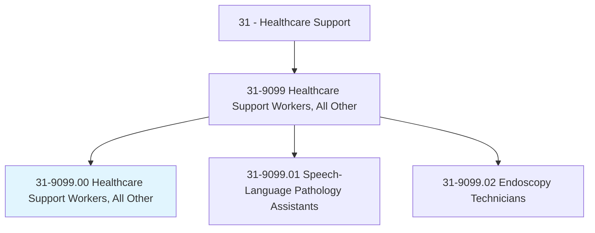
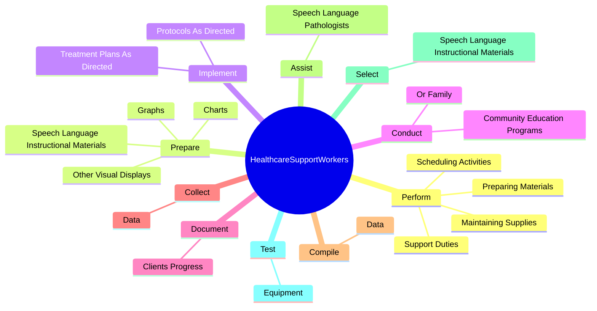
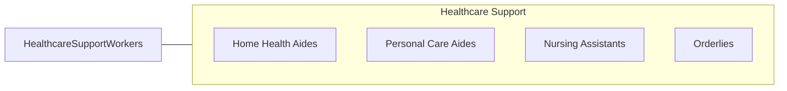

# Healthcare Support Workers, All Other

> All healthcare support workers not listed separately.

## Overview

Healthcare Support Workers, All Other is classified under Healthcare Support (SOC 31). All healthcare support workers not listed separately.

## Classification Hierarchy

## Key Statistics

| Metric | Value |
|--------|-------|
| SOC Code | 31-9099.00 |
| Category | [Healthcare Support](/occupations/HealthcareSupport/index) |
| Task Count | 29 |
| Source | O*NET |

## Core Tasks

### perform.SupportDuties

Healthcare Support Workers, All Other perform support duties as part of their core responsibilities.

**Actions:**
- `perform.SupportDuties`
- `perform.PreparingMaterials`
- `perform.MaintainingSupplies`
- `perform.SchedulingActivities`

### prepare.SpeechLanguageInstructionalMaterials

Healthcare Support Workers, All Other prepare speech language instructional materials as part of their core responsibilities.

**Actions:**
- `prepare.SpeechLanguageInstructionalMaterials`
- `prepare.Charts.to.ClientsPerformanceInformation`
- `prepare.Graphs.to.ClientsPerformanceInformation`
- `prepare.OtherVisualDisplays.to.ClientsPerformanceInformation`

### implement.TreatmentPlansAsDirected

Healthcare Support Workers, All Other implement treatment plans as directed as part of their core responsibilities.

**Actions:**
- `implement.TreatmentPlansAsDirected.by.SpeechLanguagePathologists`
- `implement.ProtocolsAsDirected.by.SpeechLanguagePathologists`

## Skills & Competencies

### Technical Skills
- **Patient Care** - Advanced
- **Medical Terminology** - Intermediate
- **Health Records** - Intermediate

### Soft Skills
- **Communication** - Essential
- **Problem Solving** - Essential
- **Critical Thinking** - Important
- **Teamwork** - Important
- **Adaptability** - Important

## Related Occupations

## Industries

This occupation is found across multiple industries. See [Industries](/industries) for sector-specific employment data.

## Career Progression

---

*Source: O*NET 31-9099.00 - ONETOccupation*
