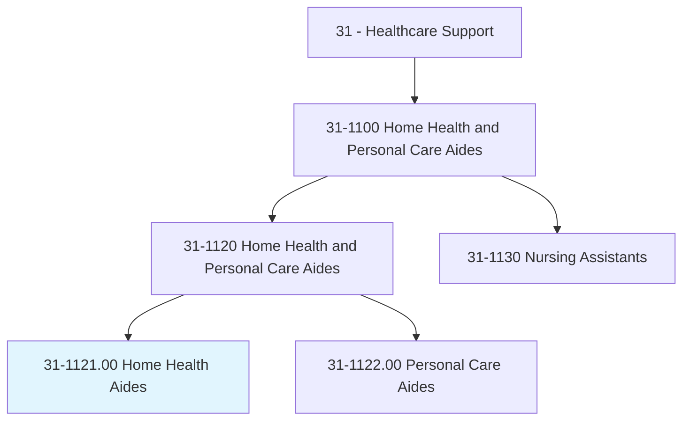
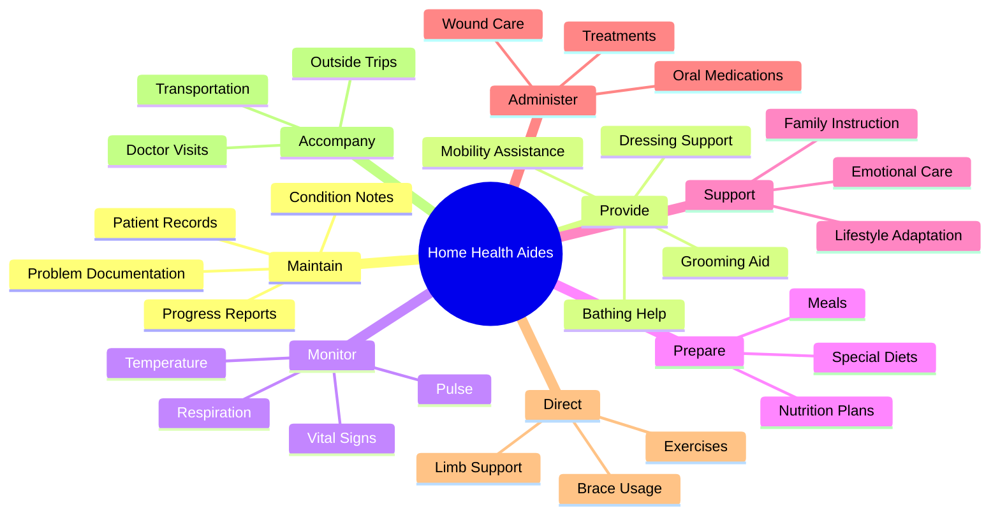
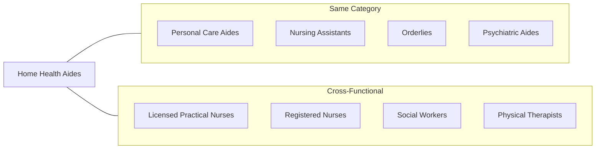
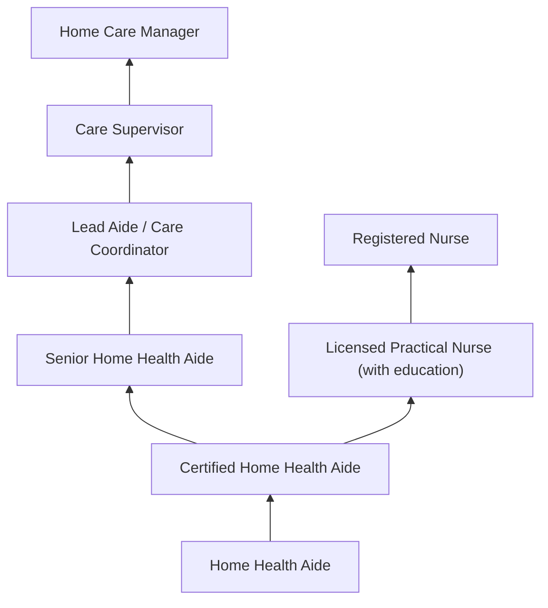

# Home Health Aides

> Monitor the health status of an individual with disabilities or illness, and address their health-related needs, such as changing bandages, dressing wounds, or administering medication. Work is performed under the direction of offsite or intermittent onsite licensed nursing staff. Provide assistance with routine healthcare tasks or activities of daily living, such as feeding, bathing, toileting, or ambulation. May also help with tasks such as preparing meals, doing light housekeeping, and doing laundry depending on the patient's abilities.

## Overview

Home Health Aides provide personalized healthcare assistance to individuals in their homes who are elderly, chronically ill, or disabled. They work under the supervision of nurses or other medical professionals to deliver hands-on care including basic health monitoring, medication assistance, wound care, and help with daily activities. Home Health Aides play a vital role in enabling patients to maintain independence and quality of life while receiving necessary care in the comfort of their own homes.

## Classification Hierarchy

## Key Statistics

| Metric | Value |
|--------|-------|
| SOC Code | 31-1121.00 |
| Job Zone | 2 (Some Preparation) |
| Category | [Healthcare Support](/occupations/HealthcareSupport/index) |
| Core Tasks | 15+ |
| Source | O*NET |

## Core Tasks

### maintain.Records

Home Health Aides document patient care and communicate with supervisors.

**Actions:**
- `maintain.Records.of.PatientCare` - Track care activities
- `maintain.Records.of.Condition` - Document health status
- `maintain.Records.of.Problems.to.Report` - Note concerns for supervisor
- `maintain.Records.of.DiscussObservations.with.Supervisor` - Communicate with nursing staff

### provide.Patients

Home Health Aides assist with mobility and personal care.

**Actions:**
- `provide.Patients.with.HelpMoving.in.OfBeds` - Assist with bed transfers
- `provide.Patients.with.Baths` - Help with bathing
- `provide.Patients.with.Wheelchairs` - Wheelchair assistance
- `provide.Patients.with.WithDressingGrooming` - Personal care support
- `provide.Patients.with.EmotionalSupport.in.Areas` - Emotional assistance
- `provide.Families.with.Instruction.in.Areas` - Family education

### bathe.Patients

Home Health Aides provide personal hygiene care.

**Actions:**
- `bathe.Patients` - Assist with bathing and hygiene

### check.VitalSigns

Home Health Aides monitor basic health indicators.

**Actions:**
- `check.PatientsPulse` - Monitor heart rate
- `check.Temperature` - Take temperature readings
- `check.Respiration` - Monitor breathing

### plan.Meals

Home Health Aides support nutritional needs.

**Actions:**
- `plan.Meals.to.PatientsFamilyMembersAccordingToPrescribedDiets` - Plan appropriate meals
- `purchase.Meals.to.PatientsFamilyMembersAccordingToPrescribedDiets` - Shop for groceries
- `prepare.Meals.to.PatientsFamilyMembersAccordingToPrescribedDiets` - Cook meals
- `serve.Meals.to.PatientsFamilyMembersAccordingToPrescribedDiets` - Serve food

### entertain.Patients

Home Health Aides provide companionship and mental stimulation.

**Actions:**
- `entertain.Converse.with.ReadAloudToPatientsToKeepThemMentallyHealthyAlert` - Engage patients mentally

### direct.Patients

Home Health Aides guide patients in therapeutic activities.

**Actions:**
- `direct.Patients.in.SimplePrescribedExercisesUse.of.BracesArtificialLimbs` - Guide exercises
- `direct.Patients.in.InUseOfBracesArtificialLimbs` - Assist with mobility devices

### massage.Patients

Home Health Aides provide comfort treatments.

**Actions:**
- `massage.Patients` - Provide therapeutic massage
- `massage.ApplyPreparations` - Apply lotions and treatments
- `massage.HeatLampStimulation` - Use heat therapy

### administer.Medications

Home Health Aides assist with medication management under supervision.

**Actions:**
- `administer.PrescribedOralMedications.of.PhysicianDirected.by.HomeCareNurseAide` - Give oral medications
- `administer.PrescribedOralMedications.of.EnsurePatientsTakeMedicine` - Ensure compliance

### accompany.Clients

Home Health Aides provide transportation and escort services.

**Actions:**
- `accompany.Clients.to.DoctorsOfficesOtherTripsOutsideHome` - Transport to appointments
- `accompany.Clients.to.ProvidingTransportation` - Drive patients
- `accompany.Clients.to.Companionship` - Provide companionship

### change.Dressings

Home Health Aides perform basic wound care.

**Actions:**
- `change.Dressings` - Change bandages and wound dressings

## Skills & Competencies

### Technical Skills
- **Basic Patient Care** - Proficient
- **Vital Signs Monitoring** - Proficient
- **Medication Assistance** - Basic
- **Wound Care (Basic)** - Basic
- **Mobility Assistance** - Proficient
- **Meal Preparation** - Proficient
- **Infection Control** - Proficient

### Soft Skills
- **Compassion** - Critical
- **Patience** - Critical
- **Communication** - Essential
- **Reliability** - Critical
- **Physical Stamina** - Essential
- **Problem Solving** - Important

## Related Occupations

## Industries

- Home Healthcare Services - Primary Employment
- [Residential Care Facilities](/industries/ResidentialCare) - Long-term Care
- Individual and Family Services - Social Services
- Nursing Care Facilities - Skilled Nursing
- [Hospitals](/industries/Healthcare/Hospitals/index) - Transitional Care

## Career Progression

## Education & Training

| Requirement | Details |
|-------------|---------|
| Typical Education | High school diploma or equivalent |
| Work Experience | None required for entry-level |
| On-the-Job Training | 75+ hours training for Medicare-certified agencies |
| Certification | State certification may be required; CPR/First Aid |
| Continuing Education | Annual competency evaluations |

## Departments

This occupation typically works in:
- Home Care Services
- Patient Care
- Skilled Nursing
- Rehabilitation Services

---

*Source: O*NET 31-1121.00 - ONETOccupation*
