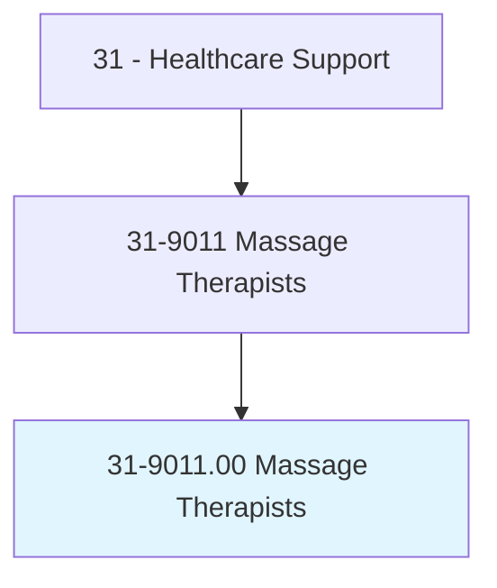
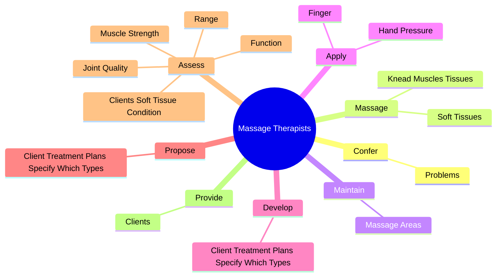
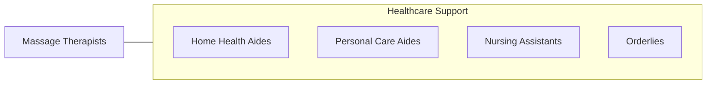

# Massage Therapists

> Perform therapeutic massages of soft tissues and joints. May assist in the assessment of range of motion and muscle strength, or propose client therapy plans.

## Overview

Massage Therapists is an occupation within the Healthcare Support category. Perform therapeutic massages of soft tissues and joints. 

## Classification Hierarchy

## Key Statistics

| Metric | Value |
|--------|-------|
| SOC Code | 31-9011.00 |
| Category | [Healthcare Support](/occupations/HealthcareSupport/index) |
| Task Count | 54 |
| Source | O*NET |

## Core Tasks

### confer.Problems

Massage Therapists confer problems as part of their core responsibilities.

**Actions:**
- `confer.Problems.with.Stress.to.determine.HowMassageWillBeHelpful`
- `confer.Problems.with.Pain.to.determine.HowMassageWillBeHelpful`

### massage.KneadMusclesTissues

Massage Therapists massage knead muscles tissues as part of their core responsibilities.

**Actions:**
- `massage.KneadMusclesTissues.of.Body.to.provide.TreatmentForMedicalConditions`
- `massage.KneadMusclesTissues.of.Injuries`
- `massage.KneadMusclesTissues.of.WellnessMaintenance`
- `massage.SoftTissues.of.Body.to.provide.TreatmentForMedicalConditions`

### maintain.MassageAreas

Massage Therapists maintain massage areas as part of their core responsibilities.

**Actions:**
- `maintain.MassageAreas.by.RestockingSupplies`
- `maintain.MassageAreas.by.SanitizingEquipment`

## Skills & Competencies

### Technical Skills
- **Patient Care** - Advanced
- **Medical Terminology** - Intermediate
- **Health Records** - Intermediate

### Soft Skills
- **Communication** - Essential
- **Problem Solving** - Essential
- **Critical Thinking** - Important
- **Teamwork** - Important
- **Adaptability** - Important

## Related Occupations

## Industries

This occupation is found across multiple industries. See [Industries](/industries) for sector-specific employment data.

## Career Progression

---

*Source: O*NET 31-9011.00 - ONETOccupation*
