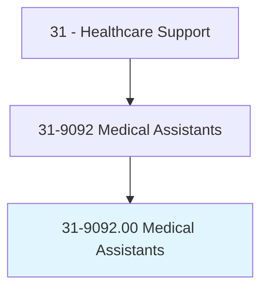
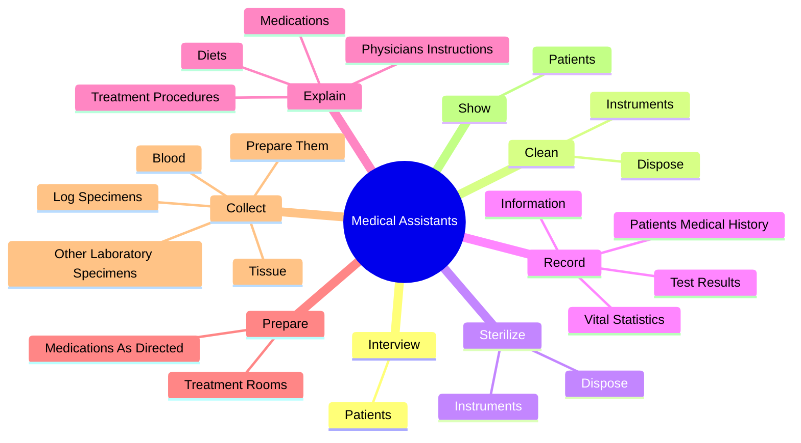
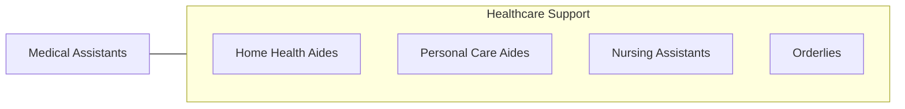

# Medical Assistants

> Perform administrative and certain clinical duties under the direction of a physician. Administrative duties may include scheduling appointments, maintaining medical records, billing, and coding information for insurance purposes. Clinical duties may include taking and recording vital signs and medical histories, preparing patients for examination, drawing blood, and administering medications as directed by physician.

## Overview

Medical Assistants is an occupation within the Healthcare Support category. Perform administrative and certain clinical duties under the direction of a physician. Administrative duties may include scheduling appointments, maintaining medical records, billing, and coding information for insurance purposes.

## Classification Hierarchy

## Key Statistics

| Metric | Value |
|--------|-------|
| SOC Code | 31-9092.00 |
| Category | [Healthcare Support](/occupations/HealthcareSupport) |
| Task Count | 61 |
| Source | O*NET |

## Core Tasks

### interview.Patients

Medical Assistants interview patients as part of their core responsibilities.

**Actions:**
- `interview.Patients.to.obtain.MedicalInformation`
- `interview.Patients.to.measure.VitalSigns`
- `interview.Patients.to.Weight`
- `interview.Patients.to.Height`

### clean.Instruments

Medical Assistants clean instruments as part of their core responsibilities.

**Actions:**
- `clean.Instruments.of.ContaminatedSupplies`
- `clean.Dispose.of.ContaminatedSupplies`

### sterilize.Instruments

Medical Assistants sterilize instruments as part of their core responsibilities.

**Actions:**
- `sterilize.Instruments.of.ContaminatedSupplies`
- `sterilize.Dispose.of.ContaminatedSupplies`

## Skills & Competencies

### Technical Skills
- **Patient Care** - Advanced
- **Medical Terminology** - Intermediate
- **Health Records** - Intermediate

### Soft Skills
- **Communication** - Essential
- **Problem Solving** - Essential
- **Critical Thinking** - Important
- **Teamwork** - Important
- **Adaptability** - Important

## Related Occupations

## Industries

This occupation is found across multiple industries. See [Industries](/industries) for sector-specific employment data.

## Career Progression

---

*Source: O*NET 31-9092.00 - ONETOccupation*
