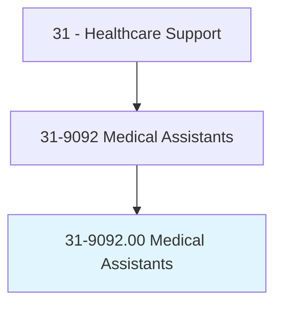
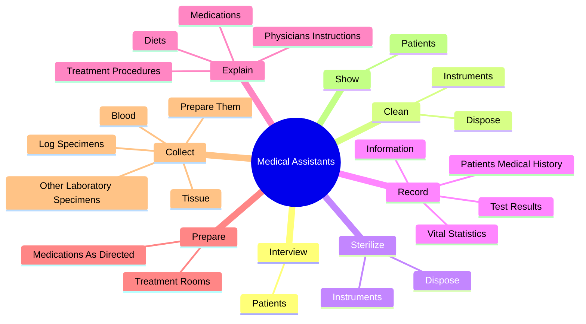
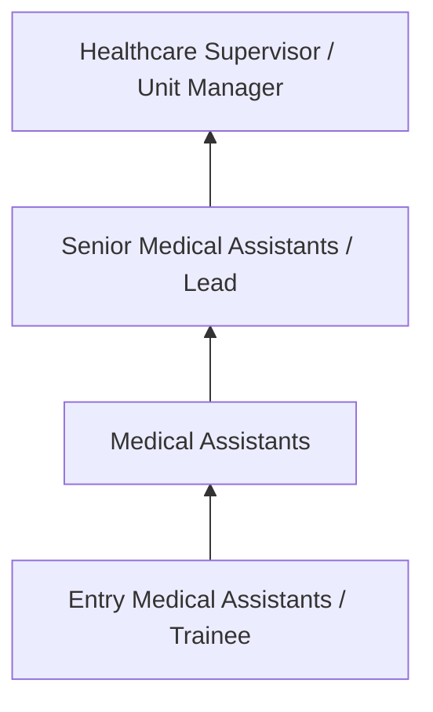
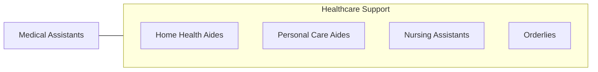

# Medical Assistants

> Perform administrative and certain clinical duties under the direction of a physician. Administrative duties may include scheduling appointments, maintaining medical records, billing, and coding information for insurance purposes. Clinical duties may include taking and recording vital signs and medical histories, preparing patients for examination, drawing blood, and administering medications as directed by physician.

## Overview

Medical Assistants professionals perform administrative and certain clinical duties under the direction of a physician. This occupation falls within the Healthcare Support category and requires a combination of specialized knowledge, technical skills, and practical experience.

These professionals work across diverse settings and organizational contexts, applying their expertise to meet the demands of their field. They must stay current with industry standards, emerging practices, and regulatory requirements that affect their work. The role demands both independent judgment and collaborative skills, as practitioners regularly interact with colleagues, stakeholders, and the public.

As the field continues to evolve, Medical Assistants professionals increasingly leverage technology and data-driven approaches to enhance their effectiveness. Career opportunities span the public and private sectors, with demand influenced by economic conditions, demographic shifts, and technological advancement.

## Classification Hierarchy



## Key Statistics

| Metric | Value |
|--------|-------|
| SOC Code | 31-9092.00 |
| Job Zone | N/A |
| Category | [Healthcare Support](/occupations/HealthcareSupport/index) |
| Core Tasks | 61+ |
| Salary Range | $28,000 - $55,000 |
| Median Salary | $38,000 |
| Growth Outlook | 15% (Much faster than average) |
| Source | O*NET |

## Core Tasks



### help.PhysiciansExamine

Medical Assistants help physicians examine as part of their core responsibilities.

**Actions:**
- `help.PhysiciansExamine` - Help physicians examine and treat patients, handing them instruments or mater...
- `help.TreatPatients` - Help physicians examine and treat patients, handing them instruments or mater...
- `help.HandingThemInstruments` - Help physicians examine and treat patients, handing them instruments or mater...
- `help.Materials` - Help physicians examine and treat patients, handing them instruments or mater...
- `help.PerformingSuchTasksAsGivingInjections` - Help physicians examine and treat patients, handing them instruments or mater...

### collect.Blood

Medical Assistants collect blood as part of their core responsibilities.

**Actions:**
- `collect.Blood.for.Testing` - Collect blood, tissue, or other laboratory specimens, log the specimens, and ...
- `collect.Tissue.for.Testing` - Collect blood, tissue, or other laboratory specimens, log the specimens, and ...
- `collect.OtherLaboratorySpecimens.for.Testing` - Collect blood, tissue, or other laboratory specimens, log the specimens, and ...
- `collect.LogSpecimens.for.Testing` - Collect blood, tissue, or other laboratory specimens, log the specimens, and ...
- `collect.PrepareThem.for.Testing` - Collect blood, tissue, or other laboratory specimens, log the specimens, and ...

### keep.FinancialRecords

Medical Assistants keep financial records as part of their core responsibilities.

**Actions:**
- `keep.FinancialRecords.to.Patients` - Keep financial records or perform other bookkeeping duties, such as handling ...
- `keep.PerformOtherBookkeepingDuties.to.Patients` - Keep financial records or perform other bookkeeping duties, such as handling ...
- `keep.HandlingCredit.to.Patients` - Keep financial records or perform other bookkeeping duties, such as handling ...
- `keep.Collections.to.Patients` - Keep financial records or perform other bookkeeping duties, such as handling ...
- `keep.MailingMonthlyStatements.to.Patients` - Keep financial records or perform other bookkeeping duties, such as handling ...

### interview.Patients

Medical Assistants interview patients as part of their core responsibilities.

**Actions:**
- `interview.Patients.to.obtain.MedicalInformation` - Interview patients to obtain medical information and measure their vital sign...
- `interview.Patients.to.measure.VitalSigns` - Interview patients to obtain medical information and measure their vital sign...
- `interview.Patients.to.Weight` - Interview patients to obtain medical information and measure their vital sign...
- `interview.Patients.to.Height` - Interview patients to obtain medical information and measure their vital sign...


## Skills & Competencies

### Technical Skills
- **Patient Care** - Advanced
- **Vital Signs Monitoring** - Advanced
- **Infection Control** - Advanced
- **Medical Terminology** - Proficient
- **Patient Safety** - Proficient
- **Electronic Health Records** - Proficient

### Soft Skills
- **Compassion** - Critical
- **Communication** - Critical
- **Physical Stamina** - Essential
- **Attention to Detail** - Essential
- **Emotional Resilience** - Essential

## Education & Certifications

| Requirement | Details |
|-------------|---------|
| Typical Education | Post-secondary certificate or associate degree |
| Work Experience | 0-1 years clinical experience |
| On-the-Job Training | Moderate - clinical procedures and patient care |
| Certifications | CNA, CPR/BLS, state-specific healthcare certifications |

## Career Progression



## Industry Variations

### Hospital Settings
Acute care support in hospital environments. Medical Assistants professionals assist with direct patient care under nursing supervision.

### Long-Term Care
Extended care in nursing homes and assisted living facilities. Emphasis on daily living assistance and ongoing patient relationships.

### Home Health
In-home patient care services. Requires independence and ability to work with minimal supervision in patient homes.

### Rehabilitation Services
Support for physical, occupational, or speech therapy. Focus on helping patients recover function and independence.

## Technology & Tools

- **Electronic health records (EHR)**
- **Patient monitoring equipment**
- **Medical devices and assistive technology**
- **Vital signs measurement tools**
- **Healthcare information systems**

## Related Occupations



## Industries

- [Hospitals](/industries/Hospitals) - High Employment
- Nursing Care Facilities - High Employment
- Home Health Services - High Employment
- Outpatient Care Centers - Moderate Employment

## Departments

This occupation typically works in:
- Patient Care
- Nursing Services
- Clinical Support

## GraphDL Semantic Structure

```graphdl
Medical Assistants perform:
- interview.Patients.to.obtain.MedicalInformation
- interview.Patients.to.measure.VitalSigns
- interview.Patients.to.Weight
- interview.Patients.to.Height
- clean.Instruments.of.ContaminatedSupplies
- clean.Dispose.of.ContaminatedSupplies
```

---

*Source: O*NET 31-9092.00 - ONETOccupation*
