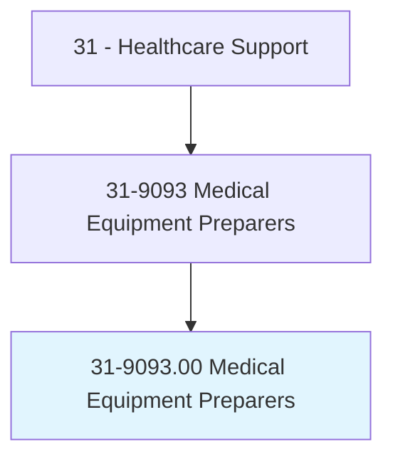
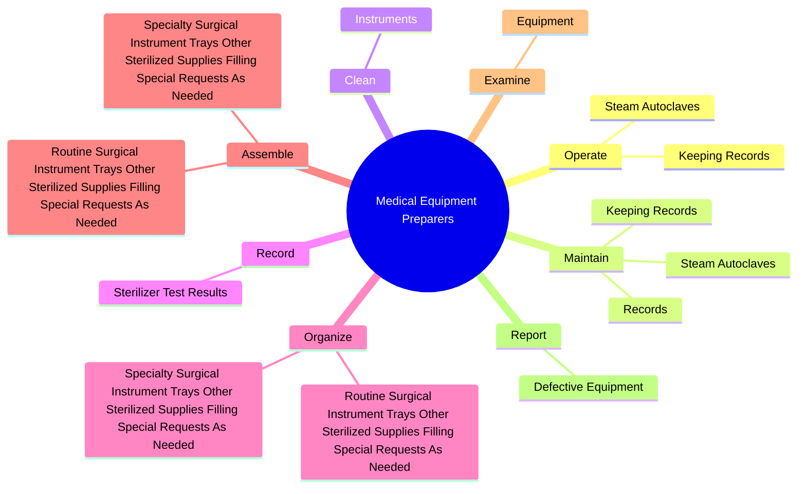
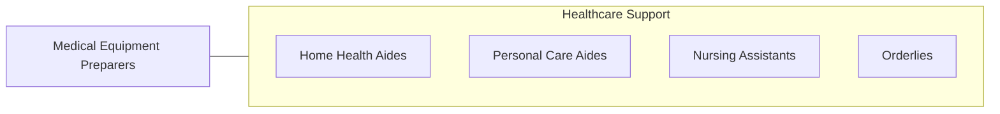

# Medical Equipment Preparers

> Prepare, sterilize, install, or clean laboratory or healthcare equipment. May perform routine laboratory tasks and operate or inspect equipment.

## Overview

Medical Equipment Preparers is an occupation within the Healthcare Support category. Prepare, sterilize, install, or clean laboratory or healthcare equipment. 

## Classification Hierarchy

## Key Statistics

| Metric | Value |
|--------|-------|
| SOC Code | 31-9093.00 |
| Category | [Healthcare Support](/occupations/HealthcareSupport/index) |
| Task Count | 57 |
| Source | O*NET |

## Core Tasks

### operate.SteamAutoclaves

Medical Equipment Preparers operate steam autoclaves as part of their core responsibilities.

**Actions:**
- `operate.SteamAutoclaves.of.LoadsCompleted`
- `operate.SteamAutoclaves.of.Items.in.Loads`
- `operate.SteamAutoclaves.of.MaintenanceProceduresPerformed`
- `operate.KeepingRecords.of.LoadsCompleted`

### maintain.SteamAutoclaves

Medical Equipment Preparers maintain steam autoclaves as part of their core responsibilities.

**Actions:**
- `maintain.SteamAutoclaves.of.LoadsCompleted`
- `maintain.SteamAutoclaves.of.Items.in.Loads`
- `maintain.SteamAutoclaves.of.MaintenanceProceduresPerformed`
- `maintain.KeepingRecords.of.LoadsCompleted`

### clean.Instruments

Medical Equipment Preparers clean instruments as part of their core responsibilities.

**Actions:**
- `clean.Instruments.to.prepare.ThemForSterilization`

## Skills & Competencies

### Technical Skills
- **Patient Care** - Advanced
- **Medical Terminology** - Intermediate
- **Health Records** - Intermediate

### Soft Skills
- **Communication** - Essential
- **Problem Solving** - Essential
- **Critical Thinking** - Important
- **Teamwork** - Important
- **Adaptability** - Important

## Related Occupations

## Industries

This occupation is found across multiple industries. See [Industries](/industries) for sector-specific employment data.

## Career Progression

---

*Source: O*NET 31-9093.00 - ONETOccupation*
