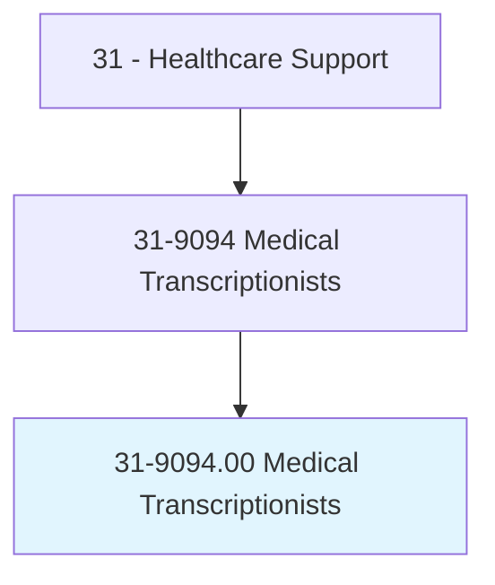
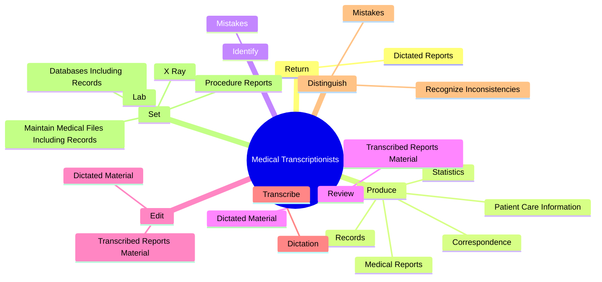
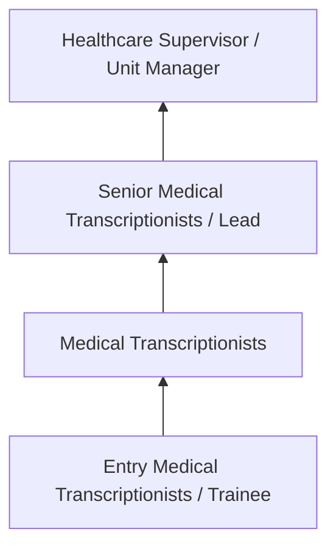
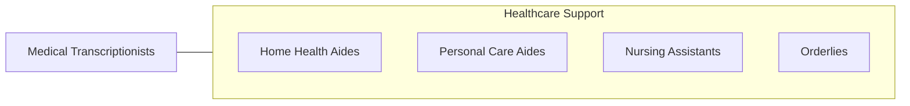

# Medical Transcriptionists

> Transcribe medical reports recorded by physicians and other healthcare practitioners using various electronic devices, covering office visits, emergency room visits, diagnostic imaging studies, operations, chart reviews, and final summaries. Transcribe dictated reports and translate abbreviations into fully understandable form. Edit as necessary and return reports in either printed or electronic form for review and signature, or correction.

## Overview

Medical Transcriptionists professionals transcribe medical reports recorded by physicians and other healthcare practitioners using various electronic devices, covering office visits, emergency room visits, diagnostic imaging studies, operations, chart reviews, and final summaries. This occupation falls within the Healthcare Support category and requires a combination of specialized knowledge, technical skills, and practical experience.

These professionals work across diverse settings and organizational contexts, applying their expertise to meet the demands of their field. They must stay current with industry standards, emerging practices, and regulatory requirements that affect their work. The role demands both independent judgment and collaborative skills, as practitioners regularly interact with colleagues, stakeholders, and the public.

As the field continues to evolve, Medical Transcriptionists professionals increasingly leverage technology and data-driven approaches to enhance their effectiveness. Career opportunities span the public and private sectors, with demand influenced by economic conditions, demographic shifts, and technological advancement.

## Classification Hierarchy



## Key Statistics

| Metric | Value |
|--------|-------|
| SOC Code | 31-9094.00 |
| Job Zone | N/A |
| Category | [Healthcare Support](/occupations/HealthcareSupport/index) |
| Core Tasks | 96+ |
| Salary Range | $28,000 - $55,000 |
| Median Salary | $38,000 |
| Growth Outlook | 15% (Much faster than average) |
| Source | O*NET |

## Core Tasks



### perform.DataEntryRetrievalServicesProvidingData

Medical Transcriptionists perform data entry retrieval services providing data as part of their core responsibilities.

**Actions:**
- `perform.DataEntryRetrievalServicesProvidingData.for.Inclusion.in.MedicalRecordsTransmissionToPhysicians` - Perform data entry and data retrieval services, providing data for inclusion ...
- `perform.DataEntryRetrievalServicesProvidingData.for.ForTransmissionToPhysicians` - Perform data entry and data retrieval services, providing data for inclusion ...
- `perform.DataRetrievalServicesProvidingData.for.Inclusion.in.MedicalRecordsTransmissionToPhysicians` - Perform data entry and data retrieval services, providing data for inclusion ...
- `perform.DataRetrievalServicesProvidingData.for.ForTransmissionToPhysicians` - Perform data entry and data retrieval services, providing data for inclusion ...
- `perform.Variety.of.ClericalTasks` - Perform a variety of clerical and office tasks, such as handling incoming and...

### distinguish.RecognizeInconsistencies

Medical Transcriptionists distinguish recognize inconsistencies as part of their core responsibilities.

**Actions:**
- `distinguish.RecognizeInconsistencies.in.MedicalTerms` - Distinguish between homonyms and recognize inconsistencies and mistakes in me...
- `distinguish.RecognizeInconsistencies.in.Referring.to.Dictionaries` - Distinguish between homonyms and recognize inconsistencies and mistakes in me...
- `distinguish.RecognizeInconsistencies.in.DrugReferences` - Distinguish between homonyms and recognize inconsistencies and mistakes in me...
- `distinguish.RecognizeInconsistencies.in.OtherSources.on.Anatomy` - Distinguish between homonyms and recognize inconsistencies and mistakes in me...
- `distinguish.RecognizeInconsistencies.in.Physiology` - Distinguish between homonyms and recognize inconsistencies and mistakes in me...

### review.TranscribedReportsMaterial

Medical Transcriptionists review transcribed reports material as part of their core responsibilities.

**Actions:**
- `review.TranscribedReportsMaterial.for.Spelling` - Review and edit transcribed reports or dictated material for spelling, gramma...
- `review.TranscribedReportsMaterial.for.Grammar` - Review and edit transcribed reports or dictated material for spelling, gramma...
- `review.TranscribedReportsMaterial.for.Clarity` - Review and edit transcribed reports or dictated material for spelling, gramma...
- `review.TranscribedReportsMaterial.for.Consistency` - Review and edit transcribed reports or dictated material for spelling, gramma...
- `review.TranscribedReportsMaterial.for.ProperMedicalTerminology` - Review and edit transcribed reports or dictated material for spelling, gramma...

### edit.TranscribedReportsMaterial

Medical Transcriptionists edit transcribed reports material as part of their core responsibilities.

**Actions:**
- `edit.TranscribedReportsMaterial.for.Spelling` - Review and edit transcribed reports or dictated material for spelling, gramma...
- `edit.TranscribedReportsMaterial.for.Grammar` - Review and edit transcribed reports or dictated material for spelling, gramma...
- `edit.TranscribedReportsMaterial.for.Clarity` - Review and edit transcribed reports or dictated material for spelling, gramma...
- `edit.TranscribedReportsMaterial.for.Consistency` - Review and edit transcribed reports or dictated material for spelling, gramma...
- `edit.TranscribedReportsMaterial.for.ProperMedicalTerminology` - Review and edit transcribed reports or dictated material for spelling, gramma...


## Skills & Competencies

### Technical Skills
- **Patient Care** - Advanced
- **Vital Signs Monitoring** - Advanced
- **Infection Control** - Advanced
- **Medical Terminology** - Proficient
- **Patient Safety** - Proficient
- **Electronic Health Records** - Proficient

### Soft Skills
- **Compassion** - Critical
- **Communication** - Critical
- **Physical Stamina** - Essential
- **Attention to Detail** - Essential
- **Emotional Resilience** - Essential

## Education & Certifications

| Requirement | Details |
|-------------|---------|
| Typical Education | Post-secondary certificate or associate degree |
| Work Experience | 0-1 years clinical experience |
| On-the-Job Training | Moderate - clinical procedures and patient care |
| Certifications | CNA, CPR/BLS, state-specific healthcare certifications |

## Career Progression



## Industry Variations

### Hospital Settings
Acute care support in hospital environments. Medical Transcriptionists professionals assist with direct patient care under nursing supervision.

### Long-Term Care
Extended care in nursing homes and assisted living facilities. Emphasis on daily living assistance and ongoing patient relationships.

### Home Health
In-home patient care services. Requires independence and ability to work with minimal supervision in patient homes.

### Rehabilitation Services
Support for physical, occupational, or speech therapy. Focus on helping patients recover function and independence.

## Technology & Tools

- **Electronic health records (EHR)**
- **Patient monitoring equipment**
- **Medical devices and assistive technology**
- **Vital signs measurement tools**
- **Healthcare information systems**

## Related Occupations



## Industries

- [Hospitals](/industries/Hospitals) - High Employment
- [Nursing Care Facilities](/industries/NursingFacilities) - High Employment
- [Home Health Services](/industries/HomeHealth) - High Employment
- [Outpatient Care Centers](/industries/OutpatientCare) - Moderate Employment

## Departments

This occupation typically works in:
- [Patient Care](/departments/PatientCare)
- [Nursing Services](/departments/NursingServices)
- [Clinical Support](/departments/ClinicalSupport)

## GraphDL Semantic Structure

```
Medical Transcriptionists perform:
- return.DictatedReports.in.PrintedForm.for.PhysiciansReview
- return.DictatedReports.in.ElectronicForm.for.PhysiciansReview
- return.DictatedReports.in.Signature
- return.DictatedReports.in.CorrectionsInclusion.in.PatientsMedicalRecords
- return.DictatedReports.in.ForInclusionInPatientsMedicalRecords
- produce.MedicalReports
```

---

*Source: O*NET 31-9094.00 - ONETOccupation*
