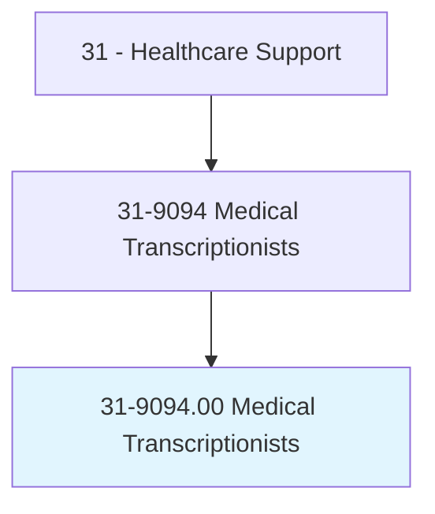
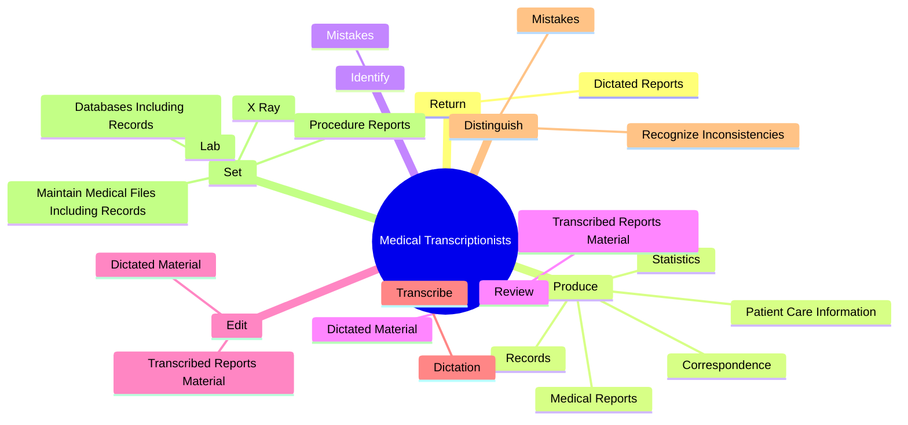
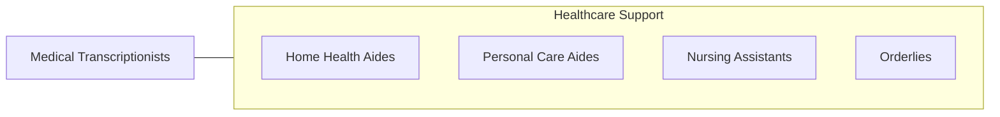

# Medical Transcriptionists

> Transcribe medical reports recorded by physicians and other healthcare practitioners using various electronic devices, covering office visits, emergency room visits, diagnostic imaging studies, operations, chart reviews, and final summaries. Transcribe dictated reports and translate abbreviations into fully understandable form. Edit as necessary and return reports in either printed or electronic form for review and signature, or correction.

## Overview

Medical Transcriptionists is an occupation within the Healthcare Support category. Transcribe medical reports recorded by physicians and other healthcare practitioners using various electronic devices, covering office visits, emergency room visits, diagnostic imaging studies, operations, chart reviews, and final summaries. Transcribe dictated reports and translate abbreviations into fully understandable form.

## Classification Hierarchy

## Key Statistics

| Metric | Value |
|--------|-------|
| SOC Code | 31-9094.00 |
| Category | [Healthcare Support](/occupations/HealthcareSupport/index) |
| Task Count | 96 |
| Source | O*NET |

## Core Tasks

### return.DictatedReports

Medical Transcriptionists return dictated reports as part of their core responsibilities.

**Actions:**
- `return.DictatedReports.in.PrintedForm.for.PhysiciansReview`
- `return.DictatedReports.in.ElectronicForm.for.PhysiciansReview`
- `return.DictatedReports.in.Signature`
- `return.DictatedReports.in.CorrectionsInclusion.in.PatientsMedicalRecords`

### produce.MedicalReports

Medical Transcriptionists produce medical reports as part of their core responsibilities.

**Actions:**
- `produce.MedicalReports`
- `produce.Correspondence`
- `produce.Records`
- `produce.PatientCareInformation`

### identify.Mistakes

Medical Transcriptionists identify mistakes as part of their core responsibilities.

**Actions:**
- `identify.Mistakes.in.ReportsWithDoctors.to.obtain.CorrectInformation`
- `identify.Mistakes.in.CheckWithDoctors.to.obtain.CorrectInformation`

## Skills & Competencies

### Technical Skills
- **Patient Care** - Advanced
- **Medical Terminology** - Intermediate
- **Health Records** - Intermediate

### Soft Skills
- **Communication** - Essential
- **Problem Solving** - Essential
- **Critical Thinking** - Important
- **Teamwork** - Important
- **Adaptability** - Important

## Related Occupations

## Industries

This occupation is found across multiple industries. See [Industries](/industries) for sector-specific employment data.

## Career Progression

---

*Source: O*NET 31-9094.00 - ONETOccupation*
