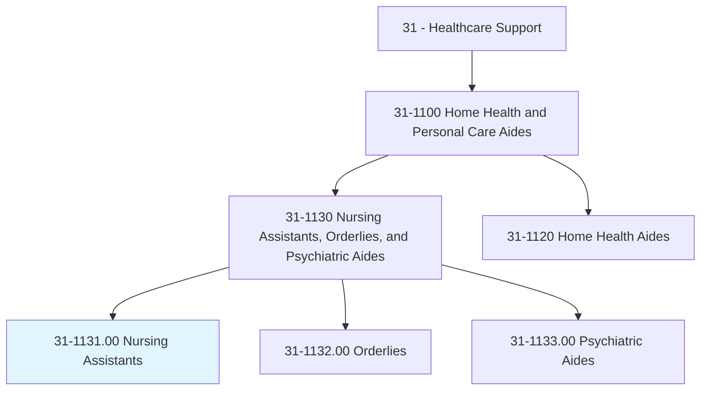
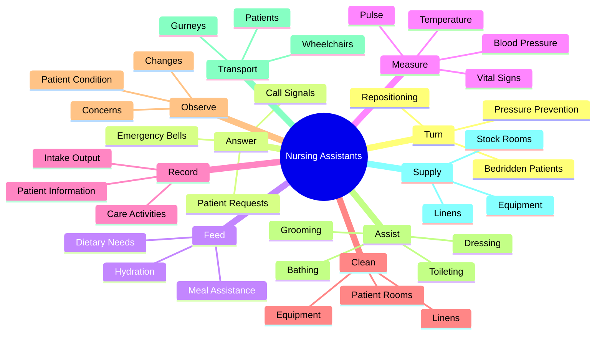
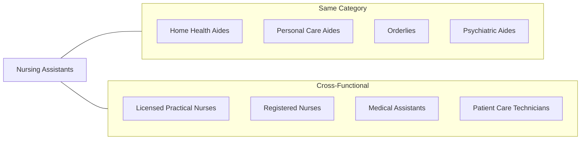
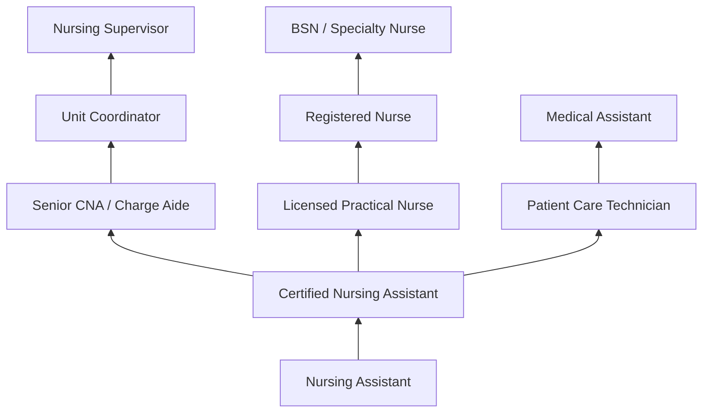

# Nursing Assistants

> Provide or assist with basic care or support under the direction of onsite licensed nursing staff. Perform duties such as monitoring of health status, feeding, bathing, dressing, grooming, toileting, or ambulation of patients in a health or nursing facility. May include medication administration and other health-related tasks. Includes nursing care attendants, nursing aides, and nursing attendants.

## Overview

Nursing Assistants, also known as Certified Nursing Assistants (CNAs), provide essential hands-on patient care in healthcare facilities under the supervision of licensed nurses. They assist patients with daily activities, monitor vital signs, document patient information, and serve as a critical link between patients and nursing staff. Nursing Assistants work in hospitals, nursing homes, and other healthcare settings, providing compassionate care to patients who need assistance with basic health needs.

## Classification Hierarchy

## Key Statistics

| Metric | Value |
|--------|-------|
| SOC Code | 31-1131.00 |
| Job Zone | 2 (Some Preparation) |
| Category | [Healthcare Support](/occupations/HealthcareSupport/index) |
| Core Tasks | 20+ |
| Source | O*NET |

## Core Tasks

### turn.BedriddenPatients

Nursing Assistants reposition patients to prevent complications.

**Actions:**
- `turn.BedriddenPatients` - Reposition immobile patients
- `reposition.BedriddenPatients` - Change patient positions

### answer.PatientCallSignals

Nursing Assistants respond promptly to patient needs.

**Actions:**
- `answer.PatientCallSignals.to.determine.PatientsNeeds` - Respond to call buttons
- `answer.SignalLights.to.determine.PatientsNeeds` - React to signal lights
- `answer.Bells.to.determine.PatientsNeeds` - Answer call bells
- `answer.IntercomSystems.to.determine.PatientsNeeds` - Respond to intercoms

### feed.Patients

Nursing Assistants assist patients with nutrition.

**Actions:**
- `feed.Patients.to.Eat` - Help patients eat
- `feed.Patients.to.Drink` - Assist with hydration
- `feed.AssistPatients.to.Eat` - Support eating activities
- `feed.AssistPatients.to.Drink` - Encourage fluid intake

### measure.VitalSigns

Nursing Assistants monitor patient health indicators.

**Actions:**
- `measure.Temperature` - Take temperature readings
- `measure.BloodPressure` - Check blood pressure
- `measure.Pulse` - Monitor heart rate
- `measure.Respiration` - Count respiratory rate

### record.PatientInformation

Nursing Assistants document patient care and observations.

**Actions:**
- `record.PatientInformation` - Document patient data
- `record.IntakeOutput` - Track fluid balance
- `record.VitalSigns` - Log vital sign readings
- `record.CareActivities` - Note care provided

### clean.Rooms

Nursing Assistants maintain clean patient environments.

**Actions:**
- `clean.PatientRooms` - Clean and organize rooms
- `clean.Equipment` - Sanitize medical equipment
- `change.BedLinens` - Replace soiled linens

### observe.Patients

Nursing Assistants monitor and report patient conditions.

**Actions:**
- `observe.PatientCondition` - Watch for changes
- `observe.Changes` - Note any deterioration
- `report.Concerns` - Communicate issues to nurses

### assist.PersonalCare

Nursing Assistants help patients with daily activities.

**Actions:**
- `assist.Bathing` - Help with bathing
- `assist.Dressing` - Assist with clothing
- `assist.Grooming` - Support personal hygiene
- `assist.Toileting` - Help with bathroom needs
- `assist.Ambulation` - Support walking

### transport.Patients

Nursing Assistants move patients within facilities.

**Actions:**
- `transport.Patients` - Move patients safely
- `use.Wheelchairs` - Operate wheelchairs
- `use.Gurneys` - Manage stretchers

### supply.Rooms

Nursing Assistants maintain adequate supplies.

**Actions:**
- `stock.SupplyRooms` - Replenish supplies
- `organize.Equipment` - Arrange equipment
- `inventory.Linens` - Track linen supply

## Skills & Competencies

### Technical Skills
- **Patient Care** - Proficient
- **Vital Signs Monitoring** - Proficient
- **Medical Documentation** - Basic
- **Infection Control** - Proficient
- **Patient Transfer Techniques** - Proficient
- **CPR/First Aid** - Certified
- **Medical Terminology** - Basic

### Soft Skills
- **Compassion** - Critical
- **Physical Stamina** - Critical
- **Communication** - Essential
- **Attention to Detail** - Essential
- **Patience** - Critical
- **Teamwork** - Essential

## Related Occupations

## Industries

- [Nursing Care Facilities](/industries/NursingCare) - Primary Employment
- [Hospitals](/industries/Healthcare/Hospitals/index) - Acute Care
- [Residential Care Facilities](/industries/ResidentialCare) - Long-term Care
- [Home Healthcare Services](/industries/HomeHealthcare) - Community Care
- [Government](/industries/Government) - VA and Public Hospitals

## Career Progression

## Education & Training

| Requirement | Details |
|-------------|---------|
| Typical Education | High school diploma or equivalent |
| Work Experience | None required for entry |
| Training Program | State-approved CNA program (75-120 hours) |
| Certification | State CNA certification required |
| Competency Exam | Written and clinical skills test |
| Continuing Education | Annual training requirements |

## Departments

This occupation typically works in:
- [Nursing Services](/departments/NursingServices)
- [Patient Care Units](/departments/PatientCare)
- [Long-term Care](/departments/LongTermCare)
- [Rehabilitation](/departments/Rehabilitation)
- [Medical-Surgical Units](/departments/MedSurg)

---

*Source: O*NET 31-1131.00 - ONETOccupation*
