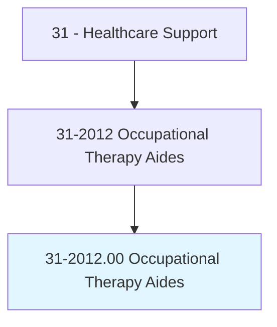
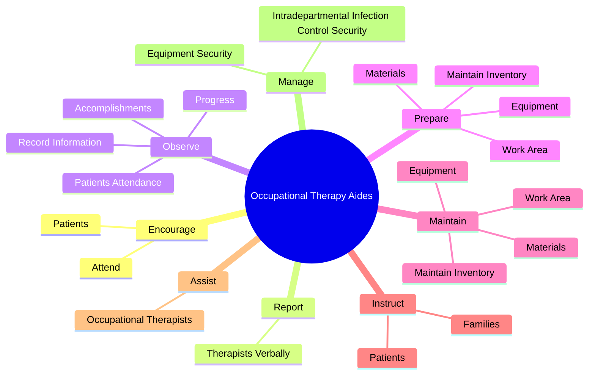
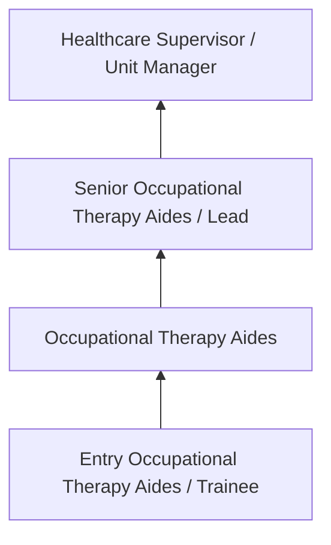
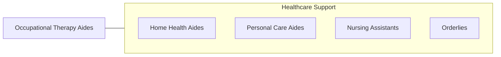

# Occupational Therapy Aides

> Under close supervision of an occupational therapist or occupational therapy assistant, perform only delegated, selected, or routine tasks in specific situations. These duties include preparing patient and treatment room.

## Overview

Occupational Therapy Aides professionals under close supervision of an occupational therapist or occupational therapy assistant, perform only delegated, selected, or routine tasks in specific situations. This occupation falls within the Healthcare Support category and requires a combination of specialized knowledge, technical skills, and practical experience.

These professionals work across diverse settings and organizational contexts, applying their expertise to meet the demands of their field. They must stay current with industry standards, emerging practices, and regulatory requirements that affect their work. The role demands both independent judgment and collaborative skills, as practitioners regularly interact with colleagues, stakeholders, and the public.

As the field continues to evolve, Occupational Therapy Aides professionals increasingly leverage technology and data-driven approaches to enhance their effectiveness. Career opportunities span the public and private sectors, with demand influenced by economic conditions, demographic shifts, and technological advancement.

## Classification Hierarchy



## Key Statistics

| Metric | Value |
|--------|-------|
| SOC Code | 31-2012.00 |
| Job Zone | N/A |
| Category | [Healthcare Support](/occupations/HealthcareSupport/index) |
| Core Tasks | 69+ |
| Salary Range | $28,000 - $55,000 |
| Median Salary | $38,000 |
| Growth Outlook | 15% (Much faster than average) |
| Source | O*NET |

## Core Tasks



### instruct.Patients

Occupational Therapy Aides instruct patients as part of their core responsibilities.

**Actions:**
- `instruct.Patients.in.Work` - Instruct patients and families in work, social, and living skills, the care a...
- `instruct.Patients.in.Social` - Instruct patients and families in work, social, and living skills, the care a...
- `instruct.Patients.in.LivingSkills` - Instruct patients and families in work, social, and living skills, the care a...
- `instruct.Patients.in.Use.of.AdaptiveEquipment` - Instruct patients and families in work, social, and living skills, the care a...
- `instruct.Patients.in.OtherSkills.to.facilitate.Home` - Instruct patients and families in work, social, and living skills, the care a...

### prepare.WorkArea

Occupational Therapy Aides prepare work area as part of their core responsibilities.

**Actions:**
- `prepare.WorkArea.of.TreatmentSupplies` - Prepare and maintain work area, materials, and equipment and maintain invento...
- `prepare.WorkArea.of.EducationalSupplies` - Prepare and maintain work area, materials, and equipment and maintain invento...
- `prepare.Materials.of.TreatmentSupplies` - Prepare and maintain work area, materials, and equipment and maintain invento...
- `prepare.Materials.of.EducationalSupplies` - Prepare and maintain work area, materials, and equipment and maintain invento...
- `prepare.Equipment.of.TreatmentSupplies` - Prepare and maintain work area, materials, and equipment and maintain invento...

### maintain.WorkArea

Occupational Therapy Aides maintain work area as part of their core responsibilities.

**Actions:**
- `maintain.WorkArea.of.TreatmentSupplies` - Prepare and maintain work area, materials, and equipment and maintain invento...
- `maintain.WorkArea.of.EducationalSupplies` - Prepare and maintain work area, materials, and equipment and maintain invento...
- `maintain.Materials.of.TreatmentSupplies` - Prepare and maintain work area, materials, and equipment and maintain invento...
- `maintain.Materials.of.EducationalSupplies` - Prepare and maintain work area, materials, and equipment and maintain invento...
- `maintain.Equipment.of.TreatmentSupplies` - Prepare and maintain work area, materials, and equipment and maintain invento...

### assist.OccupationalTherapists

Occupational Therapy Aides assist occupational therapists as part of their core responsibilities.

**Actions:**
- `assist.OccupationalTherapists.in.Planning` - Assist occupational therapists in planning, implementing, and administering t...
- `assist.OccupationalTherapists.in.Implementing` - Assist occupational therapists in planning, implementing, and administering t...
- `assist.OccupationalTherapists.in.AdministeringTherapyPrograms.to.Restore` - Assist occupational therapists in planning, implementing, and administering t...
- `assist.OccupationalTherapists.in.Reinforce` - Assist occupational therapists in planning, implementing, and administering t...
- `assist.OccupationalTherapists.in.EnhancePerformance` - Assist occupational therapists in planning, implementing, and administering t...


## Skills & Competencies

### Technical Skills
- **Patient Care** - Advanced
- **Vital Signs Monitoring** - Advanced
- **Infection Control** - Advanced
- **Medical Terminology** - Proficient
- **Patient Safety** - Proficient
- **Electronic Health Records** - Proficient

### Soft Skills
- **Compassion** - Critical
- **Communication** - Critical
- **Physical Stamina** - Essential
- **Attention to Detail** - Essential
- **Emotional Resilience** - Essential

## Education & Certifications

| Requirement | Details |
|-------------|---------|
| Typical Education | Post-secondary certificate or associate degree |
| Work Experience | 0-1 years clinical experience |
| On-the-Job Training | Moderate - clinical procedures and patient care |
| Certifications | CNA, CPR/BLS, state-specific healthcare certifications |

## Career Progression



## Industry Variations

### Hospital Settings
Acute care support in hospital environments. Occupational Therapy Aides professionals assist with direct patient care under nursing supervision.

### Long-Term Care
Extended care in nursing homes and assisted living facilities. Emphasis on daily living assistance and ongoing patient relationships.

### Home Health
In-home patient care services. Requires independence and ability to work with minimal supervision in patient homes.

### Rehabilitation Services
Support for physical, occupational, or speech therapy. Focus on helping patients recover function and independence.

## Technology & Tools

- **Electronic health records (EHR)**
- **Patient monitoring equipment**
- **Medical devices and assistive technology**
- **Vital signs measurement tools**
- **Healthcare information systems**

## Related Occupations



## Industries

- [Hospitals](/industries/Hospitals) - High Employment
- Nursing Care Facilities - High Employment
- Home Health Services - High Employment
- Outpatient Care Centers - Moderate Employment

## Departments

This occupation typically works in:
- Patient Care
- Nursing Services
- Clinical Support

## GraphDL Semantic Structure

```graphdl
Occupational Therapy Aides perform:
- encourage.Patients.to.PhysicalNeedsToFacilitateAttainmentOfTherapeuticGoals
- encourage.Attend.to.PhysicalNeedsToFacilitateAttainmentOfTherapeuticGoals
- report.TherapistsVerbally.in.Writing
- report.TherapistsVerbally.in.OnPatientsProgress
- report.TherapistsVerbally.in.Attitudes
- report.TherapistsVerbally.in.Attendance
```

---

*Source: O*NET 31-2012.00 - ONETOccupation*
