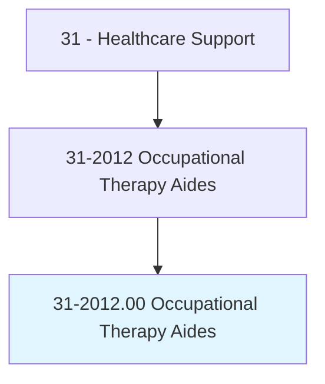
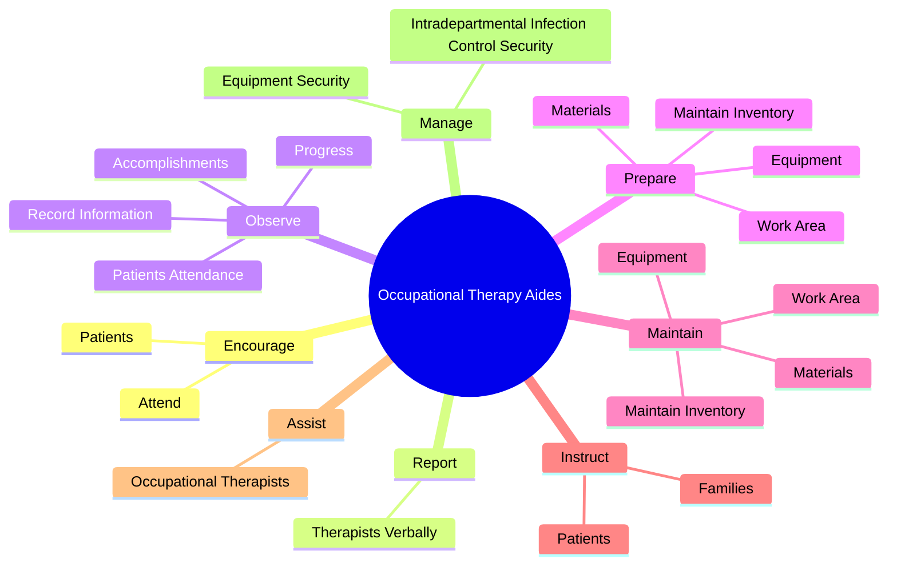
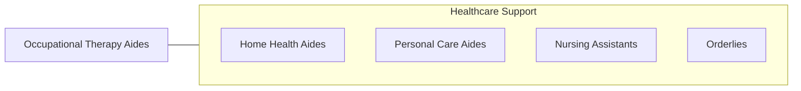

# Occupational Therapy Aides

> Under close supervision of an occupational therapist or occupational therapy assistant, perform only delegated, selected, or routine tasks in specific situations. These duties include preparing patient and treatment room.

## Overview

Occupational Therapy Aides is an occupation within the Healthcare Support category. Under close supervision of an occupational therapist or occupational therapy assistant, perform only delegated, selected, or routine tasks in specific situations. 

## Classification Hierarchy

## Key Statistics

| Metric | Value |
|--------|-------|
| SOC Code | 31-2012.00 |
| Category | [Healthcare Support](/occupations/HealthcareSupport/index) |
| Task Count | 69 |
| Source | O*NET |

## Core Tasks

### encourage.Patients

Occupational Therapy Aides encourage patients as part of their core responsibilities.

**Actions:**
- `encourage.Patients.to.PhysicalNeedsToFacilitateAttainmentOfTherapeuticGoals`
- `encourage.Attend.to.PhysicalNeedsToFacilitateAttainmentOfTherapeuticGoals`

### report.TherapistsVerbally

Occupational Therapy Aides report therapists verbally as part of their core responsibilities.

**Actions:**
- `report.TherapistsVerbally.in.Writing`
- `report.TherapistsVerbally.in.OnPatientsProgress`
- `report.TherapistsVerbally.in.Attitudes`
- `report.TherapistsVerbally.in.Attendance`

### observe.PatientsAttendance

Occupational Therapy Aides observe patients attendance as part of their core responsibilities.

**Actions:**
- `observe.PatientsAttendance.in.ClientRecords`
- `observe.Progress.in.ClientRecords`
- `observe.Accomplishments.in.ClientRecords`
- `observe.RecordInformation.in.ClientRecords`

## Skills & Competencies

### Technical Skills
- **Patient Care** - Advanced
- **Medical Terminology** - Intermediate
- **Health Records** - Intermediate

### Soft Skills
- **Communication** - Essential
- **Problem Solving** - Essential
- **Critical Thinking** - Important
- **Teamwork** - Important
- **Adaptability** - Important

## Related Occupations

## Industries

This occupation is found across multiple industries. See [Industries](/industries) for sector-specific employment data.

## Career Progression

---

*Source: O*NET 31-2012.00 - ONETOccupation*
