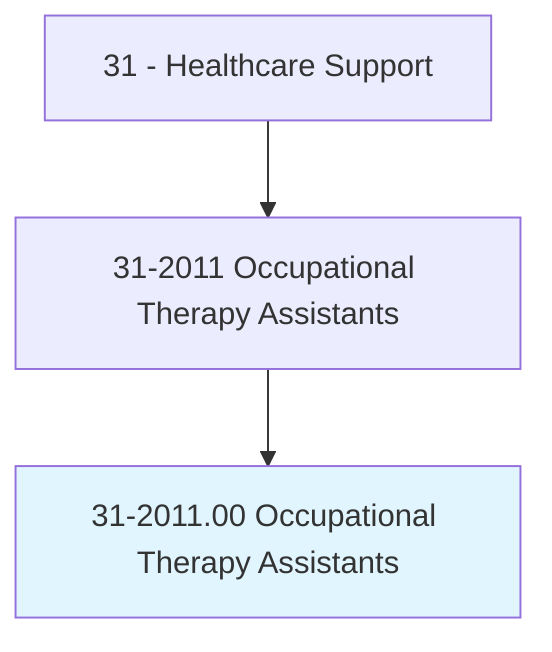
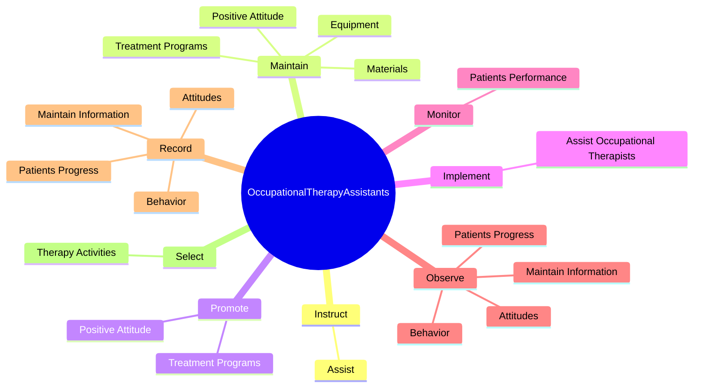
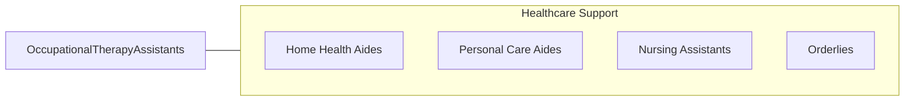

# Occupational Therapy Assistants

> Assist occupational therapists in providing occupational therapy treatments and procedures. May, in accordance with state laws, assist in development of treatment plans, carry out routine functions, direct activity programs, and document the progress of treatments. Generally requires formal training.

## Overview

Occupational Therapy Assistants is an occupation within the Healthcare Support category. Assist occupational therapists in providing occupational therapy treatments and procedures. May, in accordance with state laws, assist in development of treatment plans, carry out routine functions, direct activity programs, and document the progress of treatments.

## Classification Hierarchy

## Key Statistics

| Metric | Value |
|--------|-------|
| SOC Code | 31-2011.00 |
| Category | [Healthcare Support](/occupations/HealthcareSupport/index) |
| Task Count | 62 |
| Source | O*NET |

## Core Tasks

### instruct.Assist

Occupational Therapy Assistants instruct assist as part of their core responsibilities.

**Actions:**
- `instruct.Assist.in.InstructingPatientsFamilies.in.HomeProgramsBasicLivingSkillsCareUseOfAdaptiveEquipment`

### maintain.PositiveAttitude

Occupational Therapy Assistants maintain positive attitude as part of their core responsibilities.

**Actions:**
- `maintain.PositiveAttitude.toward.ClientsTreatmentPrograms`
- `maintain.TreatmentPrograms`
- `maintain.Equipment.for.PatientUse`
- `maintain.Materials.for.PatientUse`

### promote.PositiveAttitude

Occupational Therapy Assistants promote positive attitude as part of their core responsibilities.

**Actions:**
- `promote.PositiveAttitude.toward.ClientsTreatmentPrograms`
- `promote.TreatmentPrograms`

## Skills & Competencies

### Technical Skills
- **Patient Care** - Advanced
- **Medical Terminology** - Intermediate
- **Health Records** - Intermediate

### Soft Skills
- **Communication** - Essential
- **Problem Solving** - Essential
- **Critical Thinking** - Important
- **Teamwork** - Important
- **Adaptability** - Important

## Related Occupations

## Industries

This occupation is found across multiple industries. See [Industries](/industries) for sector-specific employment data.

## Career Progression

---

*Source: O*NET 31-2011.00 - ONETOccupation*
