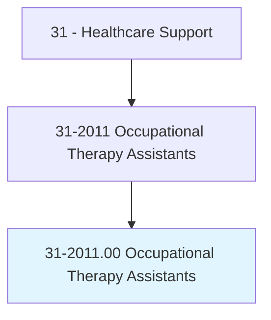
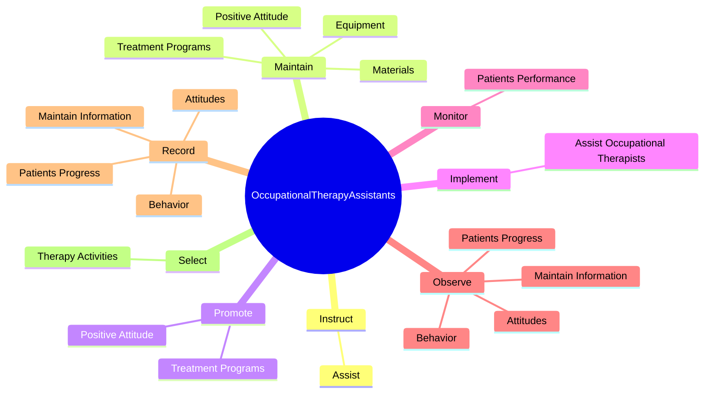
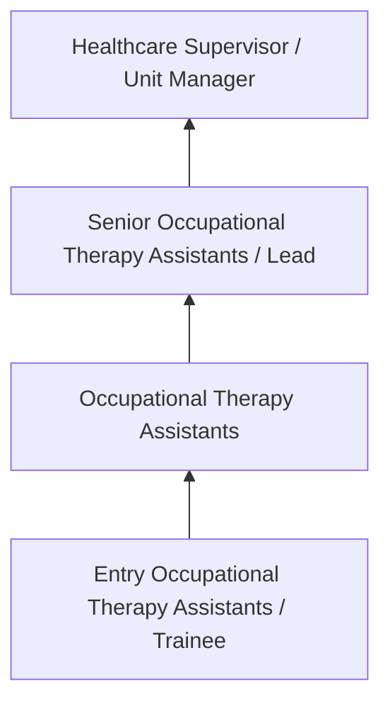
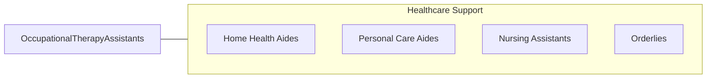

# Occupational Therapy Assistants

> Assist occupational therapists in providing occupational therapy treatments and procedures. May, in accordance with state laws, assist in development of treatment plans, carry out routine functions, direct activity programs, and document the progress of treatments. Generally requires formal training.

## Overview

Occupational Therapy Assistants professionals assist occupational therapists in providing occupational therapy treatments and procedures. This occupation falls within the Healthcare Support category and requires a combination of specialized knowledge, technical skills, and practical experience.

These professionals work across diverse settings and organizational contexts, applying their expertise to meet the demands of their field. They must stay current with industry standards, emerging practices, and regulatory requirements that affect their work. The role demands both independent judgment and collaborative skills, as practitioners regularly interact with colleagues, stakeholders, and the public.

As the field continues to evolve, Occupational Therapy Assistants professionals increasingly leverage technology and data-driven approaches to enhance their effectiveness. Career opportunities span the public and private sectors, with demand influenced by economic conditions, demographic shifts, and technological advancement.

## Classification Hierarchy



## Key Statistics

| Metric | Value |
|--------|-------|
| SOC Code | 31-2011.00 |
| Job Zone | N/A |
| Category | [Healthcare Support](/occupations/HealthcareSupport/index) |
| Core Tasks | 62+ |
| Salary Range | $28,000 - $55,000 |
| Median Salary | $38,000 |
| Growth Outlook | 15% (Much faster than average) |
| Source | O*NET |

## Core Tasks



### evaluate.DailyLivingSkills

Occupational Therapy Assistants evaluate daily living skills as part of their core responsibilities.

**Actions:**
- `evaluate.DailyLivingSkills.of.Clients.with.Physical` - Evaluate the daily living skills or capacities of clients with physical, deve...
- `evaluate.DailyLivingSkills.of.Developmental` - Evaluate the daily living skills or capacities of clients with physical, deve...
- `evaluate.DailyLivingSkills.of.MentalHealthDisabilities` - Evaluate the daily living skills or capacities of clients with physical, deve...
- `evaluate.Capacities.of.Clients.with.Physical` - Evaluate the daily living skills or capacities of clients with physical, deve...
- `evaluate.Capacities.of.Developmental` - Evaluate the daily living skills or capacities of clients with physical, deve...

### maintain.PositiveAttitude

Occupational Therapy Assistants maintain positive attitude as part of their core responsibilities.

**Actions:**
- `maintain.PositiveAttitude.toward.ClientsTreatmentPrograms` - Maintain and promote a positive attitude toward clients and their treatment p...
- `maintain.TreatmentPrograms` - Maintain and promote a positive attitude toward clients and their treatment p...
- `maintain.Equipment.for.PatientUse` - Assemble, clean, or maintain equipment or materials for patient use.
- `maintain.Materials.for.PatientUse` - Assemble, clean, or maintain equipment or materials for patient use.

### observe.PatientsProgress

Occupational Therapy Assistants observe patients progress as part of their core responsibilities.

**Actions:**
- `observe.PatientsProgress.in.ClientRecords` - Observe and record patients' progress, attitudes, and behavior and maintain t...
- `observe.Attitudes.in.ClientRecords` - Observe and record patients' progress, attitudes, and behavior and maintain t...
- `observe.Behavior.in.ClientRecords` - Observe and record patients' progress, attitudes, and behavior and maintain t...
- `observe.MaintainInformation.in.ClientRecords` - Observe and record patients' progress, attitudes, and behavior and maintain t...

### record.PatientsProgress

Occupational Therapy Assistants record patients progress as part of their core responsibilities.

**Actions:**
- `record.PatientsProgress.in.ClientRecords` - Observe and record patients' progress, attitudes, and behavior and maintain t...
- `record.Attitudes.in.ClientRecords` - Observe and record patients' progress, attitudes, and behavior and maintain t...
- `record.Behavior.in.ClientRecords` - Observe and record patients' progress, attitudes, and behavior and maintain t...
- `record.MaintainInformation.in.ClientRecords` - Observe and record patients' progress, attitudes, and behavior and maintain t...


## Skills & Competencies

### Technical Skills
- **Patient Care** - Advanced
- **Vital Signs Monitoring** - Advanced
- **Infection Control** - Advanced
- **Medical Terminology** - Proficient
- **Patient Safety** - Proficient
- **Electronic Health Records** - Proficient

### Soft Skills
- **Compassion** - Critical
- **Communication** - Critical
- **Physical Stamina** - Essential
- **Attention to Detail** - Essential
- **Emotional Resilience** - Essential

## Education & Certifications

| Requirement | Details |
|-------------|---------|
| Typical Education | Post-secondary certificate or associate degree |
| Work Experience | 0-1 years clinical experience |
| On-the-Job Training | Moderate - clinical procedures and patient care |
| Certifications | CNA, CPR/BLS, state-specific healthcare certifications |

## Career Progression



## Industry Variations

### Hospital Settings
Acute care support in hospital environments. Occupational Therapy Assistants professionals assist with direct patient care under nursing supervision.

### Long-Term Care
Extended care in nursing homes and assisted living facilities. Emphasis on daily living assistance and ongoing patient relationships.

### Home Health
In-home patient care services. Requires independence and ability to work with minimal supervision in patient homes.

### Rehabilitation Services
Support for physical, occupational, or speech therapy. Focus on helping patients recover function and independence.

## Technology & Tools

- **Electronic health records (EHR)**
- **Patient monitoring equipment**
- **Medical devices and assistive technology**
- **Vital signs measurement tools**
- **Healthcare information systems**

## Related Occupations



## Industries

- [Hospitals](/industries/Hospitals) - High Employment
- Nursing Care Facilities - High Employment
- Home Health Services - High Employment
- Outpatient Care Centers - Moderate Employment

## Departments

This occupation typically works in:
- Patient Care
- Nursing Services
- Clinical Support

## GraphDL Semantic Structure

```graphdl
Occupational Therapy Assistants perform:
- instruct.Assist.in.InstructingPatientsFamilies.in.HomeProgramsBasicLivingSkillsCareUseOfAdaptiveEquipment
- maintain.PositiveAttitude.toward.ClientsTreatmentPrograms
- maintain.TreatmentPrograms
- promote.PositiveAttitude.toward.ClientsTreatmentPrograms
- promote.TreatmentPrograms
- implement.AssistOccupationalTherapists.with.ImplementingTreatmentPlansDesigned.to.help.ClientsFunctionIndependently
```

---

*Source: O*NET 31-2011.00 - ONETOccupation*
