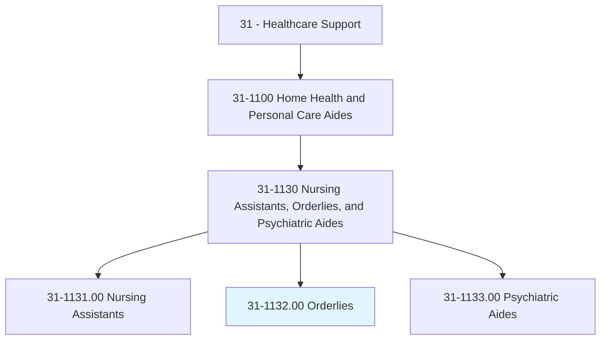
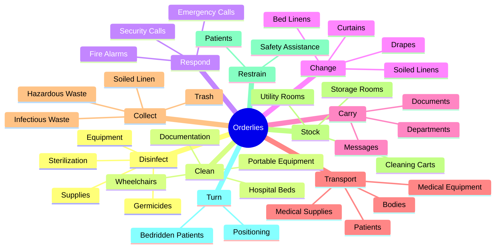
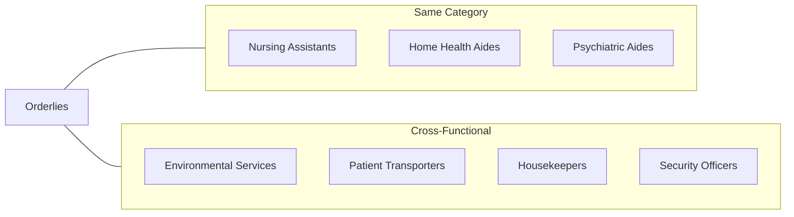
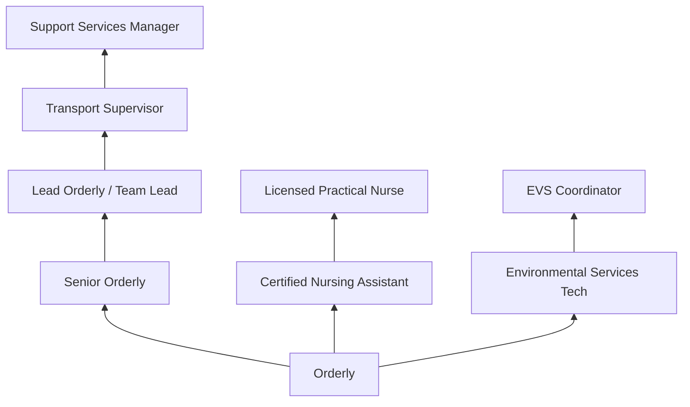

# Orderlies

> Transport patients to areas such as operating rooms or x-ray rooms using wheelchairs, stretchers, or moveable beds. May maintain stocks of supplies or clean and transport equipment. Psychiatric orderlies are included in Psychiatric Aides.

## Overview

Orderlies play a vital support role in healthcare facilities by transporting patients safely throughout the facility, maintaining equipment and supplies, and ensuring clean and organized patient care environments. They work in hospitals, nursing homes, and other healthcare settings, facilitating smooth operations by moving patients to various departments for procedures, tests, and treatments. Orderlies also respond to emergency situations and assist clinical staff with non-medical tasks.

## Classification Hierarchy

## Key Statistics

| Metric | Value |
|--------|-------|
| SOC Code | 31-1132.00 |
| Job Zone | 2 (Some Preparation) |
| Category | [Healthcare Support](/occupations/HealthcareSupport/index) |
| Core Tasks | 15+ |
| Source | O*NET |

## Core Tasks

### disinfect.Equipment

Orderlies maintain sterile and clean equipment.

**Actions:**
- `disinfect.Equipment` - Sanitize medical equipment
- `disinfect.Supplies` - Clean medical supplies
- `disinfect.UsingGermicides` - Apply germicidal solutions
- `disinfect.SterilizingEquipment` - Use sterilization equipment
- `sterilize.SterilizingEquipment` - Operate sterilizers

### clean.Equipment

Orderlies maintain clean patient care equipment.

**Actions:**
- `clean.Wheelchairs` - Clean wheelchairs
- `clean.HospitalBeds` - Sanitize hospital beds
- `clean.PortableMedicalEquipment` - Clean portable devices
- `clean.DocumentingNeededRepairs` - Document equipment issues
- `clean.Maintenance` - Report maintenance needs

### respond.Emergencies

Orderlies react to emergency situations.

**Actions:**
- `respond.EmergencyMedicalCalls` - Respond to medical emergencies
- `respond.SecurityCalls` - React to security incidents

### change.Linens

Orderlies maintain clean patient environments.

**Actions:**
- `change.SoiledLinens` - Replace dirty linens
- `change.Drapes` - Change room drapes
- `change.CubicleCurtains` - Replace privacy curtains

### carry.Messages

Orderlies facilitate communication between departments.

**Actions:**
- `carry.Messages` - Deliver messages
- `carry.Documents.between.Departments` - Transport documents

### transport.Equipment

Orderlies move equipment and supplies throughout facilities.

**Actions:**
- `transport.PortableMedicalEquipmentSupplies.between.Rooms` - Move equipment
- `transport.Departments` - Transport between departments
- `transport.MedicalSupplies.between.Rooms` - Deliver supplies
- `transport.Bodies.to.Morgue` - Transport deceased patients

### collect.Waste

Orderlies manage waste disposal safely.

**Actions:**
- `collect.InfectiousWaste.in.ClosedContainers.for.Sterilization` - Handle infectious waste
- `collect.HazardousWaste.in.ClosedContainers.for.Sterilization` - Manage hazardous materials
- `collect.InfectiousWaste.in.InAccordanceWithApplicableLaw` - Follow waste regulations
- `collect.SoiledLinen` - Gather dirty linens
- `collect.Trash` - Remove trash
- `collect.FoodTrays` - Clear food service items

### separate.Materials

Orderlies sort materials for proper disposal.

**Actions:**
- `separate.CollectedMaterials.for.Disposal` - Sort for disposal
- `separate.CollectedMaterials.for.Recycling` - Prepare recyclables
- `separate.CollectedMaterials.for.Reuse` - Identify reusable items

### stock.Supplies

Orderlies maintain adequate supply levels.

**Actions:**
- `stock.UtilityRooms.with.Supplies` - Stock utility areas
- `stock.NonmedicalStorageRooms.with.Supplies` - Fill storage rooms
- `stock.CleaningCarts.with.Supplies` - Prepare cleaning carts

### restrain.Patients

Orderlies assist with patient safety when needed.

**Actions:**
- `restrain.Patients.to.prevent.ViolenceToAssistPhysiciansNursesToAdministerTreatments` - Assist with patient restraint

### turn.Patients

Orderlies help reposition patients.

**Actions:**
- `turn.BedriddenPatientsAlone.with.Assistance` - Reposition patients
- `turn.BedriddenPatientsAlone.with.prevent.Bedsores` - Prevent pressure injuries

### provide.Support

Orderlies assist patients with daily activities.

**Actions:**
- `provide.PhysicalSupport.to.PatientsToAssistThemToPerformDailyLivingActivities` - Support daily activities

## Skills & Competencies

### Technical Skills
- **Patient Transport** - Proficient
- **Equipment Handling** - Proficient
- **Infection Control** - Proficient
- **Sterilization Techniques** - Basic
- **Waste Management** - Proficient
- **Supply Management** - Basic
- **Emergency Response** - Basic

### Soft Skills
- **Physical Strength** - Critical
- **Reliability** - Critical
- **Communication** - Essential
- **Attention to Detail** - Essential
- **Team Collaboration** - Essential
- **Calm Under Pressure** - Important

## Related Occupations

## Industries

- [Hospitals](/industries/Healthcare/Hospitals/index) - Primary Employment
- [Nursing Care Facilities](/industries/NursingCare) - Long-term Care
- [Psychiatric Hospitals](/industries/PsychiatricHospitals) - Mental Health
- [Outpatient Care Centers](/industries/OutpatientCare) - Ambulatory Services
- [Government](/industries/Government) - Public Hospitals

## Career Progression

## Education & Training

| Requirement | Details |
|-------------|---------|
| Typical Education | High school diploma or equivalent |
| Work Experience | None required for entry |
| On-the-Job Training | Short-term training (1-3 months) |
| Certification | CPR/First Aid typically required |
| Physical Requirements | Ability to lift and move patients safely |

## Departments

This occupation typically works in:
- [Patient Transport](/departments/PatientTransport)
- [Environmental Services](/departments/EnvironmentalServices)
- [Central Supply](/departments/CentralSupply)
- [Emergency Department](/departments/EmergencyDepartment)
- [Surgical Services](/departments/SurgicalServices)

---

*Source: O*NET 31-1132.00 - ONETOccupation*
