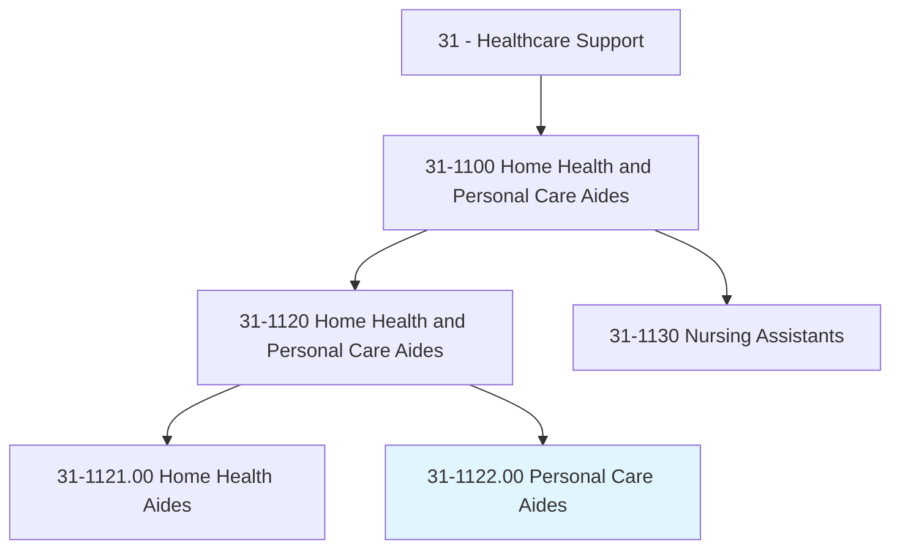
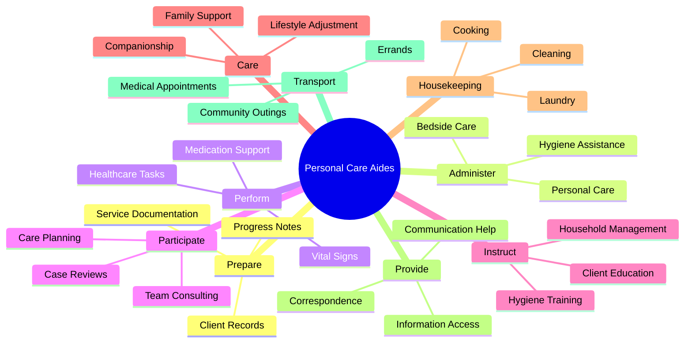
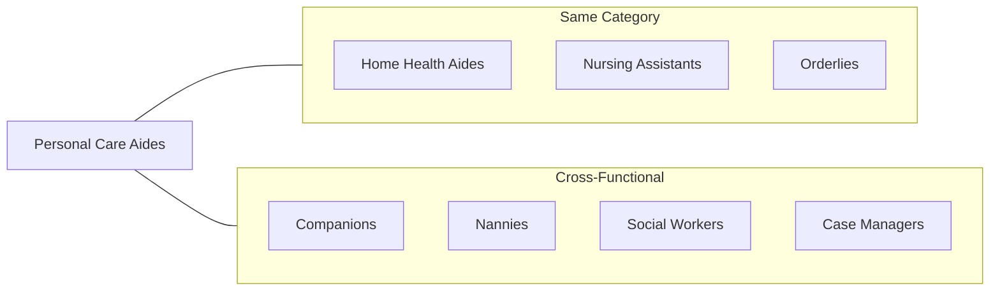
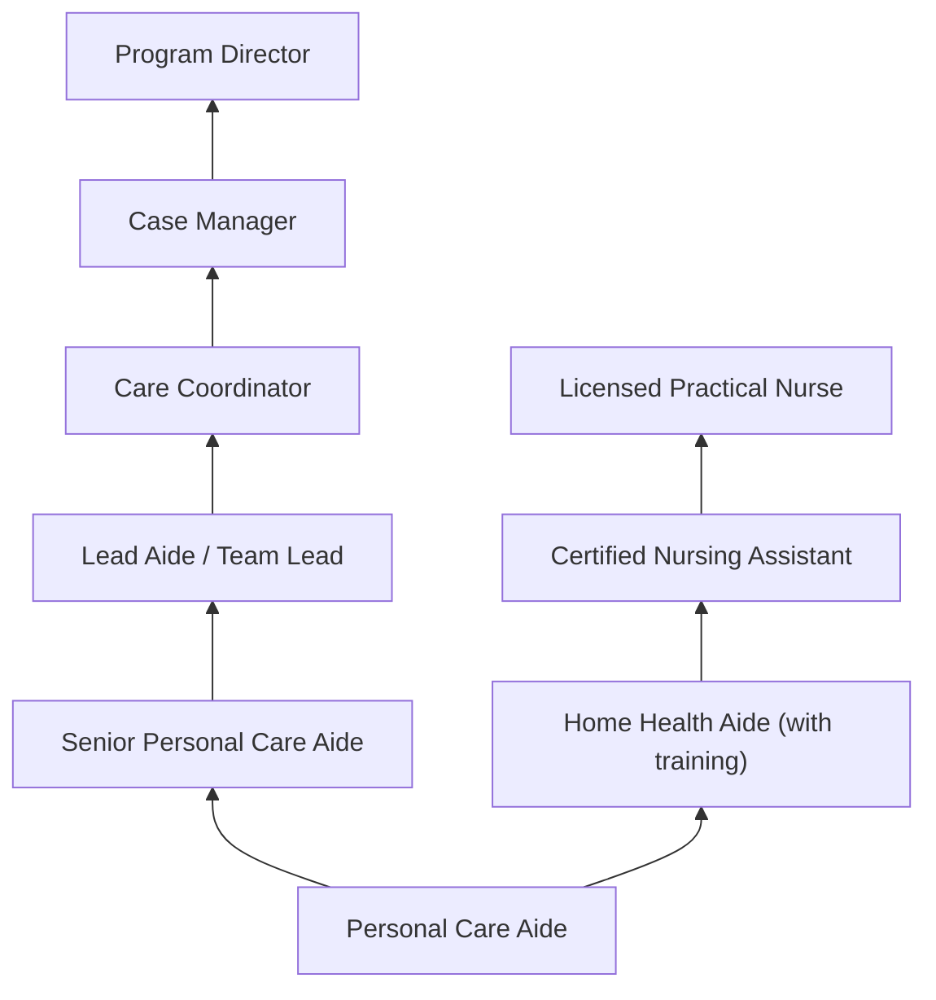

# Personal Care Aides

> Provide personalized assistance to individuals with disabilities or illness who require help with personal care and activities of daily living support (e.g., feeding, bathing, dressing, grooming, toileting, and ambulation). May also provide help with tasks such as preparing meals, doing light housekeeping, and doing laundry. Work is performed in various settings depending on the needs of the care recipient and may include locations such as their home, place of work, out in the community, or at a daytime nonresidential facility.

## Overview

Personal Care Aides assist individuals who need help with daily living activities due to age, disability, or chronic illness. Unlike Home Health Aides who focus on medical tasks, Personal Care Aides primarily provide non-medical assistance including personal hygiene, meal preparation, housekeeping, and companionship. They enable clients to maintain independence and quality of life while living in their homes or participating in community activities.

## Classification Hierarchy

## Key Statistics

| Metric | Value |
|--------|-------|
| SOC Code | 31-1122.00 |
| Job Zone | 2 (Some Preparation) |
| Category | [Healthcare Support](/occupations/HealthcareSupport/index) |
| Core Tasks | 12+ |
| Source | O*NET |

## Core Tasks

### prepare.Records

Personal Care Aides document client progress and services.

**Actions:**
- `prepare.Records.of.ClientProgress` - Track client improvements
- `prepare.Records.of.ServicesPerformed` - Document services provided
- `prepare.Records.of.ReportingChanges.in.ClientConditionToManager` - Report condition changes
- `maintain.Records.of.ClientProgress` - Keep ongoing records
- `maintain.Records.of.ServicesPerformed` - Update service logs

### administer.PersonalCare

Personal Care Aides provide hands-on assistance with daily activities.

**Actions:**
- `administer.BedsideCare` - Provide bedside assistance
- `administer.PersonalCare` - Help with personal needs
- `administer.Ambulation` - Assist with walking
- `administer.PersonalHygieneAssistance` - Support hygiene routines

### perform.HealthcareTasks

Personal Care Aides support basic health monitoring under direction.

**Actions:**
- `perform.HealthcareRelatedTasks.of.RegisteredNurses` - Tasks directed by RNs
- `perform.MonitoringVitalSigns.of.RegisteredNurses` - Check vital signs
- `perform.Medication.of.RegisteredNurses` - Medication reminders

### participate.CaseReviews

Personal Care Aides collaborate with care teams.

**Actions:**
- `participate.Consulting.with.TeamCaring.for.Client` - Team consultation
- `participate.Consulting.with.evaluate.ClientsNeeds` - Assess client needs
- `participate.Consulting.with.Plan.for.ContinuingServices` - Plan ongoing care

### instruct.Clients

Personal Care Aides educate clients on self-care and daily living.

**Actions:**
- `instruct.Clients.on.Issues` - General guidance
- `instruct.Clients.on.HouseholdCleanliness` - Cleaning education
- `instruct.Clients.on.Hygiene` - Personal hygiene instruction
- `instruct.Clients.on.Nutrition` - Nutritional guidance
- `instruct.Clients.on.InfantCare` - Infant care training
- `advise.Clients.on.Utilities` - Utility management advice

### care.Families

Personal Care Aides support families during challenging times.

**Actions:**
- `care.Families.during.Periods.of.Incapacitation` - Support during illness
- `care.Families.during.Periods.of.FamilyDisruption` - Help during transitions
- `care.Families.during.Periods.of.Convalescence` - Recovery support
- `care.Families.during.Periods.of.ProvidingCompanionship` - Companionship services

### perform.HousekeepingDuties

Personal Care Aides assist with household management.

**Actions:**
- `perform.HousekeepingDuties` - General housekeeping
- `perform.WashingClothes` - Laundry services
- `perform.Dishes` - Dishwashing

### provide.CommunicationAssistance

Personal Care Aides help clients communicate and access information.

**Actions:**
- `provide.Clients.with.CommunicationAssistance` - Communication support
- `provide.Clients.with.TypingCorrespondence` - Typing assistance
- `provide.Clients.with.ObtainingInformation.for.Them` - Information gathering

### train.FamilyMembers

Personal Care Aides educate family caregivers.

**Actions:**
- `train.FamilyMembers.to.provide.BedsideCare` - Family caregiver training

### transport.Clients

Personal Care Aides provide transportation services.

**Actions:**
- `transport.Clients.to.LocationsOutsideHome` - General transportation
- `transport.Clients.to.ToPhysiciansOffices` - Medical appointments
- `transport.Clients.to.OnOutings` - Community activities
- `transport.Clients.to.UsingMotorVehicle` - Vehicle transportation

## Skills & Competencies

### Technical Skills
- **Personal Care Assistance** - Proficient
- **Household Management** - Proficient
- **Meal Preparation** - Proficient
- **Basic Health Monitoring** - Basic
- **Mobility Assistance** - Proficient
- **Documentation** - Basic
- **Safe Driving** - Proficient

### Soft Skills
- **Compassion** - Critical
- **Patience** - Critical
- **Reliability** - Critical
- **Communication** - Essential
- **Adaptability** - Essential
- **Cultural Sensitivity** - Important

## Related Occupations

## Industries

- [Individual and Family Services](/industries/IndividualFamilyServices) - Primary Employment
- [Home Healthcare Services](/industries/HomeHealthcare) - Growing Sector
- [Residential Care Facilities](/industries/ResidentialCare) - Assisted Living
- [Vocational Rehabilitation](/industries/VocationalRehab) - Disability Services
- [Community Food and Housing](/industries/CommunityServices) - Social Services

## Career Progression

## Education & Training

| Requirement | Details |
|-------------|---------|
| Typical Education | High school diploma or equivalent |
| Work Experience | None required for entry-level |
| On-the-Job Training | Short-term training provided by employer |
| Certification | CPR/First Aid recommended; state requirements vary |
| Background Check | Criminal background check typically required |

## Departments

This occupation typically works in:
- [Personal Care Services](/departments/PersonalCare)
- [Home Care Services](/departments/HomeCare)
- [Community Support Services](/departments/CommunitySupport)
- [Disability Services](/departments/DisabilityServices)

---

*Source: O*NET 31-1122.00 - ONETOccupation*
