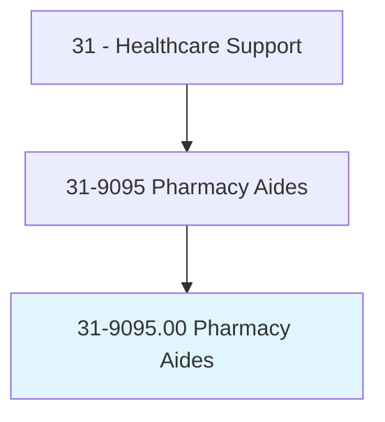
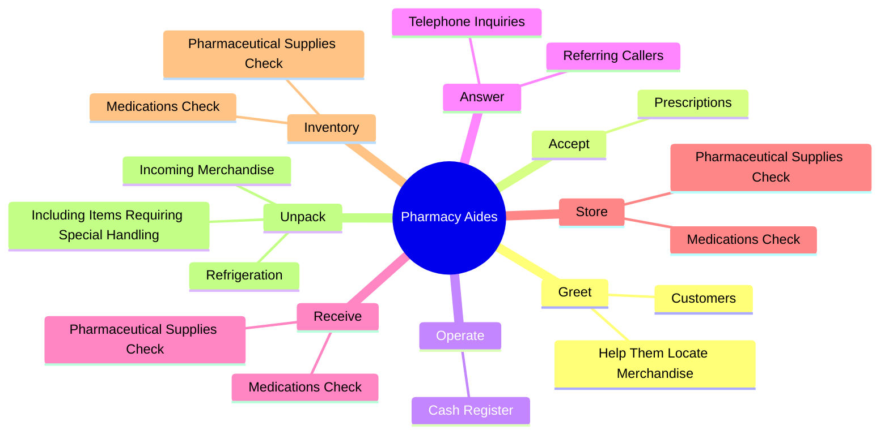
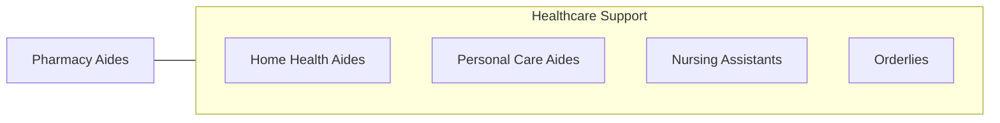

# Pharmacy Aides

> Record drugs delivered to the pharmacy, store incoming merchandise, and inform the supervisor of stock needs. May operate cash register and accept prescriptions for filling.

## Overview

Pharmacy Aides is an occupation within the Healthcare Support category. Record drugs delivered to the pharmacy, store incoming merchandise, and inform the supervisor of stock needs. 

## Classification Hierarchy

## Key Statistics

| Metric | Value |
|--------|-------|
| SOC Code | 31-9095.00 |
| Category | [Healthcare Support](/occupations/HealthcareSupport/index) |
| Task Count | 58 |
| Source | O*NET |

## Core Tasks

### greet.Customers

Pharmacy Aides greet customers as part of their core responsibilities.

**Actions:**
- `greet.Customers`
- `greet.HelpThemLocateMerchandise`

### accept.Prescriptions

Pharmacy Aides accept prescriptions as part of their core responsibilities.

**Actions:**
- `accept.Prescriptions.for.Filling`
- `accept.Prescriptions.for.Gathering`
- `accept.Prescriptions.for.ProcessingNecessaryInformation`

### operate.CashRegister

Pharmacy Aides operate cash register as part of their core responsibilities.

**Actions:**
- `operate.CashRegister.to.process.CashSales`
- `operate.CashRegister.to.CreditSales`

## Skills & Competencies

### Technical Skills
- **Patient Care** - Advanced
- **Medical Terminology** - Intermediate
- **Health Records** - Intermediate

### Soft Skills
- **Communication** - Essential
- **Problem Solving** - Essential
- **Critical Thinking** - Important
- **Teamwork** - Important
- **Adaptability** - Important

## Related Occupations

## Industries

This occupation is found across multiple industries. See [Industries](/industries) for sector-specific employment data.

## Career Progression

---

*Source: O*NET 31-9095.00 - ONETOccupation*
