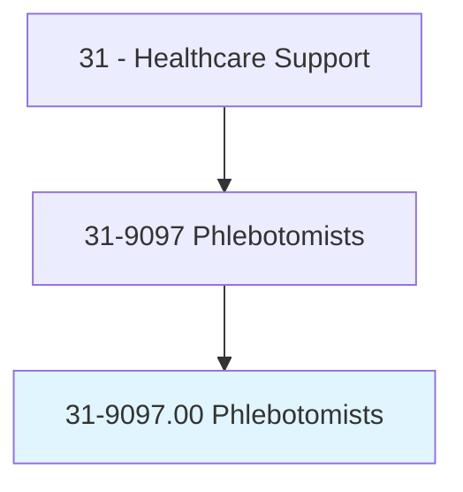
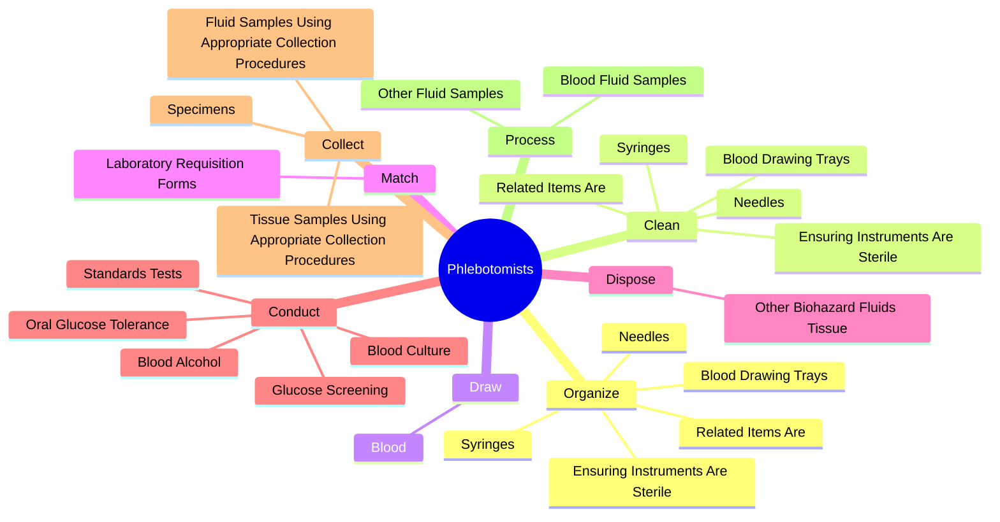
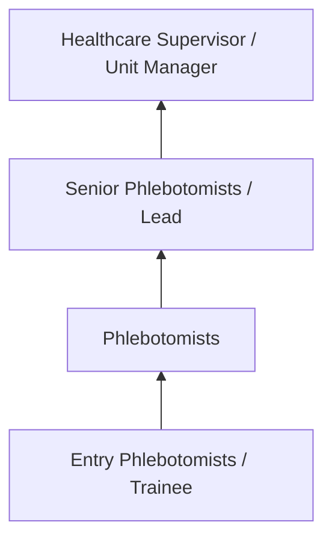
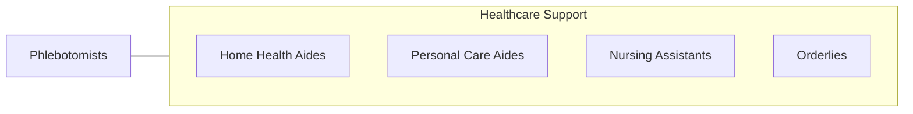

# Phlebotomists

> Draw blood for tests, transfusions, donations, or research. May explain the procedure to patients and assist in the recovery of patients with adverse reactions.

## Overview

Phlebotomists professionals draw blood for tests, transfusions, donations, or research. This occupation falls within the Healthcare Support category and requires a combination of specialized knowledge, technical skills, and practical experience.

These professionals work across diverse settings and organizational contexts, applying their expertise to meet the demands of their field. They must stay current with industry standards, emerging practices, and regulatory requirements that affect their work. The role demands both independent judgment and collaborative skills, as practitioners regularly interact with colleagues, stakeholders, and the public.

As the field continues to evolve, Phlebotomists professionals increasingly leverage technology and data-driven approaches to enhance their effectiveness. Career opportunities span the public and private sectors, with demand influenced by economic conditions, demographic shifts, and technological advancement.

## Classification Hierarchy



## Key Statistics

| Metric | Value |
|--------|-------|
| SOC Code | 31-9097.00 |
| Job Zone | N/A |
| Category | [Healthcare Support](/occupations/HealthcareSupport/index) |
| Core Tasks | 69+ |
| Salary Range | $28,000 - $55,000 |
| Median Salary | $38,000 |
| Growth Outlook | 15% (Much faster than average) |
| Source | O*NET |

## Core Tasks



### conduct.StandardsTests

Phlebotomists conduct standards tests as part of their core responsibilities.

**Actions:**
- `conduct.StandardsTests` - Conduct standards tests, such as blood alcohol, blood culture, oral glucose t...
- `conduct.BloodAlcohol` - Conduct standards tests, such as blood alcohol, blood culture, oral glucose t...
- `conduct.BloodCulture` - Conduct standards tests, such as blood alcohol, blood culture, oral glucose t...
- `conduct.OralGlucoseTolerance` - Conduct standards tests, such as blood alcohol, blood culture, oral glucose t...
- `conduct.GlucoseScreening` - Conduct standards tests, such as blood alcohol, blood culture, oral glucose t...

### draw.Blood

Phlebotomists draw blood as part of their core responsibilities.

**Actions:**
- `draw.Blood.from.Veins.by.VacuumTube` - Draw blood from veins by vacuum tube, syringe, or butterfly venipuncture meth...
- `draw.Blood.from.Syringe` - Draw blood from veins by vacuum tube, syringe, or butterfly venipuncture meth...
- `draw.Blood.from.ButterflyVenipunctureMethods` - Draw blood from veins by vacuum tube, syringe, or butterfly venipuncture meth...
- `draw.Blood.from.Capillaries.by.DermalPuncture` - Draw blood from capillaries by dermal puncture, such as heel or finger stick ...
- `draw.Blood.from.Heel` - Draw blood from capillaries by dermal puncture, such as heel or finger stick ...

### monitor.BloodDonors

Phlebotomists monitor blood donors as part of their core responsibilities.

**Actions:**
- `monitor.BloodDonors.during.AfterProcedures.to.ensure.Health` - Monitor blood or plasma donors during and after procedures to ensure health, ...
- `monitor.BloodDonors.during.AfterProcedures.to.Safety` - Monitor blood or plasma donors during and after procedures to ensure health, ...
- `monitor.BloodDonors.during.AfterProcedures.to.Comfort` - Monitor blood or plasma donors during and after procedures to ensure health, ...
- `monitor.PlasmaDonors.during.AfterProcedures.to.ensure.Health` - Monitor blood or plasma donors during and after procedures to ensure health, ...
- `monitor.PlasmaDonors.during.AfterProcedures.to.Safety` - Monitor blood or plasma donors during and after procedures to ensure health, ...

### determine.DonorSuitability

Phlebotomists determine donor suitability as part of their core responsibilities.

**Actions:**
- `determine.DonorSuitability.to.interview.Results` - Determine donor suitability, according to interview results, vital signs, and...
- `determine.DonorSuitability.to.VitalSigns` - Determine donor suitability, according to interview results, vital signs, and...
- `determine.DonorSuitability.to.MedicalHistory` - Determine donor suitability, according to interview results, vital signs, and...
- `determine.According.to.interview.Results` - Determine donor suitability, according to interview results, vital signs, and...
- `determine.According.to.VitalSigns` - Determine donor suitability, according to interview results, vital signs, and...


## Skills & Competencies

### Technical Skills
- **Patient Care** - Advanced
- **Vital Signs Monitoring** - Advanced
- **Infection Control** - Advanced
- **Medical Terminology** - Proficient
- **Patient Safety** - Proficient
- **Electronic Health Records** - Proficient

### Soft Skills
- **Compassion** - Critical
- **Communication** - Critical
- **Physical Stamina** - Essential
- **Attention to Detail** - Essential
- **Emotional Resilience** - Essential

## Education & Certifications

| Requirement | Details |
|-------------|---------|
| Typical Education | Post-secondary certificate or associate degree |
| Work Experience | 0-1 years clinical experience |
| On-the-Job Training | Moderate - clinical procedures and patient care |
| Certifications | CNA, CPR/BLS, state-specific healthcare certifications |

## Career Progression



## Industry Variations

### Hospital Settings
Acute care support in hospital environments. Phlebotomists professionals assist with direct patient care under nursing supervision.

### Long-Term Care
Extended care in nursing homes and assisted living facilities. Emphasis on daily living assistance and ongoing patient relationships.

### Home Health
In-home patient care services. Requires independence and ability to work with minimal supervision in patient homes.

### Rehabilitation Services
Support for physical, occupational, or speech therapy. Focus on helping patients recover function and independence.

## Technology & Tools

- **Electronic health records (EHR)**
- **Patient monitoring equipment**
- **Medical devices and assistive technology**
- **Vital signs measurement tools**
- **Healthcare information systems**

## Related Occupations



## Industries

- [Hospitals](/industries/Hospitals) - High Employment
- Nursing Care Facilities - High Employment
- Home Health Services - High Employment
- Outpatient Care Centers - Moderate Employment

## Departments

This occupation typically works in:
- Patient Care
- Nursing Services
- Clinical Support

## GraphDL Semantic Structure

```graphdl
Phlebotomists perform:
- organize.BloodDrawingTrays.of.FirstTimeUse
- organize.EnsuringInstrumentsAreSterile.of.FirstTimeUse
- organize.Needles.of.FirstTimeUse
- organize.Syringes.of.FirstTimeUse
- organize.RelatedItemsAre.of.FirstTimeUse
- clean.BloodDrawingTrays.of.FirstTimeUse
```

---

*Source: O*NET 31-9097.00 - ONETOccupation*
