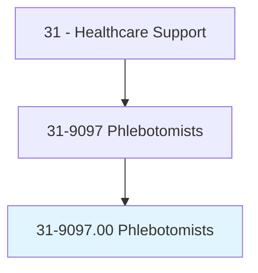
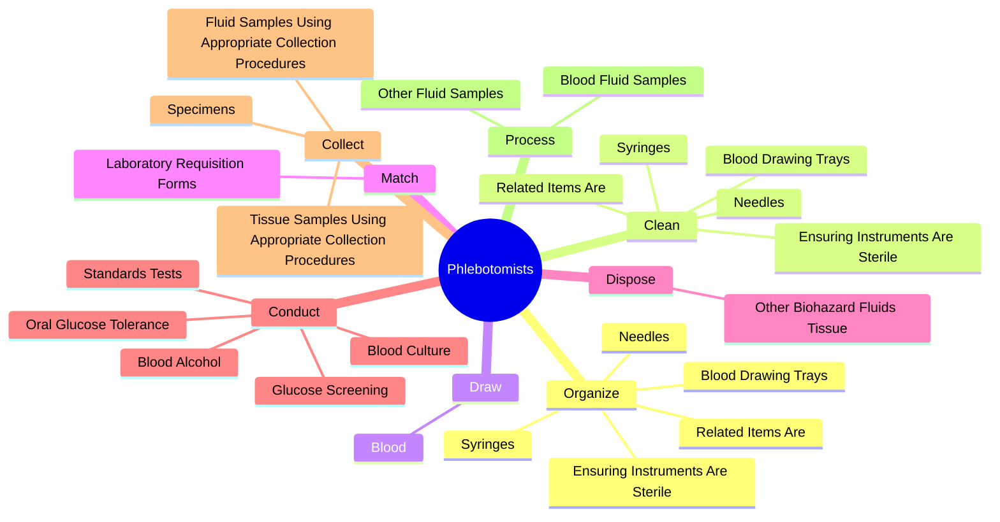
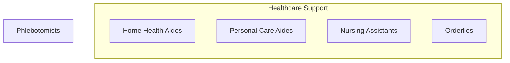

# Phlebotomists

> Draw blood for tests, transfusions, donations, or research. May explain the procedure to patients and assist in the recovery of patients with adverse reactions.

## Overview

Phlebotomists is an occupation within the Healthcare Support category. Draw blood for tests, transfusions, donations, or research. 

## Classification Hierarchy

## Key Statistics

| Metric | Value |
|--------|-------|
| SOC Code | 31-9097.00 |
| Category | [Healthcare Support](/occupations/HealthcareSupport) |
| Task Count | 69 |
| Source | O*NET |

## Core Tasks

### organize.BloodDrawingTrays

Phlebotomists organize blood drawing trays as part of their core responsibilities.

**Actions:**
- `organize.BloodDrawingTrays.of.FirstTimeUse`
- `organize.EnsuringInstrumentsAreSterile.of.FirstTimeUse`
- `organize.Needles.of.FirstTimeUse`
- `organize.Syringes.of.FirstTimeUse`

### clean.BloodDrawingTrays

Phlebotomists clean blood drawing trays as part of their core responsibilities.

**Actions:**
- `clean.BloodDrawingTrays.of.FirstTimeUse`
- `clean.EnsuringInstrumentsAreSterile.of.FirstTimeUse`
- `clean.Needles.of.FirstTimeUse`
- `clean.Syringes.of.FirstTimeUse`

### draw.Blood

Phlebotomists draw blood as part of their core responsibilities.

**Actions:**
- `draw.Blood.from.Veins.by.VacuumTube`
- `draw.Blood.from.Syringe`
- `draw.Blood.from.ButterflyVenipunctureMethods`
- `draw.Blood.from.Capillaries.by.DermalPuncture`

## Skills & Competencies

### Technical Skills
- **Patient Care** - Advanced
- **Medical Terminology** - Intermediate
- **Health Records** - Intermediate

### Soft Skills
- **Communication** - Essential
- **Problem Solving** - Essential
- **Critical Thinking** - Important
- **Teamwork** - Important
- **Adaptability** - Important

## Related Occupations

## Industries

This occupation is found across multiple industries. See [Industries](/industries) for sector-specific employment data.

## Career Progression

---

*Source: O*NET 31-9097.00 - ONETOccupation*
