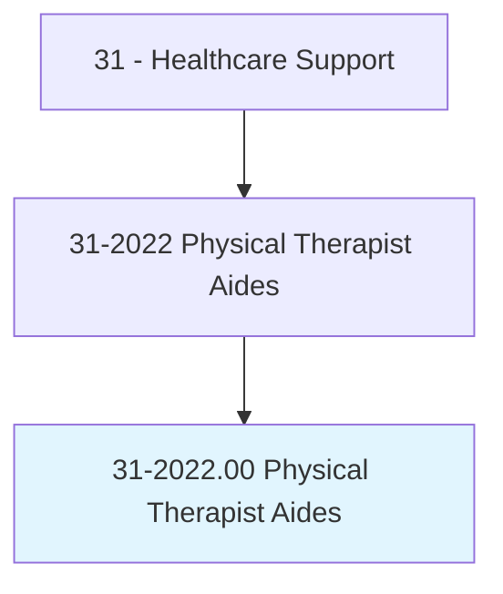
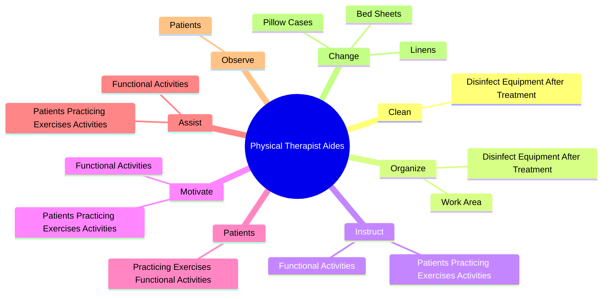
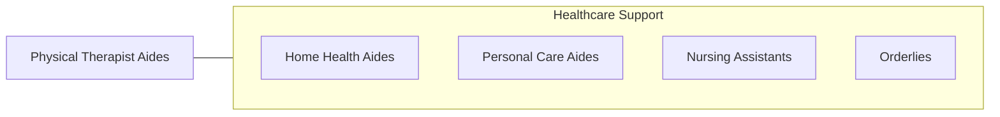

# Physical Therapist Aides

> Under close supervision of a physical therapist or physical therapy assistant, perform only delegated, selected, or routine tasks in specific situations. These duties include preparing the patient and the treatment area.

## Overview

Physical Therapist Aides is an occupation within the Healthcare Support category. Under close supervision of a physical therapist or physical therapy assistant, perform only delegated, selected, or routine tasks in specific situations. 

## Classification Hierarchy

## Key Statistics

| Metric | Value |
|--------|-------|
| SOC Code | 31-2022.00 |
| Category | [Healthcare Support](/occupations/HealthcareSupport) |
| Task Count | 37 |
| Source | O*NET |

## Core Tasks

### clean.DisinfectEquipmentAfterTreatment

Physical Therapist Aides clean disinfect equipment after treatment as part of their core responsibilities.

**Actions:**
- `clean.DisinfectEquipmentAfterTreatment`

### organize.WorkArea

Physical Therapist Aides organize work area as part of their core responsibilities.

**Actions:**
- `organize.WorkArea`
- `organize.DisinfectEquipmentAfterTreatment`

### instruct.PatientsPracticingExercisesActivities

Physical Therapist Aides instruct patients practicing exercises activities as part of their core responsibilities.

**Actions:**
- `instruct.PatientsPracticingExercisesActivities.under.Direction.of.MedicalStaff`
- `instruct.FunctionalActivities.under.Direction.of.MedicalStaff`

## Skills & Competencies

### Technical Skills
- **Patient Care** - Advanced
- **Medical Terminology** - Intermediate
- **Health Records** - Intermediate

### Soft Skills
- **Communication** - Essential
- **Problem Solving** - Essential
- **Critical Thinking** - Important
- **Teamwork** - Important
- **Adaptability** - Important

## Related Occupations

## Industries

This occupation is found across multiple industries. See [Industries](/industries) for sector-specific employment data.

## Career Progression

---

*Source: O*NET 31-2022.00 - ONETOccupation*
